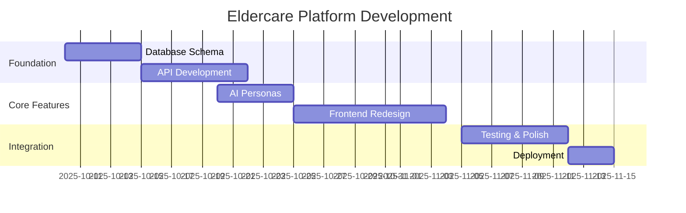

# Kalito Space → Eldercare Management Platform

## Project Vision

Transform the existing Kalito Space AI chat platform into a comprehensive eldercare management system to help manage the care of elderly parents. This refactor will leverage the existing sophisticated infrastructure while adding specialized eldercare functionality.

## Current System Strengths

### 🏗️ **Solid Foundation**
- **Advanced Memory System**: Conversation summaries and semantic pins perfect for medical history tracking
- **Multi-Model AI Support**: Local (Ollama) + Cloud (OpenAI, Claude) for privacy and capability balance
- **Sophisticated Database**: SQLite with WAL mode, foreign keys, and performance optimization
- **Modern Tech Stack**: Vue 3, TypeScript, Express, comprehensive API layer
- **Persona System**: AI personality customization ideal for specialized care assistants

### 🧠 **Memory System Benefits for Eldercare**
- **Long-term Context**: Remember medical history across months/years
- **Importance Scoring**: Prioritize critical health information
- **Semantic Pins**: Flag allergies, medications, emergency contacts
- **Conversation Summaries**: Compress doctor visits and care planning sessions

## Transformation Strategy

### 🔄 **Evolutionary, Not Revolutionary**
- **Extend** existing tables rather than replace
- **Maintain** backward compatibility 
- **Leverage** existing memory and persona systems
- **Reframe** chat sessions as care management sessions

## Target Use Cases

### 👩‍⚕️ **Primary Care Management**
- **Medical History Tracking**: Comprehensive health records
- **Medication Management**: Schedules, interactions, adherence
- **Appointment Coordination**: Scheduling, reminders, follow-ups
- **Vital Signs Monitoring**: Blood pressure, weight, temperature trends
- **Document Generation**: Doctor letters, care summaries, insurance forms

### 🤖 **AI-Powered Assistance**
- **Care Planning**: AI helps organize and prioritize care tasks
- **Medical Documentation**: Generate clear, organized summaries
- **Trend Analysis**: Identify patterns in vitals and symptoms
- **Medication Reminders**: Smart scheduling and interaction warnings
- **Emergency Preparedness**: Quick access to critical information

### 🔐 **Privacy & Security**
- **Local Processing**: Sensitive data stays on your machine
- **Cloud Augmentation**: Use cloud AI for non-sensitive document generation
- **Data Ownership**: Complete control over parent's medical information

## Implementation Phases

### **Phase 1: Database Foundation** (Week 1-2)
- Extend database schema with eldercare tables
- Create migration scripts
- Set up new data relationships

### **Phase 2: Core API** (Week 2-3)
- Build patient management endpoints
- Create medical record CRUD operations
- Implement medication tracking API

### **Phase 3: AI Specialization** (Week 3-4)
- Design eldercare-focused personas
- Create specialized prompts for medical tasks
- Implement document generation workflows

### **Phase 4: Frontend Transformation** (Week 4-6)
- Redesign UI for care management
- Build patient dashboards
- Create medical record forms

### **Phase 5: Integration & Testing** (Week 6-7)
- End-to-end testing
- Data import/export tools
- Performance optimization

### **Phase 6: Advanced Features** (Week 8+)
- Trend analysis and reporting
- Smart reminders and alerts
- Mobile/tablet optimization

## Success Metrics

### 🎯 **Functional Goals**
- ✅ Complete medical history for both parents
- ✅ Automated medication tracking
- ✅ Streamlined appointment management
- ✅ AI-generated care documentation
- ✅ Quick access to emergency information

### 📊 **Technical Goals**
- ✅ <2 second response times for all operations
- ✅ 99.9% data integrity (no lost medical records)
- ✅ Offline capability for critical functions
- ✅ HIPAA-compliant data handling practices
- ✅ Easy backup and restore procedures

## Project Timeline

## Risk Assessment

### ⚠️ **Technical Risks**
- **Data Migration Complexity**: Moving from chat to care data structure
- **UI/UX Overhaul**: Significant frontend changes required
- **AI Model Performance**: Ensuring medical content accuracy

### 🛡️ **Mitigation Strategies**
- **Incremental Development**: Build alongside existing system
- **Comprehensive Testing**: Medical data requires extra validation
- **Backup Strategies**: Multiple redundant data protection layers

## Next Steps

1. **Review Phase Documentation**: Read through all phase documents
2. **Customize for Your Needs**: Adjust timelines and priorities
3. **Begin Phase 1**: Start with database schema extensions
4. **Iterate and Refine**: Continuous feedback and improvement

---

*This project transforms a sophisticated AI platform into a practical tool for real-world eldercare challenges. The existing infrastructure provides an excellent foundation for building something truly useful.*