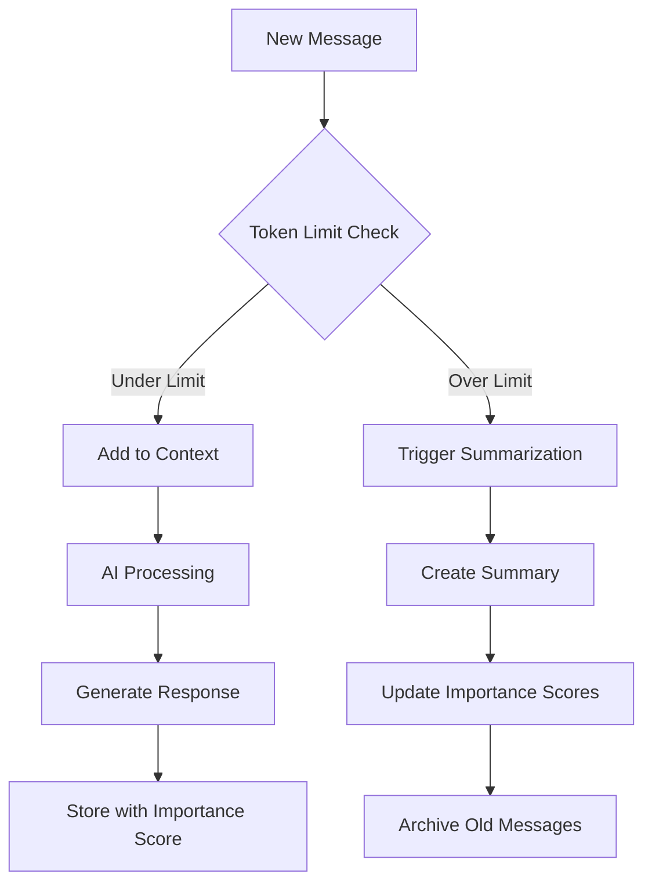

# Backend Database Guide

This comprehensive guide explains the Kalito database architecture, memory management system, and development patterns for the AI chat platform.

## Current Implementation Status

**✅ Active Features:**
- Core table structure with foreign key relationships
- Essential performance index (`idx_messages_session_created`)
- Foreign key enforcement for data integrity
- Standard SQLite configuration with DELETE journal mode
- Backup and restore system

**📋 Future Enhancements:**
- Additional performance indexes (add when performance needs arise)
- WAL mode (if concurrent access becomes necessary)
- Protection triggers (currently handled at application level)
- Advanced pin typing system
## Architecture Overview

The Kalito database is designed around **conversation memory management** with emphasis on:

- **Session-centric architecture:** All data revolves around conversation sessions
- **Importance-based retrieval:** Every content type has importance scoring for AI context
- **Cascade deletion:** Clean data relationships prevent orphaned records
- **Performance indexing:** Optimized for common query patterns in AI applications

### Database Technology Stack

- **SQLite:** Embedded database for simplicity and portability
- **Journal Mode:** DELETE (standard mode, reliable and simple)
- **Foreign Key Enforcement:** Enabled for data integrity
- **ACID Transactions:** Consistent state management

## Core Tables Deep Dive

### Sessions Table

**Purpose:** Central hub for all conversation data
**Usage:** Every AI interaction belongs to a session

```sql
CREATE TABLE sessions (
  id TEXT PRIMARY KEY,           -- UUID for session identification
  name TEXT,                     -- User-defined session name
  model TEXT,                    -- AI model used (e.g., "mistral:7b")
  recap TEXT,                    -- Brief session description
  persona_id TEXT,               -- FK to personas table
  created_at TEXT,               -- ISO timestamp
  updated_at TEXT,               -- Last activity timestamp
  saved INTEGER DEFAULT 0       -- Save status (0=temporary, 1=saved)
);
```

**Key Relationships:**
- Parent to messages, conversation_summaries, semantic_pins
- Child to personas (many sessions can use one persona)

**Business Logic:**
- `saved=0`: Temporary sessions, subject to cleanup
- `saved=1`: User-saved sessions, permanent until user deletion
- `updated_at` drives "recent sessions" features

### Personas Table

**Purpose:** AI personality and configuration storage
**Usage:** Defines how AI behaves in conversations

```sql
CREATE TABLE personas (
  id TEXT PRIMARY KEY,           -- UUID identifier
  name TEXT NOT NULL,            -- Display name
  prompt TEXT NOT NULL,          -- Core personality prompt
  description TEXT,              -- UI description
  icon TEXT,                     -- Icon identifier for UI
  default_model TEXT,            -- Preferred AI model
  suggested_models TEXT,         -- JSON array of alternatives
  temperature REAL,              -- AI creativity (0.0-2.0)
  maxTokens INTEGER,             -- Response length limit
  created_at TEXT,               -- Creation timestamp
  updated_at TEXT,               -- Last modification
  category TEXT,                 -- Grouping category
  topP REAL,                     -- Nucleus sampling parameter
  stopSequences TEXT,            -- AI stopping conditions
  repeatPenalty REAL,            -- Repetition control
  is_default INTEGER DEFAULT 0  -- Default flag per category
);
```

**Advanced Features:**
- **Rich AI Configuration:** Full control over model behavior
- **Category-based Defaults:** One default persona per category
- **Protection Triggers:** Prevent deletion of default personas

### Messages Table

**Purpose:** Core conversation storage with memory scoring
**Usage:** Every user input and AI response

```sql
CREATE TABLE messages (
  id INTEGER PRIMARY KEY AUTOINCREMENT,  -- Sequential message ID
  session_id TEXT NOT NULL,              -- FK to sessions
  role TEXT,                             -- 'user', 'assistant', 'system'
  text TEXT,                             -- Message content
  model_id TEXT,                         -- AI model that generated response
  token_usage INTEGER,                   -- Token consumption tracking
  importance_score REAL DEFAULT 0.5,    -- Memory importance (0.0-1.0)
  created_at TEXT,                       -- Message timestamp
  FOREIGN KEY (session_id) REFERENCES sessions(id) ON DELETE CASCADE
);
```

**Memory Architecture:**
- **Role-based Storage:** Different handling for user vs AI messages
- **Importance Scoring:** Higher scores = more likely to be recalled
- **Token Tracking:** Cost and usage monitoring
- **Sequential IDs:** Maintains conversation order

### Conversation Summaries Table

**Purpose:** Compressed memory storage for long conversations
**Usage:** AI context optimization when full history is too large

```sql
CREATE TABLE conversation_summaries (
  id TEXT PRIMARY KEY,                    -- UUID identifier
  session_id TEXT NOT NULL,               -- FK to sessions
  summary TEXT NOT NULL,                  -- Compressed conversation
  message_count INTEGER NOT NULL,        -- Number of messages summarized
  start_message_id TEXT,                  -- Range start reference
  end_message_id TEXT,                    -- Range end reference
  importance_score REAL DEFAULT 0.7,     -- Summary importance
  created_at TEXT DEFAULT CURRENT_TIMESTAMP,
  FOREIGN KEY (session_id) REFERENCES sessions(id) ON DELETE CASCADE
);
```

**Summarization Strategy:**
- Created when conversation exceeds token limits
- Higher importance than individual messages (default 0.7)
- Maintains message range references for debugging
- Enables efficient long-term memory

### Semantic Pins Table

**Purpose:** User and AI-generated concept bookmarks
**Usage:** Important concepts, code snippets, key decisions

```sql
CREATE TABLE semantic_pins (
  id TEXT PRIMARY KEY,                    -- UUID identifier
  session_id TEXT NOT NULL,               -- FK to sessions
  content TEXT NOT NULL,                  -- Pinned content
  source_message_id TEXT,                 -- Original message reference
  importance_score REAL DEFAULT 0.8,     -- High importance by default
  pin_type TEXT DEFAULT 'user',          -- Current field for pin types
  created_at TEXT DEFAULT CURRENT_TIMESTAMP,
  FOREIGN KEY (session_id) REFERENCES sessions(id) ON DELETE CASCADE
);
```

**Pin Type Strategy:**
- **user:** User-created pins (default via pin_type field)
- **Future enhancement:** Additional pin types can be implemented as needed

## Memory Management System

### Context Assembly Algorithm

```javascript
// Simplified context building logic
async function buildConversationContext(sessionId, maxTokens = 4000) {
  const context = [];
  let tokenCount = 0;
  
  // 1. Always include semantic pins (highest importance)
  const pins = await db.query(`
    SELECT * FROM semantic_pins 
    WHERE session_id = ? 
    ORDER BY importance_score DESC, created_at DESC
    LIMIT 10
  `, [sessionId]);
  
  // 2. Include recent conversation summaries
  const summaries = await db.query(`
    SELECT * FROM conversation_summaries 
    WHERE session_id = ? 
    ORDER BY importance_score DESC, created_at DESC
    LIMIT 3
  `, [sessionId]);
  
  // 3. Fill remaining space with recent messages
  const messages = await db.query(`
    SELECT * FROM messages 
    WHERE session_id = ? 
    ORDER BY created_at DESC
    LIMIT 20
  `, [sessionId]);
  
  return assembleContext(pins, summaries, messages, maxTokens);
}
```

### Importance Scoring Guidelines

| Content Type | Default Score | Adjustment Factors |
|--------------|---------------|-------------------|
| User Messages | 0.6 | +0.2 for questions, +0.1 for code |
| AI Responses | 0.5 | +0.3 for solutions, +0.2 for explanations |
| Manual Pins | 0.8 | User-controlled |
| Auto Pins | 0.7 | AI-detected importance |
| Summaries | 0.7 | Based on summarized content |

### Memory Lifecycle



## Performance Optimization

### Index Strategy

The database uses **essential indexes** optimized for core query patterns:

```sql
-- Essential: Recent messages by session (IMPLEMENTED)
CREATE INDEX idx_messages_session_created
ON messages(session_id, created_at DESC);

-- Future optimizations (add when needed):
-- CREATE INDEX idx_messages_session_importance_created
-- ON messages(session_id, importance_score DESC, created_at DESC);

-- CREATE INDEX idx_summaries_session_importance_created
-- ON conversation_summaries(session_id, importance_score DESC, created_at DESC);

-- CREATE INDEX idx_semantic_pins_session_importance_created
-- ON semantic_pins(session_id, importance_score DESC, created_at DESC);
```

### Query Performance Patterns

**Optimized Queries:**
```sql
-- ✅ GOOD: Uses session + time index
SELECT * FROM messages 
WHERE session_id = ? 
ORDER BY created_at DESC 
LIMIT 20;

-- ✅ GOOD: Uses session + importance index
SELECT * FROM messages 
WHERE session_id = ? AND importance_score > 0.7
ORDER BY importance_score DESC, created_at DESC;
```

**Avoid These Patterns:**
```sql
-- ❌ BAD: Full table scan
SELECT * FROM messages WHERE role = 'user';

-- ❌ BAD: No index on text content
SELECT * FROM messages WHERE text LIKE '%code%';
```

### Database Maintenance

**Current Configuration:**
- **DELETE mode:** Simple, reliable journaling
- **Foreign Keys:** Enforced for data integrity
- **Essential indexing:** Core performance optimization

**Regular Maintenance:**
```sql
-- Optimize database
PRAGMA optimize;

-- Check database integrity
PRAGMA integrity_check;

-- Analyze query performance
PRAGMA table_info(messages);

-- Check foreign key enforcement
PRAGMA foreign_keys;
```

## Data Integrity & Protection

### Foreign Key Cascade Strategy

All session-related data uses `ON DELETE CASCADE`:

```sql
-- When session is deleted, all related data is automatically removed
FOREIGN KEY (session_id) REFERENCES sessions(id) ON DELETE CASCADE
```

**Impact:**
- Deleting a session removes all messages, summaries, and pins
- Prevents orphaned data
- Maintains database consistency

### Protection Strategy

**Current Approach:**
- **Manual management** of default personas
- **Application-level validation** for critical operations
- **Backup strategy** for data recovery (see `/backups` directory)

**Future Enhancement (Optional):**
```sql
-- Example protection triggers (not currently implemented)
-- CREATE TRIGGER trg_no_delete_default_persona
-- BEFORE DELETE ON personas
-- FOR EACH ROW
-- WHEN OLD.is_default = 1
-- BEGIN
--   SELECT RAISE(ABORT, 'Cannot delete default persona');
-- END;
```

### Data Validation

**Type Constraints:**
- Semantic pin types are enum-validated
- Importance scores should be 0.0-1.0 range
- Timestamps use ISO format

## Development Workflow

### Database Connection Pattern

```typescript
// db/db.ts
import Database from 'better-sqlite3'
import * as path from 'path'

// Path to your SQLite file - always points to source database
const dbFile = path.resolve(__dirname, __dirname.includes('dist') ? '../../../db/kalito.db' : 'kalito.db')

export const db = new Database(dbFile)

// Enable foreign key constraints
db.pragma('foreign_keys = ON')
```

### Migration Strategy

**Schema Changes:**
1. Create backup: `cp kalito.db kalito.db.backup.$(date +%Y%m%d_%H%M%S)`
2. Test migration on backup
3. Apply to production database
4. Update TypeScript types

**Safe Migration Example:**
```sql
-- Add new column with default
ALTER TABLE messages ADD COLUMN metadata TEXT DEFAULT '{}';

-- Update indexes if needed
CREATE INDEX idx_messages_metadata ON messages(json_extract(metadata, '$.type'));
```

### Testing Database Logic

**Unit Test Pattern:**
```typescript
describe('Memory Management', () => {
  beforeEach(() => {
    // Use in-memory database for tests
    const testDb = new Database(':memory:');
    // Initialize schema
    initializeSchema(testDb);
  });
  
  it('should retrieve high-importance messages first', async () => {
    // Test importance-based retrieval
  });
});
```

## Troubleshooting

### Common Issues

**1. Database Locked Error**
```bash
# Check for long-running connections
lsof /path/to/kalito.db

# Solution: Close all connections, restart server
```

**2. Foreign Key Constraint Failed**
```sql
-- Check constraint violations
PRAGMA foreign_key_check;

-- Enable foreign keys if disabled
PRAGMA foreign_keys = ON;
```

**3. Performance Degradation**
```sql
-- Analyze query plans
EXPLAIN QUERY PLAN SELECT * FROM messages WHERE session_id = ?;

-- Rebuild indexes if needed
REINDEX;
```

**4. Database Performance**
```sql
-- Check database size and optimize
PRAGMA page_count;
PRAGMA page_size;

-- Analyze and optimize
ANALYZE;
PRAGMA optimize;
```

### Debugging Queries

**Memory Assembly Debug:**
```sql
-- Check context retrieval for session
SELECT 'pins' as type, content, importance_score FROM semantic_pins WHERE session_id = ?
UNION ALL
SELECT 'summary' as type, summary, importance_score FROM conversation_summaries WHERE session_id = ?
UNION ALL  
SELECT 'message' as type, text, importance_score FROM messages WHERE session_id = ?
ORDER BY importance_score DESC, created_at DESC;
```

**Performance Analysis:**
```sql
-- Check index usage
EXPLAIN QUERY PLAN SELECT * FROM messages 
WHERE session_id = 'session-123' 
ORDER BY created_at DESC LIMIT 10;
```

### Database Recovery

**Backup Strategy:**
```bash
# Create backup
sqlite3 kalito.db ".backup kalito.db.backup.$(date +%Y%m%d_%H%M%S)"

# Restore from backup
sqlite3 kalito.db.new ".restore kalito.db.backup.20250913_144500"
```

**Corruption Recovery:**
```sql
-- Check integrity
PRAGMA integrity_check;

-- Repair if possible
.recover kalito.db.corrupted kalito.db.recovered
```

## Best Practices

### Development Guidelines

1. **Always use transactions** for multi-table operations
2. **Index foreign key columns** for join performance
3. **Validate importance scores** stay within 0.0-1.0 range
4. **Use prepared statements** to prevent SQL injection
5. **Monitor WAL file size** in production

### Schema Design Principles

1. **Session-centric relationships** keep data organized
2. **Importance scoring** enables smart memory management
3. **Cascade deletion** prevents orphaned data
4. **Protection triggers** safeguard critical data
5. **Compound indexes** optimize query patterns

### Memory Management Best Practices

1. **Regularly summarize** long conversations
2. **Update importance scores** based on user interaction
3. **Limit context size** to prevent token overflow
4. **Pin critical information** manually
5. **Archive old sessions** to maintain performance

## Current Setup Summary

### What's Implemented:
- **Database:** SQLite with foreign key constraints
- **Tables:** All core tables (sessions, messages, personas, conversation_summaries, semantic_pins)
- **Indexes:** Essential message retrieval index
- **Backup System:** Automated backups in `/backups` directory
- **Personas:** 4 working personas including specialized coding assistant

### Quick Maintenance:
```bash
# Check database health
cd backend && sqlite3 db/kalito.db "PRAGMA integrity_check; PRAGMA foreign_key_check;"

# Create backup
./scripts/backup-db

# View current personas
cd backend && sqlite3 db/kalito.db "SELECT id, name FROM personas;"
```

### Performance Monitoring:
```sql
-- Check if main index is being used
EXPLAIN QUERY PLAN SELECT * FROM messages 
WHERE session_id = 'test-session' 
ORDER BY created_at DESC LIMIT 10;
```

This guide serves as the definitive reference for understanding and working with the Kalito database architecture.
