# Database Schema Charts

This document provides comprehensive visual diagrams of the Kalito database schema, including entity relationships, indexes, triggers, and optimization patterns.

## Current Implementation Status (Updated: Sep 16, 2025)

**✅ Active (Implemented):**
- Core table structure with proper relationships
- Foreign key constraints enabled
- Essential performance index (`idx_messages_session_created`)
- 4 working personas (including specialized coding assistant)
- Backup and recovery system

**📋 Future Enhancements (Available when needed):**
- Additional performance indexes
- Database triggers for protection
- WAL mode configuration
- Advanced pin typing system

## Complete Entity Relationship Diagram


## Database Performance Optimization


## Data Integrity & Protection

```mermaid
graph LR
    subgraph "✅ Active Foreign Key Constraints"
        A[sessions.persona_id → personas.id]
        B[messages.session_id → sessions.id<br/>ON DELETE CASCADE]
        C[conversation_summaries.session_id → sessions.id<br/>ON DELETE CASCADE]
        D[semantic_pins.session_id → sessions.id<br/>ON DELETE CASCADE]
    end
    
    subgraph "📋 Future Database Triggers"
        E[trg_no_delete_default_persona<br/>Prevents deletion of default personas]
        F[trg_no_unset_default_persona<br/>Prevents unsetting default flag]
    end
    
    subgraph "✅ Current Protection Strategy"
        G[Application-level validation<br/>Manual default persona management<br/>Backup system in /backups]
    end

    style A fill:#90EE90
    style B fill:#90EE90
    style C fill:#90EE90
    style D fill:#90EE90
    style E fill:#FFE4B5
    style F fill:#FFE4B5
    style G fill:#90EE90
```



## Memory System Architecture

```mermaid
flowchart TD
    A[User Input] --> B[Session Context]
    B --> C{Memory Retrieval}
    
    C --> D["✅ Recent Messages<br/>idx_messages_session_created"]
    C --> E["📋 Important Messages<br/>(future optimization)"]
    C --> F["📋 Conversation Summaries<br/>(future optimization)"]
    C --> G["📋 Semantic Pins<br/>(basic queries)"]
    
    D --> H[Context Assembly]
    E -.-> H
    F -.-> H
    G --> H
    
    H --> I[AI Processing<br/>with Persona]
    I --> J[Response Generation]
    
    J --> K[Store Response<br/>messages table]
    K --> L{Trigger Summary?}
    L -->|Yes| M[Create Summary<br/>conversation_summaries]
    L -->|No| N[End]
    M --> O[Update Importance Scores]
    O --> N

    style D fill:#90EE90
    style E fill:#FFE4B5
    style F fill:#FFE4B5
    style G fill:#F0F8FF
```



## Session Management Flow


## Data Storage Patterns


## Index Usage Optimization

| Query Pattern              | Status | Primary Index                              | Use Case             | Performance |
| -------------------------- | ------ | ------------------------------------------ | -------------------- | ----------- |
| Recent messages by session | ✅ Active | `idx_messages_session_created`            | Chat history display | Optimized   |
| Primary key lookups        | ✅ Active | Auto-generated PKs                         | Record retrieval     | Optimized   |
| Important memory recall    | 📋 Future | `idx_messages_session_importance_created` | AI context building  | Add when needed |
| Summary retrieval          | 📋 Future | `idx_summaries_session_created`           | Session overview     | Add when needed |
| Semantic search            | 📋 Future | `idx_semantic_pins_session_importance_created` | Concept-based recall | Add when needed |

## Schema Statistics

- **Total Tables:** 5 (plus sqlite_sequence)
- **Active Performance Indexes:** 1 (`idx_messages_session_created`)
- **Auto-generated Indexes:** 4 (primary key constraints)
- **Active Triggers:** 0 (managed at application level)
- **Foreign Key Relationships:** 4 with CASCADE delete
- **Foreign Key Enforcement:** ✅ Enabled

## Database File Structure

```
backend/db/
├── kalito.db              # Main database file (DELETE journal mode)
├── db.ts                 # Database connection logic (with FK enforcement)
└── init.ts               # Schema initialization & migrations

backups/
└── kalito.db.2025-09-13_060634.bak  # Database backups
```

## Schema Evolution Notes

- **Auto-increment Messages:** `messages.id` uses INTEGER PRIMARY KEY AUTOINCREMENT
- **Flexible Persona Configuration:** Rich AI model settings per persona (4 active personas)
- **Memory Optimization:** Importance scoring across all content types
- **Data Protection:** Application-level management with backup system
- **Performance Focus:** Essential index implemented, additional indexes ready for future needs
- **Minimal Approach:** Simple, reliable setup with room for growth
