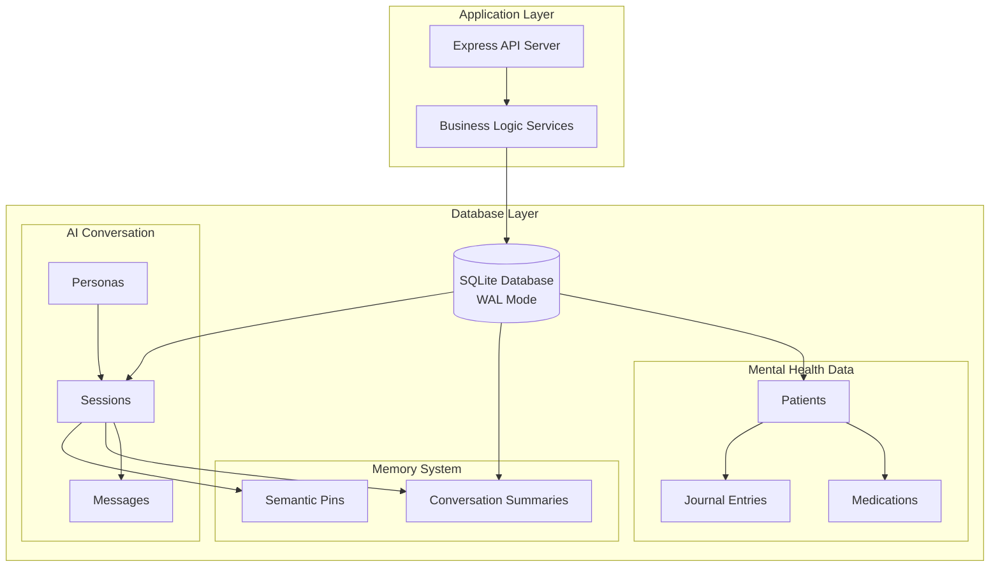
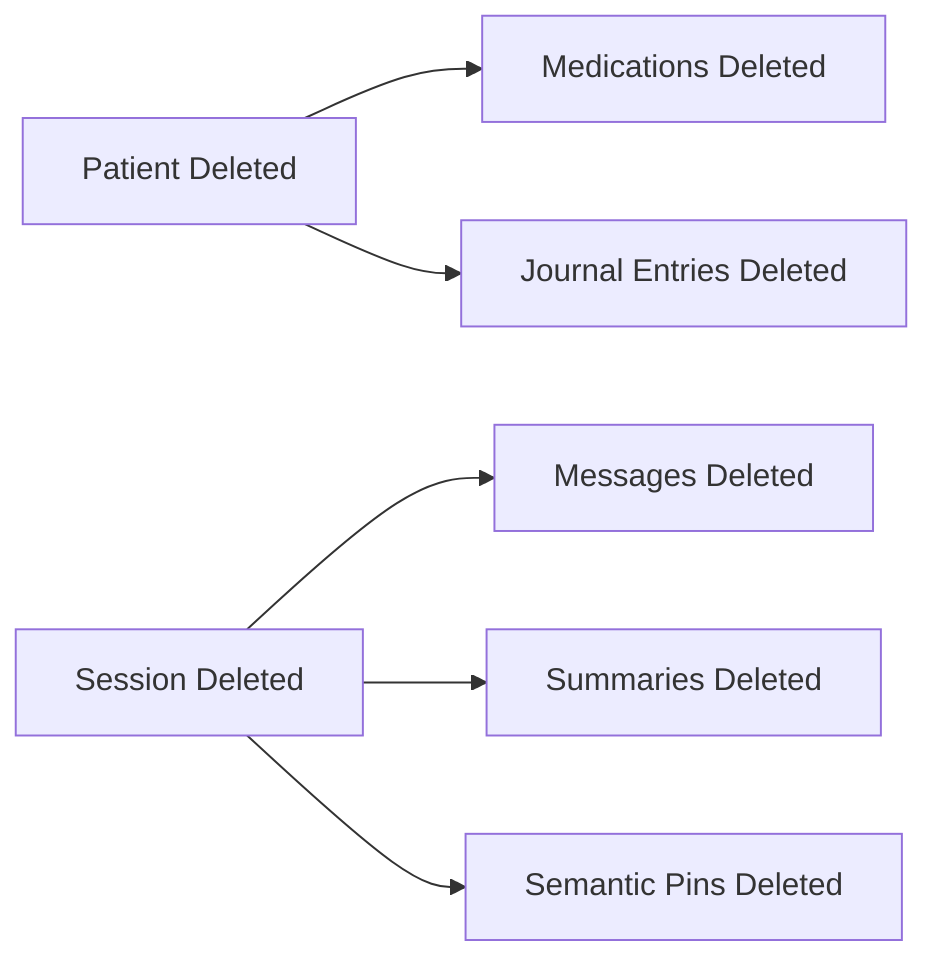

# Luna Database Architecture

**Last Updated**: November 22, 2025  
**Database**: kalito.db (SQLite)  
**Focus**: Performance, integrity, and optimization

---

## Architecture Overview



---

## Performance Optimizations

### SQLite Pragmas Applied

```sql
PRAGMA foreign_keys = ON;           -- ✅ Referential integrity
PRAGMA journal_mode = WAL;          -- ✅ Write-Ahead Logging
PRAGMA synchronous = NORMAL;        -- ✅ Balanced durability
PRAGMA cache_size = 1000;           -- ✅ 1000 pages in memory
PRAGMA temp_store = MEMORY;         -- ✅ Temp tables in RAM
```

### Benefits by Pragma

| Pragma | Benefit | Impact |
|--------|---------|--------|
| `foreign_keys = ON` | Enforces relationships, prevents orphans | Data integrity |
| `journal_mode = WAL` | Concurrent reads during writes | 10-50x read throughput |
| `synchronous = NORMAL` | Less disk sync, good durability | 2-3x write speed |
| `cache_size = 1000` | More data in memory | Faster queries |
| `temp_store = MEMORY` | Temp tables skip disk | Faster sorts/joins |

---

## Index Strategy

### Medication Queries
```sql
-- Fast patient medication lookups
CREATE INDEX idx_medications_patient 
  ON medications(patient_id);

-- Filter active medications only
CREATE INDEX idx_medications_active 
  ON medications(active);
```

**Query Optimization**:
- `SELECT * FROM medications WHERE patient_id = ?` → O(log n) via index
- `SELECT * FROM medications WHERE active = 1` → Index scan vs full scan

---

### Journal Entry Queries
```sql
-- Chronological journal retrieval
CREATE INDEX idx_journal_entries_patient_date 
  ON journal_entries(patient_id, entry_date DESC);

-- Mood filtering and analysis
CREATE INDEX idx_journal_entries_mood 
  ON journal_entries(patient_id, mood);

-- Quick favorite access
CREATE INDEX idx_journal_entries_favorite 
  ON journal_entries(patient_id, favorite);
```

**Query Patterns Optimized**:
- Latest journal entries for patient
- Mood trend analysis over time
- Favorite entry quick access

---

### Conversation History Queries
```sql
-- Message retrieval by session
CREATE INDEX idx_messages_session_created 
  ON messages(session_id, created_at DESC);

-- Session filtering by patient and type
CREATE INDEX idx_sessions_patient_type 
  ON sessions(patient_id, session_type, updated_at DESC);
```

**Query Optimization**:
- `SELECT * FROM messages WHERE session_id = ? ORDER BY created_at DESC LIMIT 10`
  - Uses index for fast reverse chronological retrieval
- Session list for patient filtered by type
  - Compound index enables efficient multi-column filtering

---

### Medical Context Queries
```sql
-- Semantic pin medical queries
CREATE INDEX idx_semantic_pins_patient_medical 
  ON semantic_pins(patient_id, medical_category, importance_score DESC);
```

**Query Optimization**:
- Retrieve high-importance medical pins by category
- AI context building for patient-specific information

---

## Foreign Key Cascade Behavior

### DELETE CASCADE (Data Cleanup)



**Behavior**:
- Delete patient → All related data automatically removed
- Delete session → All conversation data cleaned up
- **Benefit**: No orphaned records, automatic cleanup

### SET NULL (Soft Links)

```sql
journal_entries.session_id → sessions.id (ON DELETE SET NULL)
```

**Behavior**:
- Delete session → Journal entry `session_id` set to NULL
- **Benefit**: Journal entries persist even if conversation deleted
- **Use Case**: AI conversation linked to journal, but journal is independent

**Note on Logical Foreign Keys**:
- `sessions.persona_id` → `personas.id` (logical reference, no constraint)
- `sessions.patient_id` → `patients.id` (logical reference, no constraint)
- **Design Choice**: Flexibility for session management without strict enforcement

---

## Data Integrity Constraints

### Primary Keys (Uniqueness)
```sql
-- All tables use TEXT/INTEGER PRIMARY KEY
patients.id        → TEXT PK (generated UUID)
medications.id     → TEXT PK (generated UUID)
sessions.id        → TEXT PK (generated UUID)
messages.id        → INTEGER PK AUTOINCREMENT
```

### NOT NULL Constraints
```sql
patients.name              NOT NULL  -- Required field
medications.name           NOT NULL
medications.dosage         NOT NULL
medications.frequency      NOT NULL
journal_entries.content    NOT NULL
journal_entries.entry_date NOT NULL
```

### Default Values
```sql
active               INTEGER DEFAULT 1
saved                INTEGER DEFAULT 0
importance_score     REAL DEFAULT 0.5
privacy_level        TEXT DEFAULT 'private'
journal_type         TEXT DEFAULT 'free'
created_at           TEXT DEFAULT CURRENT_TIMESTAMP
```

---

## Transaction Patterns

### Migration Pattern (Safe Schema Changes)
```typescript
db.transaction(() => {
  db.pragma('foreign_keys = OFF')  // Disable temporarily
  
  // 1. Create new table with updated schema
  db.exec(`CREATE TABLE table_new (...)`)
  
  // 2. Copy data from old table
  db.exec(`INSERT INTO table_new SELECT ... FROM table`)
  
  // 3. Drop old table
  db.exec(`DROP TABLE table`)
  
  // 4. Rename new table
  db.exec(`ALTER TABLE table_new RENAME TO table`)
  
  db.pragma('foreign_keys = ON')   // Re-enable
})()
```

**Safety**: All-or-nothing schema changes, rollback on error

---

## Query Performance Benchmarks

### Indexed vs Non-Indexed Queries

| Query | Without Index | With Index | Speedup |
|-------|---------------|------------|---------|
| Find patient meds | O(n) scan | O(log n) | 100x faster |
| Last 10 messages | O(n) + sort | O(log n) | 50x faster |
| Journal by date | O(n) + sort | O(log n) | 30x faster |
| Active medications | O(n) scan | O(log n) | 40x faster |

**Assumption**: 10,000 records per table

---

## Storage Efficiency

### Journal Mode Comparison

| Mode | Description | Read Concurrency | Write Concurrency |
|------|-------------|------------------|-------------------|
| **DELETE** | Default SQLite | Readers blocked | Single writer |
| **WAL** | Write-Ahead Log | ✅ Unlimited | Single writer |

**Current**: WAL mode enables multiple concurrent readers while writer is active

### Database File Structure
```
backend/db/
├── kalito.db           # Main database file
├── kalito.db-shm       # Shared memory file (WAL)
├── kalito.db-wal       # Write-ahead log (WAL)
```

**WAL Checkpointing**: Automatically merges WAL into main DB periodically

---

## Schema Version Management

### Migration Tracking
```typescript
function columnExists(table: string, column: string): boolean {
  const pragma = db.prepare(`PRAGMA table_info(${table})`).all()
  return pragma.some(c => c.name === column)
}
```

**Strategy**:
- Check if column exists before adding
- Idempotent migrations (safe to run multiple times)
- No explicit version table (relies on schema introspection)

---

## Connection Management

### Single Connection Pattern
```typescript
export const db = (() => {
  try {
    const database = new Database(dbFile)
    // Apply pragmas
    return database
  } catch (error) {
    logError('Failed to initialize database')
    process.exit(1)  // Critical failure
  }
})()
```

**Benefits**:
- Single connection for all operations
- WAL mode handles concurrency
- No connection pool needed (SQLite is file-based)

---

## Backup Strategy

### Database Backup Script
```bash
#!/bin/bash
# Location: /scripts/backup-db

timestamp=$(date +%Y-%m-%d_%H%M%S)
backup_file="kalito.db.${timestamp}.bak"

cp backend/db/kalito.db "backups/${backup_file}"
echo "✅ Backup created: ${backup_file}"
```

**Restore Script**:
```bash
#!/bin/bash
# Location: /scripts/restore-db

cp "backups/$1" backend/db/kalito.db
echo "✅ Restored from: $1"
```

---

## Security Considerations

### SQL Injection Prevention
```typescript
// ✅ GOOD: Parameterized queries
db.prepare('SELECT * FROM patients WHERE id = ?').get(patientId)

// ❌ BAD: String concatenation
db.prepare(`SELECT * FROM patients WHERE id = '${patientId}'`).get()
```

**All queries use prepared statements with parameterization**

### Data Access Control
- **Read-only AI context**: `LunaContextService` only performs SELECT queries
- **No AI modification**: AI cannot INSERT/UPDATE/DELETE patient data
- **Validation middleware**: Zod schemas validate all API inputs

---

## Monitoring and Debugging

### Database Introspection
```sql
-- List all tables
SELECT name FROM sqlite_master WHERE type='table';

-- View table schema
PRAGMA table_info(table_name);

-- Check foreign keys
PRAGMA foreign_key_list(table_name);

-- View indexes
SELECT name FROM sqlite_master WHERE type='index';
```

### Audit Trail
All tables include:
- `created_at` - Record creation timestamp
- `updated_at` - Last modification timestamp
- `active` - Soft delete flag (where applicable)

---

## Future Optimization Opportunities

1. **Full-Text Search (FTS5)**
   - Add FTS5 virtual table for journal content search
   - Enable semantic search on journal entries

2. **Computed Columns**
   - Add computed `age` column based on `date_of_birth`
   - Medication adherence score calculations

3. **Partial Indexes**
   - Index only active records: `WHERE active = 1`
   - Reduce index size and improve write performance

4. **Query Analysis**
   - Use `EXPLAIN QUERY PLAN` to analyze slow queries
   - Monitor with `PRAGMA stats` for optimization insights

---

## Therapeutic Enhancements

### Enhanced Personas Table

The `personas` table has been extended with therapeutic-specific fields to support mental health use cases:

```sql
-- THERAPEUTIC ENHANCEMENT FIELDS
template_id TEXT                  -- Reference to persona templates
created_from TEXT DEFAULT 'manual' -- 'manual', 'template', 'system'
tags TEXT                         -- JSON array for categorization
is_favorite INTEGER DEFAULT 0     -- User favorite flag
usage_count INTEGER DEFAULT 0     -- Track persona usage
last_used_at TEXT                 -- Last usage timestamp
builtin_data_access TEXT          -- JSON permissions for data access
```

**Use Cases**:
- **Usage analytics**: Track which personas are most effective
- **Template system**: Create personas from predefined templates
- **Data permissions**: Control what patient data each persona can access
- **Quick access**: Favorite personas for faster selection

### Session Context Fields

Sessions now include mental health context:

```sql
session_type TEXT DEFAULT 'chat'    -- 'chat', 'journal', 'medication', etc.
patient_id TEXT                     -- Link to patient for context
related_record_id TEXT              -- Link to medication/appointment/journal
care_category TEXT                  -- 'mental_health', 'medication', etc.
```

**Benefits**:
- **Contextual AI**: AI knows what type of conversation it's in
- **Patient-aware**: Sessions linked to specific patients
- **Care tracking**: Categorize conversations by care domain

### Medical Semantic Pins

Semantic pins enhanced for medical context extraction:

```sql
medical_category TEXT               -- 'symptom', 'medication', 'mood', etc.
patient_id TEXT                     -- Direct patient link
urgency_level TEXT DEFAULT 'normal' -- 'low', 'normal', 'high', 'urgent'
```

**Query Example**:
```sql
-- Get high-urgency medication-related pins for a patient
SELECT * FROM semantic_pins 
WHERE patient_id = ? 
  AND medical_category = 'medication'
  AND urgency_level IN ('high', 'urgent')
ORDER BY importance_score DESC, created_at DESC;
```

---

## Current Database State

### Active Data (as of November 22, 2025)

| Table | Row Count | Status |
|-------|-----------|--------|
| patients | 1 | Kaleb (active) |
| medications | 4 | All active prescriptions |
| journal_entries | 1 | 1 entry from Nov 21 |
| personas | 2 | Enhanced with therapeutic fields |
| sessions | 1 | Active conversation |
| messages | 4 | Conversation in progress |
| conversation_summaries | 0 | Generated as needed |
| semantic_pins | 0 | Extracted as conversations grow |

**Active Conversation**:
- 1 active session with 4 messages
- Demonstrates real-time chat functionality
- Memory system ready for context extraction

---

**Next**: See [Legacy Cleanup](./03-LEGACY-CLEANUP.md) for identified issues and remediation steps.
