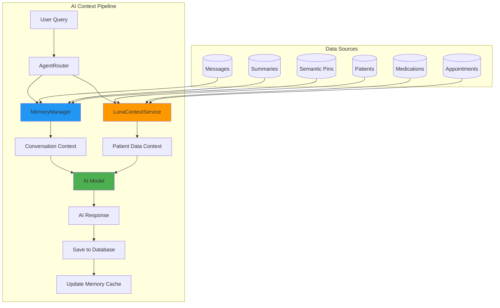

# Luna AI Context & Memory Architecture

**Last Updated:** November 14, 2025  
**Version:** 1.0  
**Status:** Production Ready ✅

This document provides comprehensive documentation for Luna's AI context and memory management system, which powers intelligent conversations with full awareness of patient data and conversation history.

## 🏗️ Overview

Luna's AI system consists of two primary services that work together to provide intelligent, context-aware conversations:

1. **LunaContextService** - Provides real-time patient data context (medications, appointments, demographics)
2. **MemoryManager** - Manages conversation history, summarization, and semantic memory

### Architecture Diagram



## 📊 LunaContextService

**Location:** `/backend/logic/lunaContextService.ts`  
**Purpose:** Provides AI models with comprehensive patient data context

### Core Functionality

The LunaContextService bridges patient data with AI conversations, enabling the AI to reference:
- Patient demographics and personal information
- Current medications with full prescription details
- Recent and upcoming appointments
- Treatment history and notes

### Key Features

#### 🔒 **Security & Privacy**
```typescript
// Read-only operations only - AI cannot modify patient data
// All models get full context access for comprehensive care
// Strict confidentiality protocols in generated prompts
```

#### 🎯 **Mental Health Focus**
- Optimized for therapeutic conversations
- Caregiver-aware context (Caleb caring for mother Aurora)
- Crisis intervention content prioritization
- Family dynamics awareness

#### 📋 **Data Structures**

```typescript
interface PatientContext {
  id: string
  name: string
  age?: number              // Calculated from date_of_birth
  gender?: string
  phone?: string
  city?: string
  state?: string
  occupation?: string
  occupation_description?: string
  languages?: string
  primary_doctor_id?: string
  notes?: string
}

interface MedicationContext {
  id: string
  patientId: string
  patientName?: string      // For easy reference
  name: string             // Brand name
  genericName?: string
  dosage: string
  frequency: string
  prescribingDoctor?: string
  pharmacy?: string
  rxNumber?: string
  notes?: string
}

interface AppointmentContext {
  id: string
  appointmentDate: string
  appointmentTime?: string
  appointmentType?: string
  location?: string
  status: string
  preparationNotes?: string
  outcomeSummary?: string
  followUpRequired?: boolean
}
```

### Core Methods

#### `getLunaContext(adapter: LLMAdapter, patientId?: string): LunaContext`
**Primary method** - Returns comprehensive context for AI models

```typescript
const context = lunaContextService.getLunaContext(adapter, patientId)
// Returns: { patients, medications, recentAppointments, summary }
```

#### `generateContextualPrompt(adapter: LLMAdapter, userQuery: string, sessionId?: string): string`
**Smart context injection** - Analyzes user query and session to provide relevant context

```typescript
// Automatically detects patient references in queries
// Session-aware patient focus
// Returns formatted prompt with relevant data
const contextPrompt = lunaContextService.generateContextualPrompt(
  adapter, 
  "How is Caleb's medication working?", 
  sessionId
)
```

#### `findPatientByReference(reference: string): PatientContext | null`
**Natural language patient lookup** - Case-insensitive patient name matching

```typescript
// Supports partial names, nicknames, and fuzzy matching
const patient = lunaContextService.findPatientByReference("Caleb")
const patient = lunaContextService.findPatientByReference("mom") // Aurora
```

### Integration with Structured Services

LunaContextService leverages specialized services for data validation:

```typescript
// Uses StructuredMedicationService for validated medication data
this.structuredMedicationService.getMedicationsStructured(patientId)

// Uses StructuredAppointmentService for consistent appointment data
this.structuredAppointmentService.getRecentAppointmentsForContext(patientId)
```

### Context Summary Generation

The service automatically generates comprehensive summaries:

```typescript
## Mental Health Practice Context Summary

### Patients (1)
- **Caleb Sanchez**, age 39, male
  Phone: 956-324-1560
  Location: Laredo, Texas
  Occupation: Caregiver "Palomita"
  Details: I take care of my elderly Mom Aurora Sanchez.
  Languages: English and Spanish

### Active Medications (3)
**Caleb Sanchez (3 medications)**
- Lithium (Lithium Carb) 300mg - three_times_daily
  Prescribed by: Myriam Thiele
  Pharmacy: Genoa Healthcare (Rx: 143801/2)

### Upcoming Appointments (1)
- 2025-11-17 at 14:30 (routine)
  Location: 1500 Pappas St, Laredo, TX 78041
```

### AI Instructions Integration

Each context includes specific AI behavioral instructions:

```typescript
## CRITICAL Instructions for AI Assistant
- **USE ONLY CURRENT DATA**: The information above is the AUTHORITATIVE source
- **PATIENT CONFIDENTIALITY**: Treat all information as strictly confidential  
- **ACCURATE REPORTING**: Use only the data shown above
- **NO HALLUCINATION**: Do not invent or assume details not provided
- **PROFESSIONAL CONTEXT**: This is for Caleb's mental health practice management
```

## 🧠 MemoryManager

**Location:** `/backend/logic/memoryManager.ts`  
**Purpose:** Hybrid memory system with rolling buffer, summarization, and semantic pins

### Core Architecture

The MemoryManager implements a sophisticated three-layer memory system:

1. **Rolling Buffer** - Recent messages (5-8 messages)
2. **Conversation Summaries** - AI-generated summaries of message groups
3. **Semantic Pins** - Important extracted information

### Key Features

#### ⚡ **Performance Optimization**
```typescript
// Intelligent caching with 30-second TTL
private messageCountCache = new Map()
private recentMessagesCache = new Map()
private readonly CACHE_TTL = 30000 // Optimized for therapy sessions
```

#### 🎯 **Mental Health Optimization**
```typescript
// Therapy-optimized summarization threshold
private readonly SUMMARY_THRESHOLD = 8 // Messages before auto-summarization

// Mental health importance scoring
if (text.includes('feeling') || text.includes('anxiety') || text.includes('depression')) {
  score += 0.25 // Higher than technical content
}
```

#### 🔄 **Industry Standard Memory Pattern**
```typescript
// Build context from existing messages BEFORE saving current input
1. getRecentMessages() - Retrieve conversation history
2. Save user message to database
3. Pass pre-built context to AI
4. Save AI response with metadata
```

### Core Methods

#### `buildContext(sessionId: string, maxTokens?: number): Promise<MemoryContext>`
**Primary memory method** - Builds comprehensive conversation context

```typescript
const context = await memoryManager.buildContext(sessionId, 3000)
// Returns: { recentMessages, semanticPins, summaries, totalTokens }
```

#### `scoreMessageImportance(message: MessageWithImportance): number`
**Intelligent scoring** - Tailored for mental health conversations

```typescript
// Mental health content scoring
if (text.includes('depression') || text.includes('anxiety')) {
  score += 0.25 // High therapeutic importance
}

// Crisis content gets highest priority
if (text.includes('crisis') || text.includes('suicidal')) {
  score += 0.3 // Maximum urgency
}

// Family/caregiver content (Caleb's specific situation)
if (text.includes('mom') || text.includes('aurora')) {
  score += 0.15 // Family caregiving focus
}
```

#### `autoSummarizeSession(sessionId: string): Promise<ConversationSummary | null>`
**Automatic summarization** - Creates summaries when conversation reaches threshold

```typescript
// Smart session-aware model selection
private getSummarizationModel(sessionId: string): string {
  const sessionModel = this.getSessionModel(sessionId)
  
  if (sessionModel && this.isLocalModel(sessionModel)) {
    return sessionModel // Use local model for offline capability
  }
  
  return 'gpt-4.1-nano' // Fallback to Luna's preferred cloud model
}
```

#### `createSemanticPin(request: CreatePinRequest): SemanticPin`
**Information extraction** - Manually or automatically create important information pins

```typescript
const pin = memoryManager.createSemanticPin({
  session_id: sessionId,
  content: "Patient reported significant mood improvement with new medication",
  source_message_id: messageId,
  importance_score: 0.9,
  pin_type: 'therapeutic_insight'
})
```

### Memory Context Structure

```typescript
interface MemoryContext {
  recentMessages: MessageWithImportance[]    // Last 5-8 messages
  semanticPins: SemanticPin[]               // Top 3-5 important extracts
  summaries: ConversationSummary[]          // Recent 2-3 summaries
  totalTokens: number                       // Estimated token count
}

interface MessageWithImportance {
  id: number
  session_id: string
  role: 'user' | 'assistant'
  text: string
  model_id?: string
  token_usage?: number
  importance_score: number    // 0.0 - 1.0
  created_at: string
}
```

### Summarization System

#### AI-Generated Summaries
The system uses session-aware model selection for summarization:

```typescript
// Enhanced prompts for different model types
const systemPrompt = isLocal 
  ? `TASK: Create a brief summary of the conversation below. 
     FORMAT: 1-2 sentences describing key topics and outcomes.
     MENTAL HEALTH CONTEXT: Include emotional states, treatment topics, family concerns.`
  : `You are a conversation summarizer for Luna mental health practice. 
     Focus on therapeutic relevance and maintain patient confidentiality.`
```

#### Fallback System
When AI summarization fails, the system creates structured fallbacks:

```typescript
// Topic extraction for mental health conversations
private extractTopics(messages: MessageWithImportance[]): string[] {
  // Emotional states: depression, anxiety, stress, mood
  // Treatment: medication, therapy, appointments  
  // Family: caregiving, family dynamics
  // Wellness: coping strategies, sleep, exercise
  // Crisis: urgent situations, support needs
}
```

### Caching Strategy

#### Performance-Oriented Caching
```typescript
// Cache recent messages with session-specific keys
private recentMessagesCache = new Map<string, { messages, timestamp }>()

// Intelligent cache invalidation
public invalidateSessionCache(sessionId: string): void {
  // Clear all cache entries for the session
  for (const key of this.recentMessagesCache.keys()) {
    if (key.startsWith(`${sessionId}:`)) {
      this.recentMessagesCache.delete(key)
    }
  }
}
```

#### Cache TTL Optimization
- **30 seconds** cache TTL (longer than typical due to therapy session patterns)
- **Automatic cleanup** of expired entries
- **Session-specific invalidation** when new messages are added

### Smart Truncation

When context exceeds token limits, the system implements intelligent truncation:

```typescript
private truncateContext(messages, pins, summaries, maxTokens): MemoryContext {
  // Priority hierarchy:
  // 1. Recent messages (minimum 3 messages always preserved)
  // 2. High-importance semantic pins
  // 3. Recent summaries
  
  // Token estimation: ~0.75 tokens per character
  // Smart content preservation based on importance scores
}
```

## 🔄 Integration Flow

### Complete Context Flow
```typescript
// 1. User sends message to /api/agent
app.post('/api/agent', async (req, res) => {
  const { sessionId, message } = req.body
  
  // 2. Build conversation context BEFORE saving message
  const conversationHistory = await memoryManager.buildContext(sessionId)
  
  // 3. Get patient data context
  const patientContext = lunaContextService.generateContextualPrompt(
    adapter, message, sessionId
  )
  
  // 4. Save user message
  const userMessageId = await saveMessage(sessionId, 'user', message)
  
  // 5. Send to AI with full context
  const aiResponse = await runAgent({
    modelName,
    input: message,
    conversationHistory,  // Memory context
    systemPrompt: basePrompt + patientContext,  // Patient context
    sessionId
  })
  
  // 6. Save AI response
  await saveMessage(sessionId, 'assistant', aiResponse.reply)
  
  // 7. Update memory cache
  memoryManager.invalidateSessionCache(sessionId)
  
  // 8. Auto-summarize if needed
  await memoryManager.autoSummarizeSession(sessionId)
})
```

### Context Building Process
1. **Memory Context**: Recent messages, summaries, semantic pins
2. **Patient Context**: Demographics, medications, appointments
3. **Session Context**: Model selection, patient focus
4. **Query Analysis**: Extract patient references, intent
5. **Smart Merging**: Combine contexts without duplication
6. **Token Management**: Intelligent truncation if needed

## 📊 Performance Characteristics

### Timing Benchmarks
- **Context Building**: ~50-100ms (cached)
- **Context Building**: ~200-500ms (cold)
- **Patient Context**: ~10-50ms
- **Memory Invalidation**: ~5-10ms
- **Auto-summarization**: ~2-5 seconds

### Memory Usage
- **Message Cache**: ~1MB per 1000 cached messages
- **Context Objects**: ~10KB per session context
- **Summary Storage**: ~500B per conversation summary
- **Semantic Pins**: ~200B per pin

### Scalability Notes
- **Cache TTL**: Optimized for therapy session patterns (30s)
- **Batch Summarization**: Processes 8 messages at a time
- **Token Limits**: 3000 tokens default, intelligent truncation
- **Session Isolation**: Each session maintains independent context

## 🛠️ Configuration Options

### Environment Variables
```env
# Memory Management
MEMORY_CACHE_TTL=30000              # Cache time-to-live in ms
MEMORY_SUMMARY_THRESHOLD=8          # Messages before summarization
MEMORY_DEFAULT_TOKEN_LIMIT=3000     # Default context token limit
MEMORY_MAX_RECENT_MESSAGES=8        # Maximum recent messages

# Context Service  
CONTEXT_MAX_RECENT_DAYS=30          # Days for "recent" appointments
CONTEXT_ENABLE_PATIENT_DETECTION=true  # Auto-detect patients in queries
```

### Model Configuration
```typescript
// Summarization model selection
private getSummarizationModel(sessionId: string): string {
  // Session model if local (for offline capability)
  // gpt-4.1-nano fallback (Luna's preferred cloud model)
}

// Importance scoring weights
MENTAL_HEALTH_WEIGHT = 0.25         // Therapeutic content boost
CRISIS_WEIGHT = 0.30               // Crisis content (highest priority)
FAMILY_WEIGHT = 0.15               // Family/caregiving content
TECHNICAL_WEIGHT = 0.10            // Technical content (lower in therapy)
```

## 🚨 Error Handling & Fallbacks

### MemoryManager Fallbacks
```typescript
// When AI summarization fails
return this.createFallbackSummary(messages)
// → "Conversation with 8 messages about: anxiety, medication management, family caregiving"

// When context building fails  
return {
  recentMessages: this.getRecentMessages(sessionId, this.DEFAULT_CONTEXT_LIMIT),
  semanticPins: [],
  summaries: [],
  totalTokens: 0,
}

// When cache corruption occurs
this.cleanupCache() // Automatic cleanup of expired entries
```

### LunaContextService Fallbacks
```typescript
// When patient data unavailable
if (context.patients.length === 0) {
  return "" // No context injection
}

// When database queries fail
catch (error) {
  console.error('Error fetching patients for context:', error)
  return [] // Empty results, continue operation
}

// When patient not found
return null // Graceful degradation
```

### Network & Offline Handling
```typescript
// Detect network errors for offline scenarios
const isNetworkError = errorMessage.includes('ECONNREFUSED') || 
                      errorMessage.includes('ETIMEDOUT')

if (isNetworkError) {
  return `📱 Offline summary: ${messageCount} messages. Recent: "${lastMessage}..."`
}
```

## 📝 Usage Examples

### Basic Context Retrieval
```typescript
import { LunaContextService } from './logic/lunaContextService'
import { MemoryManager } from './logic/memoryManager'

const contextService = new LunaContextService()
const memoryManager = new MemoryManager()

// Get patient context for AI
const patientContext = contextService.getLunaContext(adapter)
console.log(`Found ${patientContext.patients.length} patients`)
console.log(`Active medications: ${patientContext.medications.length}`)

// Get conversation context  
const memoryContext = await memoryManager.buildContext(sessionId)
console.log(`Recent messages: ${memoryContext.recentMessages.length}`)
console.log(`Semantic pins: ${memoryContext.semanticPins.length}`)
```

### Smart Query Analysis
```typescript
// Automatic patient detection
const contextPrompt = contextService.generateContextualPrompt(
  adapter,
  "How is mom's anxiety doing with the new medication?", // References Aurora
  sessionId
)
// Returns patient-focused context for Aurora's treatment
```

### Memory Management
```typescript
// Manual importance scoring
const importance = memoryManager.scoreMessageImportance({
  role: 'user',
  text: "I'm feeling really depressed and overwhelmed with caregiving",
  // ... other properties
})
console.log(`Importance: ${importance}`) // → 0.9 (high therapeutic importance)

// Check if summarization needed
if (memoryManager.needsSummarization(sessionId)) {
  const summary = await memoryManager.autoSummarizeSession(sessionId)
  console.log('Created summary:', summary.summary)
}
```

### Semantic Pins
```typescript
// Create important information pins
const pin = memoryManager.createSemanticPin({
  session_id: sessionId,
  content: "Patient switched from Zyprexa 10mg to 5mg due to side effects",
  source_message_id: messageId,
  importance_score: 0.9,
  pin_type: 'medication_change'
})
```

## 🔐 Security & Privacy

### Data Protection
- **Read-only operations**: AI cannot modify patient data
- **Session isolation**: Each session maintains independent context
- **Confidentiality instructions**: Every context includes privacy guidelines
- **No data hallucination**: Strict instructions against inventing patient details

### Access Control
- **Full context access**: All models receive comprehensive patient data (single-user practice)
- **Session-based focus**: Optional patient focus based on session context
- **Audit trails**: All context access logged for therapeutic review

### Privacy Guidelines
```typescript
// Embedded in every AI context
"## CRITICAL Instructions for AI Assistant
- **PATIENT CONFIDENTIALITY**: Treat all information as strictly confidential
- **ACCURATE REPORTING**: Use only the data shown above  
- **NO HALLUCINATION**: Do not invent patient details not provided
- **PROFESSIONAL CONTEXT**: This is for mental health practice management"
```

## 🧪 Testing & Validation

### Unit Tests
- **Context building accuracy**
- **Memory cache invalidation**  
- **Patient detection logic**
- **Importance scoring consistency**
- **Fallback behavior verification**

### Integration Tests
- **End-to-end conversation flow**
- **Multi-session context isolation**
- **Performance under load**
- **Error recovery scenarios**

### Performance Tests
- **Cache hit/miss ratios**
- **Context building latency**
- **Memory usage patterns**
- **Token estimation accuracy**

## 🔧 Troubleshooting

### Common Issues

#### Context Not Available
```bash
# Check database connectivity
node -e "const {db} = require('./db/db'); console.log(db.prepare('SELECT COUNT(*) FROM patients').get())"

# Verify patient data
GET /api/patients
```

#### Memory Cache Issues
```typescript
// Clear all caches
memoryManager.cleanupCache()

// Force cache invalidation
memoryManager.invalidateSessionCache(sessionId)
```

#### Summarization Failures
```typescript
// Check model availability
const adapter = getModelAdapter(modelName)
console.log('Model type:', adapter.type)

// Review fallback summaries
// Look for "Offline summary" or "Conversation with X messages" patterns
```

### Debug Logging
```typescript
// Enable memory manager debug logging
console.log(`[Debug] Cache check for ${sessionId}:`, {
  hasCached: !!cached,
  cacheAge: now - cached.timestamp,
  foundMessages: messages.length
})
```

### Performance Monitoring
```typescript
// Monitor context building performance
const startTime = Date.now()
const context = await memoryManager.buildContext(sessionId)
const duration = Date.now() - startTime
console.log(`Context built in ${duration}ms`)
```

## 📚 Related Documentation

- **[Database Schema](../db/DB-SCHEMA.md)** - Patient data structure
- **[Conversation Fix](../fixes/conversation-context-continuity-fix.md)** - Memory architecture details  
- **[Agent Service Documentation](./agent-service.md)** - AI model integration
- **[Model Registry Documentation](./model-registry.md)** - Model adapter system

---

**Documentation Status**: ✅ Complete  
**Next Review**: December 2025  
**Maintainer**: Luna Development Team