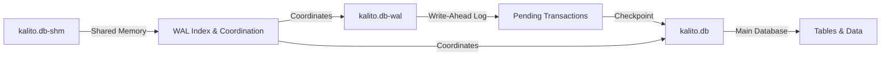
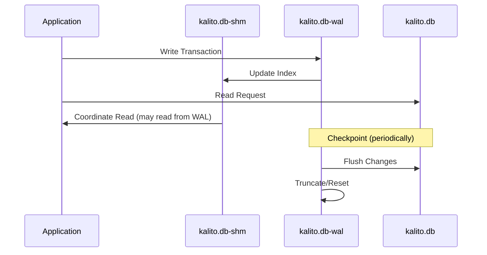
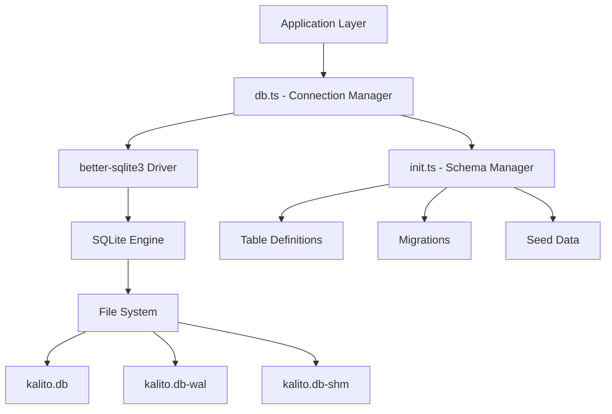
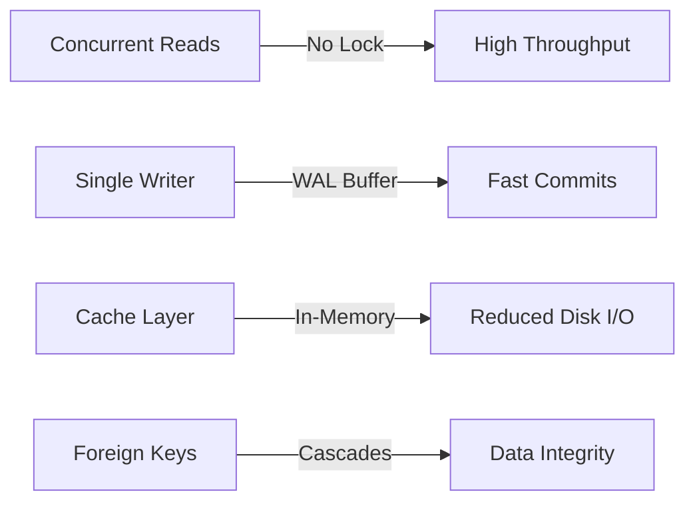

# Database Overview

## Introduction

The Kalito database system is built on **SQLite 3** using the `better-sqlite3` Node.js library. It serves as the persistence layer for an AI chat application that supports multiple AI models, conversation sessions, personas (AI personality configurations), and an advanced memory management system.

## Database Location

- **Development:** `/home/kalito/kalito-labs/kalito-repo/backend/db/kalito.db`
- **Production (compiled):** Resolves dynamically based on whether running from `dist/` folder

The database file location is determined at runtime in `db.ts`:
```typescript
const dbFile = path.resolve(__dirname, __dirname.includes('dist') ? '../../../db/kalito.db' : 'kalito.db')
```

## Database Files

The database consists of three files that work together:



### 1. **kalito.db** - Main Database File
- **Type:** SQLite 3.x database (version 3.50.2)
- **Purpose:** Primary storage container for all application data
- **Size:** Contains 18 database pages with UTF-8 encoding
- **Contains:** 
  - All table schemas
  - All persistent data
  - Indexes and constraints

### 2. **kalito.db-wal** - Write-Ahead Log
- **Type:** SQLite Write-Ahead Log (version 3.7.0)
- **Purpose:** Transaction journal for concurrent read/write operations
- **How it works:**
  - New transactions are written to this file first
  - Allows multiple readers while a write is in progress
  - Periodically "checkpointed" back into the main database file
- **Benefits:**
  - Better concurrency (readers don't block writers)
  - Improved write performance
  - Crash recovery protection

### 3. **kalito.db-shm** - Shared Memory File
- **Type:** SQLite Write-Ahead Log shared memory
- **Purpose:** Index and coordination file for WAL mode
- **Details:**
  - Page size: 4096 bytes
  - Tracks 146 frames across 18 pages
  - Contains checksums and read-marks for data integrity
  - Facilitates coordination between multiple processes accessing the database

## WAL Mode Explained



**Write-Ahead Logging (WAL)** means:
1. Changes are appended to the WAL file instead of overwriting the database
2. Readers can access the main database while writes happen to WAL
3. When WAL grows large, a "checkpoint" operation merges changes back
4. This provides ACID properties with better performance

## Database Architecture Layers



## Core Tables

The database consists of **5 core tables** organized by functionality:

### Session Management
1. **sessions** - Chat session metadata
2. **messages** - Individual messages within sessions

### AI Configuration
3. **personas** - AI personality and parameter configurations

### Memory System (Phase 2)
4. **conversation_summaries** - Condensed historical context
5. **semantic_pins** - Important information flagged for recall

## Database Optimizations

The system is configured with several performance optimizations (from `db.ts`):

| Pragma Setting | Value | Purpose |
|----------------|-------|---------|
| `foreign_keys` | ON | Enforce referential integrity |
| `journal_mode` | WAL | Enable Write-Ahead Logging |
| `synchronous` | NORMAL | Balance durability vs performance |
| `cache_size` | 1000 pages | ~4MB cache for better performance |
| `temp_store` | MEMORY | Keep temporary tables in RAM |

### Performance Characteristics



## File Management

### Backup System
The application includes backup scripts:
- **backup-db**: Creates timestamped backups (e.g., `kalito.db.2025-10-06_180932.bak`)
- **restore-db**: Restores from backup files
- Location: `/home/kalito/kalito-labs/kalito-repo/scripts/`

### Critical on Exit
The database connection is **critical** - if initialization fails, the application exits immediately:
```typescript
process.exit(1) // Exit as database is critical for the application
```

## Data Integrity Features

1. **Foreign Key Constraints**: Automatic CASCADE DELETE ensures orphaned records are cleaned up
2. **Primary Keys**: All tables use appropriate primary keys (TEXT or AUTOINCREMENT)
3. **Timestamps**: Automatic timestamps track creation and updates
4. **Default Values**: Sensible defaults prevent null-related issues
5. **Indexes**: Strategic indexes improve query performance

## Version & Schema Information

- **SQLite Version**: 3.50.2
- **Encoding**: UTF-8
- **Page Size**: 4096 bytes
- **Current Pages**: 18 (with 4 free pages)
- **Schema Version**: 4
- **Database Counter**: 149 (write transactions)

## Use Cases

This database design supports:

1. **Multi-Model AI Chat**: Store conversations with different AI models
2. **Persona System**: Configure and save AI personalities with custom parameters
3. **Session Management**: Create ephemeral or persistent chat sessions
4. **Memory Management**: Intelligent context window management with summaries and pins
5. **Token Tracking**: Monitor usage across messages and models
6. **Importance Scoring**: Weight messages/content by relevance

## Related Documentation

- [02-Table-Schemas.md](./02-Table-Schemas.md) - Detailed table schemas and relationships
- [03-Initialization-Process.md](./03-Initialization-Process.md) - Database setup and migrations
- [04-Connection-Management.md](./04-Connection-Management.md) - Connection handling and configuration
- [05-Memory-System.md](./05-Memory-System.md) - Advanced memory management features
