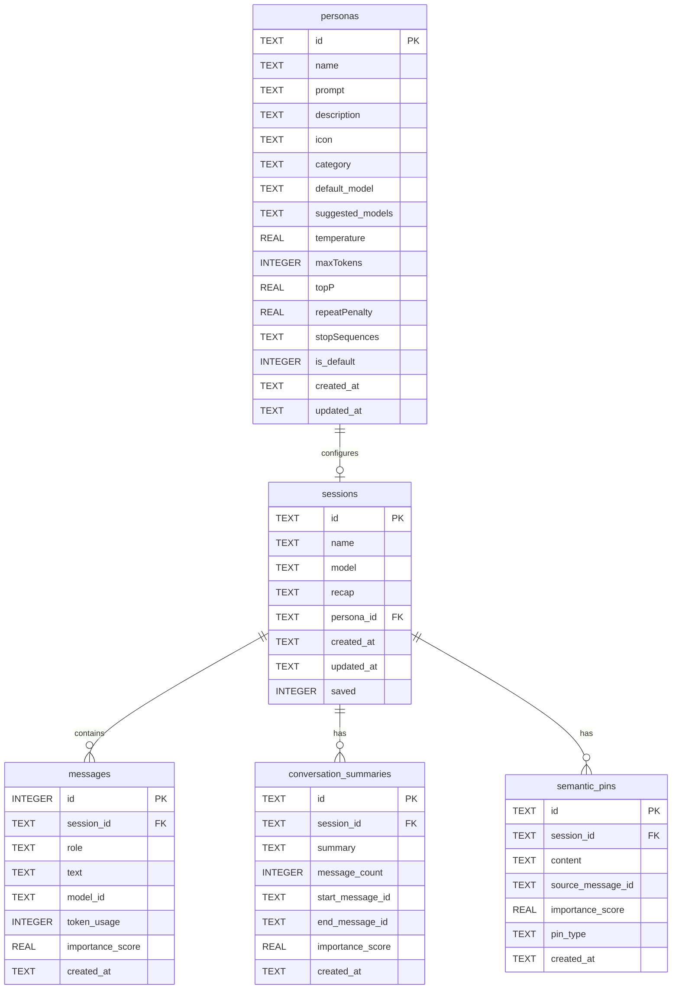
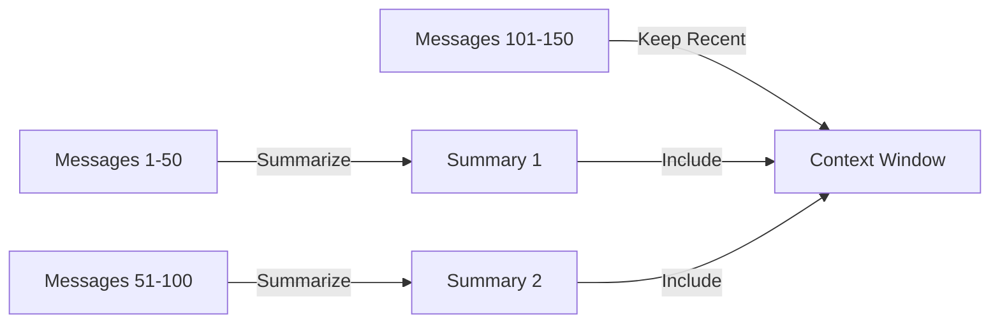
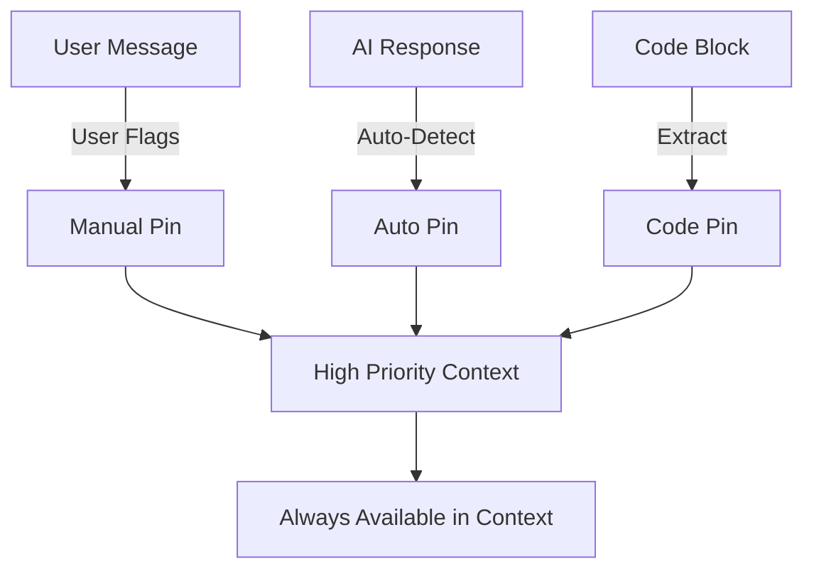
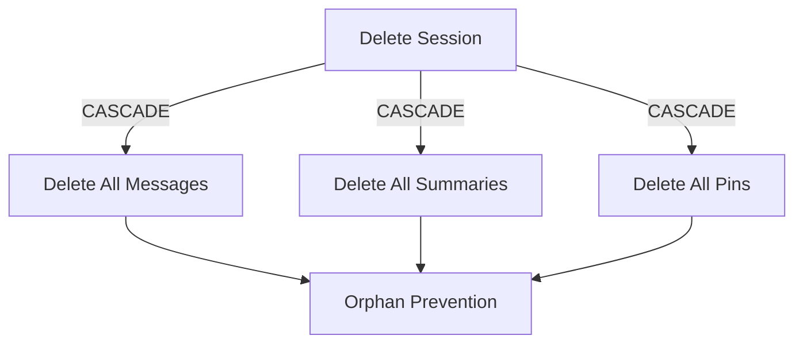
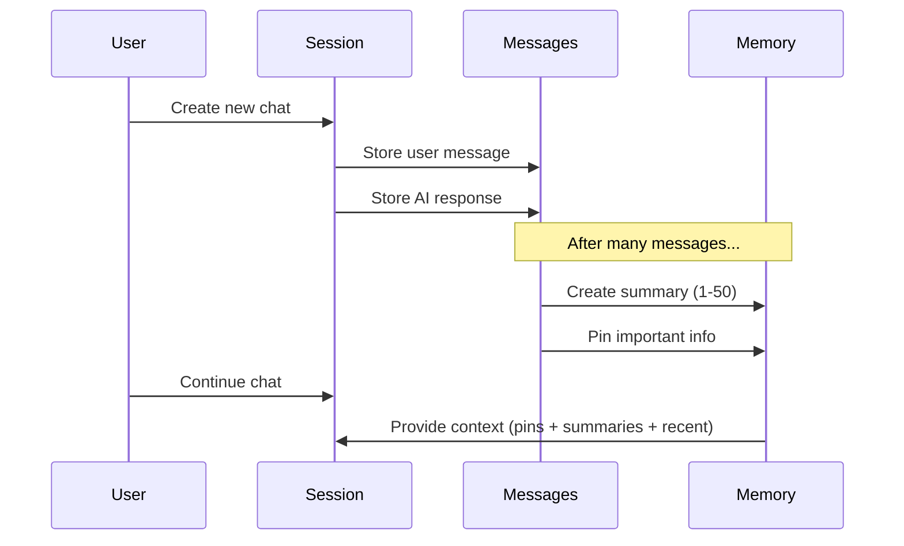

# Table Schemas & Relationships

## Entity Relationship Diagram



## Table Details

### 1. sessions

**Purpose**: Stores chat session metadata. Each session represents a conversation thread with an AI model.

```sql
CREATE TABLE sessions (
  id TEXT PRIMARY KEY,
  name TEXT,
  model TEXT,
  recap TEXT,
  persona_id TEXT,
  created_at TEXT,
  updated_at TEXT,
  saved INTEGER DEFAULT 0
);
```

| Column | Type | Constraints | Description |
|--------|------|-------------|-------------|
| `id` | TEXT | PRIMARY KEY | Unique identifier (UUID format) |
| `name` | TEXT | nullable | User-defined session name |
| `model` | TEXT | nullable | AI model identifier (e.g., "gpt-4", "claude-3") |
| `recap` | TEXT | nullable | Summary/recap of the conversation |
| `persona_id` | TEXT | nullable | Foreign key to personas table |
| `created_at` | TEXT | nullable | ISO 8601 timestamp of creation |
| `updated_at` | TEXT | nullable | ISO 8601 timestamp of last update |
| `saved` | INTEGER | DEFAULT 0 | 0 = ephemeral, 1 = persisted |

**Key Behaviors**:
- **Ephemeral Sessions** (`saved = 0`): Can be cleaned up automatically
- **Saved Sessions** (`saved = 1`): Persist indefinitely
- Used to track which AI model and persona configuration was used
- Acts as the parent for all messages, summaries, and pins

**Relationships**:
- One session has many messages (1:N)
- One session has many conversation_summaries (1:N)
- One session has many semantic_pins (1:N)
- One session may reference one persona (N:1)

---

### 2. messages

**Purpose**: Stores individual messages within chat sessions. Supports the standard chat roles (system, user, assistant).

```sql
CREATE TABLE messages (
  id INTEGER PRIMARY KEY AUTOINCREMENT,
  session_id TEXT NOT NULL,
  role TEXT,
  text TEXT,
  model_id TEXT,
  token_usage INTEGER,
  importance_score REAL DEFAULT 0.5,
  created_at TEXT,
  FOREIGN KEY (session_id) REFERENCES sessions(id) ON DELETE CASCADE
);
```

| Column | Type | Constraints | Description |
|--------|------|-------------|-------------|
| `id` | INTEGER | PRIMARY KEY AUTOINCREMENT | Sequential message identifier |
| `session_id` | TEXT | NOT NULL, FK | Links to parent session |
| `role` | TEXT | nullable | "system", "user", or "assistant" |
| `text` | TEXT | nullable | Message content |
| `model_id` | TEXT | nullable | Which model generated this response |
| `token_usage` | INTEGER | nullable | Token count for this message |
| `importance_score` | REAL | DEFAULT 0.5 | Relevance score (0.0 to 1.0) |
| `created_at` | TEXT | nullable | ISO 8601 timestamp |

**Key Behaviors**:
- **CASCADE DELETE**: When a session is deleted, all messages are automatically removed
- **Importance Scoring**: Used by memory management to prioritize context
- **Token Tracking**: Helps manage context window limits
- **Role-based**: Follows OpenAI's chat completion message format

**Indexes**:
```sql
CREATE INDEX idx_messages_session_created 
  ON messages(session_id, created_at DESC);

CREATE INDEX idx_messages_session_importance_created 
  ON messages(session_id, importance_score DESC, created_at DESC);
```

**Index Purposes**:
- First index: Fast retrieval of recent messages per session
- Second index: Retrieve most important recent messages for context building

**Relationships**:
- Many messages belong to one session (N:1)

---

### 3. personas

**Purpose**: Defines AI personality configurations with behavioral parameters. Personas customize how the AI responds and behaves.

```sql
CREATE TABLE personas (
  id TEXT PRIMARY KEY,
  name TEXT NOT NULL,
  prompt TEXT NOT NULL,
  description TEXT,
  icon TEXT,
  category TEXT,
  default_model TEXT,
  suggested_models TEXT,
  temperature REAL,
  maxTokens INTEGER,
  topP REAL,
  repeatPenalty REAL,
  stopSequences TEXT,
  is_default INTEGER DEFAULT 0,
  created_at TEXT DEFAULT CURRENT_TIMESTAMP,
  updated_at TEXT DEFAULT CURRENT_TIMESTAMP
);
```

| Column | Type | Constraints | Description |
|--------|------|-------------|-------------|
| `id` | TEXT | PRIMARY KEY | Unique identifier |
| `name` | TEXT | NOT NULL | Display name of persona |
| `prompt` | TEXT | NOT NULL | System prompt defining behavior |
| `description` | TEXT | nullable | User-facing description |
| `icon` | TEXT | nullable | Emoji or icon for UI |
| `category` | TEXT | nullable | "cloud" or "local" |
| `default_model` | TEXT | nullable | Preferred model for this persona |
| `suggested_models` | TEXT | nullable | JSON array of compatible models |
| `temperature` | REAL | nullable | Creativity/randomness (0.0-2.0) |
| `maxTokens` | INTEGER | nullable | Response length limit |
| `topP` | REAL | nullable | Nucleus sampling parameter (0.0-1.0) |
| `repeatPenalty` | REAL | nullable | Repetition penalty (0.8-1.5) |
| `stopSequences` | TEXT | nullable | JSON array of stop sequences |
| `is_default` | INTEGER | DEFAULT 0 | 1 if default persona for category |
| `created_at` | TEXT | DEFAULT CURRENT_TIMESTAMP | Creation timestamp |
| `updated_at` | TEXT | DEFAULT CURRENT_TIMESTAMP | Last update timestamp |

**Key Behaviors**:
- **Categories**: Separate "cloud" (API-based) from "local" (self-hosted) models
- **Default Personas**: System seeds two defaults (one per category)
- **Parameter Tuning**: Stores model-specific generation parameters
- **Prompt Engineering**: Central location for system prompts

**Default Personas** (seeded on init):

| ID | Name | Category | Temperature | Max Tokens | Purpose |
|----|------|----------|-------------|------------|---------|
| `default-cloud` | Default Cloud Assistant | cloud | 0.7 | 1500 | General-purpose cloud AI |
| `default-local` | Default Local Assistant | local | 0.6 | 800 | Privacy-focused local AI |

**Relationships**:
- One persona can be used by many sessions (1:N)

---

### 4. conversation_summaries

**Purpose**: Part of the Phase 2 Memory System. Stores condensed summaries of conversation segments to maintain context beyond token limits.

```sql
CREATE TABLE conversation_summaries (
  id TEXT PRIMARY KEY,
  session_id TEXT NOT NULL,
  summary TEXT NOT NULL,
  message_count INTEGER NOT NULL,
  start_message_id TEXT,
  end_message_id TEXT,
  importance_score REAL DEFAULT 0.7,
  created_at TEXT DEFAULT CURRENT_TIMESTAMP,
  FOREIGN KEY (session_id) REFERENCES sessions(id) ON DELETE CASCADE
);
```

| Column | Type | Constraints | Description |
|--------|------|-------------|-------------|
| `id` | TEXT | PRIMARY KEY | Unique identifier |
| `session_id` | TEXT | NOT NULL, FK | Parent session |
| `summary` | TEXT | NOT NULL | Condensed version of messages |
| `message_count` | INTEGER | NOT NULL | How many messages were summarized |
| `start_message_id` | TEXT | nullable | First message ID in range |
| `end_message_id` | TEXT | nullable | Last message ID in range |
| `importance_score` | REAL | DEFAULT 0.7 | Relevance score (higher = more important) |
| `created_at` | TEXT | DEFAULT CURRENT_TIMESTAMP | When summary was created |

**Key Behaviors**:
- **CASCADE DELETE**: Summaries are removed when parent session is deleted
- **Range Tracking**: Links back to original message range
- **Importance Scoring**: Helps prioritize which summaries to include in context
- **Token Optimization**: Summaries use fewer tokens than full message history

**Use Case**:


**Relationships**:
- Many summaries belong to one session (N:1)

---

### 5. semantic_pins

**Purpose**: Part of the Phase 2 Memory System. Flags specific pieces of information as important for long-term retention and easy recall.

```sql
CREATE TABLE semantic_pins (
  id TEXT PRIMARY KEY,
  session_id TEXT NOT NULL,
  content TEXT NOT NULL,
  source_message_id TEXT,
  importance_score REAL DEFAULT 0.8,
  pin_type TEXT DEFAULT 'user',
  created_at TEXT DEFAULT CURRENT_TIMESTAMP,
  FOREIGN KEY (session_id) REFERENCES sessions(id) ON DELETE CASCADE
);
```

| Column | Type | Constraints | Description |
|--------|------|-------------|-------------|
| `id` | TEXT | PRIMARY KEY | Unique identifier |
| `session_id` | TEXT | NOT NULL, FK | Parent session |
| `content` | TEXT | NOT NULL | The pinned information |
| `source_message_id` | TEXT | nullable | Original message this came from |
| `importance_score` | REAL | DEFAULT 0.8 | How critical this info is (0.0-1.0) |
| `pin_type` | TEXT | DEFAULT 'user' | Type classification |
| `created_at` | TEXT | DEFAULT CURRENT_TIMESTAMP | When pin was created |

**Pin Types**:
- `user`: Manually pinned by user
- `auto`: Automatically detected as important
- `code`: Code snippets or technical content
- `concept`: Key concepts or definitions
- `system`: System-generated pins

**Key Behaviors**:
- **CASCADE DELETE**: Pins are removed with parent session
- **High Default Score**: Pins are weighted heavily (0.8 default)
- **Source Tracking**: Can trace back to originating message
- **Type Classification**: Enables filtering by pin category

**Use Case**:


**Relationships**:
- Many pins belong to one session (N:1)

---

## Cascade Behavior Visualization



When a session is deleted, all related data is automatically cleaned up through `ON DELETE CASCADE` foreign key constraints. This ensures:
- No orphaned messages
- No orphaned summaries
- No orphaned pins
- Automatic data integrity maintenance

## Data Flow



## Summary Table

| Table | Purpose | Primary Key | Foreign Keys | CASCADE |
|-------|---------|-------------|--------------|---------|
| sessions | Chat metadata | TEXT | - | N/A |
| messages | Chat messages | INTEGER (auto) | session_id | YES |
| personas | AI configurations | TEXT | - | N/A |
| conversation_summaries | Historical context | TEXT | session_id | YES |
| semantic_pins | Flagged info | TEXT | session_id | YES |

## Storage Considerations

- **TEXT fields**: UTF-8 encoded, variable length
- **INTEGER fields**: Signed 64-bit integers
- **REAL fields**: IEEE 754 floating point (double precision)
- **Timestamps**: ISO 8601 format strings (TEXT type)
- **JSON data**: Stored as TEXT (e.g., `suggested_models`, `stopSequences`)
