# Database Initialization Process

## Overview

The database initialization happens in **`init.ts`**, which is responsible for:
1. Creating the database file if it doesn't exist
2. Defining all table schemas
3. Running migrations for schema changes
4. Seeding default personas
5. Setting up indexes for performance

## Initialization Flow


## Step-by-Step Breakdown

### Step 1: File Creation

**Location**: Lines 1-11 of `init.ts`

```typescript
const dbPath = path.resolve(__dirname, 
  __dirname.includes('dist') 
    ? '../../../db/kalito.db' 
    : 'kalito.db'
)

if (!fs.existsSync(dbPath)) {
  fs.writeFileSync(dbPath, '')
  console.log(`Created new database file: ${dbPath}`)
}
```

**What happens**:
1. Determines the correct path (development vs production)
2. Checks if the database file exists
3. If not, creates an empty file
4. Uses the imported `db` connection from `db.ts`

**Path Resolution**:
- **Development**: `./kalito.db` (relative to script location)
- **Production (compiled)**: `../../../db/kalito.db` (from dist folder to backend/db)

---

### Step 2: Core Table Creation

**Location**: Lines 13-96 of `init.ts`

Each table is created using `db.exec()` with `CREATE TABLE IF NOT EXISTS` statements. The order of creation:


**Why this order?**
- `sessions` is created first because other tables reference it
- `personas` is independent
- `messages`, `summaries`, and `pins` all have foreign keys to `sessions`

#### sessions Table

```sql
CREATE TABLE IF NOT EXISTS sessions (
  id TEXT PRIMARY KEY,
  name TEXT,
  model TEXT,
  recap TEXT,
  persona_id TEXT,
  created_at TEXT,
  updated_at TEXT,
  saved INTEGER DEFAULT 0
);
```

**Purpose**: Chat session metadata storage.

#### messages Table

```sql
CREATE TABLE IF NOT EXISTS messages (
  id INTEGER PRIMARY KEY AUTOINCREMENT,
  session_id TEXT NOT NULL,
  role TEXT,
  text TEXT,
  model_id TEXT,
  token_usage INTEGER,
  importance_score REAL DEFAULT 0.5,
  created_at TEXT,
  FOREIGN KEY (session_id) REFERENCES sessions(id) ON DELETE CASCADE
);
```

**Key Feature**: `ON DELETE CASCADE` ensures messages are deleted when sessions are deleted.

#### personas Table

```sql
CREATE TABLE IF NOT EXISTS personas (
  id TEXT PRIMARY KEY,
  name TEXT NOT NULL,
  prompt TEXT NOT NULL,
  description TEXT,
  icon TEXT,
  category TEXT,
  default_model TEXT,
  suggested_models TEXT,
  temperature REAL,
  maxTokens INTEGER,
  topP REAL,
  repeatPenalty REAL,
  stopSequences TEXT,
  is_default INTEGER DEFAULT 0,
  created_at TEXT DEFAULT CURRENT_TIMESTAMP,
  updated_at TEXT DEFAULT CURRENT_TIMESTAMP
);
```

**Key Feature**: `CURRENT_TIMESTAMP` provides automatic timestamp management.

#### conversation_summaries Table

```sql
CREATE TABLE IF NOT EXISTS conversation_summaries (
  id TEXT PRIMARY KEY,
  session_id TEXT NOT NULL,
  summary TEXT NOT NULL,
  message_count INTEGER NOT NULL,
  start_message_id TEXT,
  end_message_id TEXT,
  importance_score REAL DEFAULT 0.7,
  created_at TEXT DEFAULT CURRENT_TIMESTAMP,
  FOREIGN KEY (session_id) REFERENCES sessions(id) ON DELETE CASCADE
);
```

**Purpose**: Phase 2 memory system - conversation history compression.

#### semantic_pins Table

```sql
CREATE TABLE IF NOT EXISTS semantic_pins (
  id TEXT PRIMARY KEY,
  session_id TEXT NOT NULL,
  content TEXT NOT NULL,
  source_message_id TEXT,
  importance_score REAL DEFAULT 0.8,
  pin_type TEXT DEFAULT 'user',
  created_at TEXT DEFAULT CURRENT_TIMESTAMP,
  FOREIGN KEY (session_id) REFERENCES sessions(id) ON DELETE CASCADE
);
```

**Purpose**: Phase 2 memory system - important information flagging.

---

### Step 3: Migrations

**Location**: Lines 98-158 of `init.ts`

The migration system handles schema evolution without losing data. Two helper functions support the migration process:

#### Helper Functions

```typescript
function columnExists(table: string, column: string): boolean {
  const pragma = db.prepare(`PRAGMA table_info(${table})`).all()
  return pragma.some(c => c.name === column)
}

function tableHasFK(table: string, refTable: string): boolean {
  const fks = db.prepare(`PRAGMA foreign_key_list(${table})`).all()
  return fks.some(fk => fk.table === refTable)
}
```

**`columnExists()`**: Checks if a column already exists in a table.
**`tableHasFK()`**: Checks if a table has a foreign key to another table.

#### Column Migrations


**Migration Array**:

```typescript
const migrations = [
  { column: 'importance_score', ddl: 'ALTER TABLE messages ADD COLUMN importance_score REAL DEFAULT 0.5' },
  { column: 'suggested_models', ddl: 'ALTER TABLE personas ADD COLUMN suggested_models TEXT' },
  { column: 'temperature', ddl: 'ALTER TABLE personas ADD COLUMN temperature REAL' },
  { column: 'maxTokens', ddl: 'ALTER TABLE personas ADD COLUMN maxTokens INTEGER' },
  { column: 'category', ddl: 'ALTER TABLE personas ADD COLUMN category TEXT' },
  { column: 'topP', ddl: 'ALTER TABLE personas ADD COLUMN topP REAL' },
  { column: 'stopSequences', ddl: 'ALTER TABLE personas ADD COLUMN stopSequences TEXT' },
  { column: 'repeatPenalty', ddl: 'ALTER TABLE personas ADD COLUMN repeatPenalty REAL' },
  { column: 'is_default', ddl: 'ALTER TABLE personas ADD COLUMN is_default INTEGER DEFAULT 0' },
  { column: 'saved', ddl: 'ALTER TABLE sessions ADD COLUMN saved INTEGER DEFAULT 0' },
]
```

**Execution**:
```typescript
for (const { column, ddl } of migrations) {
  try {
    db.exec(ddl)
    console.log(`✅ Added ${column} column`)
  } catch {
    // ignore if column exists
  }
}
```

**Why try-catch?** SQLite will throw an error if the column already exists. The catch block silently ignores this, making the migrations idempotent (safe to run multiple times).

#### Foreign Key Migration

**Problem**: The `messages` table might not have a proper foreign key constraint in older versions.

**Solution**: Recreate the table with proper constraints:

```mermaid
sequenceDiagram
    participant Init as init.ts
    participant DB as Database
    
    Init->>DB: Check if FK exists
    DB-->>Init: No FK found
    Init->>DB: BEGIN TRANSACTION
    Init->>DB: Disable foreign_keys
    Init->>DB: CREATE messages_new (with FK)
    Init->>DB: COPY data to messages_new
    Init->>DB: DROP messages
    Init->>DB: RENAME messages_new → messages
    Init->>DB: CREATE indexes
    Init->>DB: Enable foreign_keys
    Init->>DB: COMMIT TRANSACTION
```



**Code**:

```typescript
if (!tableHasFK('messages', 'sessions')) {
  db.transaction(() => {
    db.pragma('foreign_keys = OFF')
    
    // Create new table with proper FK
    db.exec(`CREATE TABLE IF NOT EXISTS messages_new (...)`)
    
    // Copy data
    db.exec(`INSERT INTO messages_new (...) SELECT ... FROM messages`)
    
    // Swap tables
    db.exec(`DROP TABLE messages`)
    db.exec(`ALTER TABLE messages_new RENAME TO messages`)
    
    // Add indexes
    db.exec(`CREATE INDEX idx_messages_session_created ...`)
    db.exec(`CREATE INDEX idx_messages_session_importance_created ...`)
    
    db.pragma('foreign_keys = ON')
  })()
}
```

**Key Points**:
1. **Transaction**: Wrapped in `db.transaction()` for atomicity
2. **Foreign Keys OFF**: Required to manipulate table structure
3. **Data Preservation**: All existing data is copied
4. **Index Recreation**: Performance indexes are rebuilt
5. **Foreign Keys ON**: Re-enabled after migration

---

### Step 4: Index Creation

**Location**: Lines 146-153 of `init.ts`

Two composite indexes are created for the `messages` table:

#### Index 1: Session + Created Time

```sql
CREATE INDEX IF NOT EXISTS idx_messages_session_created
  ON messages(session_id, created_at DESC);
```

**Purpose**: Fast retrieval of recent messages for a session.

**Query optimization**:
```sql
-- This query uses the index
SELECT * FROM messages 
WHERE session_id = 'abc123' 
ORDER BY created_at DESC 
LIMIT 50;
```

#### Index 2: Session + Importance + Created Time

```sql
CREATE INDEX IF NOT EXISTS idx_messages_session_importance_created
  ON messages(session_id, importance_score DESC, created_at DESC);
```

**Purpose**: Retrieve most important recent messages for context building.

**Query optimization**:
```sql
-- This query uses the index
SELECT * FROM messages 
WHERE session_id = 'abc123' 
ORDER BY importance_score DESC, created_at DESC 
LIMIT 10;
```

**Index Strategy Visualization**:


---

### Step 5: Default Persona Seeding

**Location**: Lines 160-217 of `init.ts`

The system seeds two default personas on first run:


#### Prepared Statements

```typescript
const ensurePersona = db.prepare('SELECT id FROM personas WHERE id = ?')
const insertPersona = db.prepare(`
  INSERT INTO personas (
    id, name, prompt, description, icon, category,
    temperature, maxTokens, topP, repeatPenalty, is_default
  ) VALUES (?, ?, ?, ?, ?, ?, ?, ?, ?, ?, ?)
`)
```

**Why prepared statements?**
- Prevents SQL injection
- Better performance (compiled once, executed multiple times)
- Type safety

#### Default Personas

**1. Default Cloud Assistant**

```typescript
{
  id: 'default-cloud',
  name: 'Default Cloud Assistant',
  prompt: 'You are a helpful, knowledgeable AI assistant. Provide accurate, clear responses.',
  description: 'Versatile cloud-based assistant for general tasks',
  icon: '☁️',
  category: 'cloud',
  temperature: 0.7,
  maxTokens: 1500,
  topP: 0.9,
  repeatPenalty: 1.1,
  is_default: 1,
}
```

**Characteristics**:
- Higher temperature (0.7) for creative responses
- Larger token limit (1500) for detailed answers
- Balanced parameters for general use

**2. Default Local Assistant**

```typescript
{
  id: 'default-local',
  name: 'Default Local Assistant',
  prompt: 'You are a helpful local AI assistant. Provide clear, concise, and private responses.',
  description: 'Privacy-focused assistant that runs locally',
  icon: '⚡',
  category: 'local',
  temperature: 0.6,
  maxTokens: 800,
  topP: 0.8,
  repeatPenalty: 1.0,
  is_default: 1,
}
```

**Characteristics**:
- Lower temperature (0.6) for more focused responses
- Smaller token limit (800) for faster local processing
- Optimized for resource-constrained environments

#### Seeding Logic

```typescript
for (const persona of defaultPersonas) {
  const exists = ensurePersona.get(persona.id)
  if (!exists) {
    insertPersona.run(
      persona.id,
      persona.name,
      persona.prompt,
      persona.description,
      persona.icon,
      persona.category,
      persona.temperature,
      persona.maxTokens,
      persona.topP,
      persona.repeatPenalty,
      persona.is_default
    )
    console.log(`🌱 Seeded default persona: ${persona.id}`)
  }
}
```

**Idempotent**: Only inserts if the persona doesn't exist.

---

## Initialization Completion

```typescript
console.log('✅ Database initialized at:', dbPath)
```

Final log message confirming successful initialization.

---

## Complete Initialization Sequence

```mermaid
sequenceDiagram
    participant App as Application
    participant Init as init.ts
    participant DB as db.ts
    participant SQLite as SQLite Engine
    participant FS as File System
    
    App->>Init: Import init.ts
    Init->>FS: Check if kalito.db exists
    
    alt File doesn't exist
        Init->>FS: Create empty file
    end
    
    Init->>DB: Import db connection
    DB->>SQLite: Connect to database
    DB->>SQLite: Set pragmas (WAL, FK, cache)
    
    Init->>SQLite: CREATE TABLE sessions
    Init->>SQLite: CREATE TABLE messages
    Init->>SQLite: CREATE TABLE personas
    Init->>SQLite: CREATE TABLE conversation_summaries
    Init->>SQLite: CREATE TABLE semantic_pins
    
    loop For each migration
        Init->>SQLite: Try ALTER TABLE ADD COLUMN
    end
    
    alt Messages table lacks FK
        Init->>SQLite: BEGIN TRANSACTION
        Init->>SQLite: Recreate table with FK
        Init->>SQLite: COMMIT TRANSACTION
    end
    
    Init->>SQLite: CREATE INDEX idx_messages_session_created
    Init->>SQLite: CREATE INDEX idx_messages_session_importance_created
    
    loop For each default persona
        Init->>SQLite: Check if exists
        alt Doesn't exist
            Init->>SQLite: INSERT persona
        end
    end
    
    Init->>App: Initialization complete ✅
```



---

## Error Handling

### Database Connection Errors

Handled in `db.ts`:
```typescript
try {
  const database = new Database(dbFile)
  // ... setup ...
} catch (error) {
  logError('Failed to initialize database connection:', err)
  console.error(`Database connection error: ${err.message}`)
  process.exit(1) // Critical failure
}
```

**Behavior**: Application exits immediately if database cannot be initialized.

### Migration Errors

```typescript
try {
  db.exec(ddl)
  console.log(`✅ Added ${column} column`)
} catch {
  // Silently ignore - column probably exists
}
```

**Behavior**: Migration failures are silently ignored (assumed to be duplicate column errors).

---

## Best Practices Demonstrated

1. **Idempotent Operations**: All operations use `IF NOT EXISTS` or check before executing
2. **Transactions**: Critical operations wrapped in transactions for atomicity
3. **Foreign Key Enforcement**: Enabled from the start for data integrity
4. **Performance Optimization**: Indexes created during initialization
5. **Graceful Degradation**: Migration errors don't crash the application
6. **Default Data**: Sensible defaults seeded for immediate usability
7. **Path Resolution**: Handles both development and production environments

---

## Maintenance Notes

### Adding a New Column

1. Add to the appropriate `CREATE TABLE` statement
2. Add a migration entry to the `migrations` array
3. Run the application - migration executes automatically

### Adding a New Table

1. Add `CREATE TABLE IF NOT EXISTS` statement in init.ts
2. Consider foreign key relationships
3. Add any necessary indexes
4. Update documentation

### Changing Default Personas

Modify the `defaultPersonas` array. Changes only affect new installations unless you manually update existing records.
