# Memory Management System (Phase 2)

## Overview

The Phase 2 Memory System is an advanced context management feature that enables the AI to maintain awareness of long conversations beyond the typical token limit. It consists of two main components:

1. **Conversation Summaries**: Compressed representations of historical message ranges
2. **Semantic Pins**: Flagged pieces of important information for quick recall

This system transforms a simple chat application into an intelligent assistant with long-term memory capabilities.

## The Context Window Problem

```mermaid
graph TD
    A[Conversation Grows] --> B{Token Limit Reached?}
    B -->|No| C[Include All Messages]
    B -->|Yes| D[Need to Truncate]
    
    D --> E[Naive: Drop Old Messages]
    D --> F[Smart: Memory System]
    
    E --> G[Loss of Context ❌]
    F --> H[Preserved Understanding ✅]
```



### The Challenge

Most AI models have token limits:
- GPT-4: 8k-128k tokens
- Claude: 100k-200k tokens
- Local models: Often 2k-4k tokens

A single conversation can easily exceed these limits, forcing decisions about what to keep.

### Traditional Solutions (Naive)

**Sliding Window**:


**Problems**:
- Loses early context completely
- No awareness of importance
- Conversation coherence degrades

### Memory System Solution (Smart)


---

## Architecture


---

## Conversation Summaries

### Table Schema

```sql
CREATE TABLE conversation_summaries (
  id TEXT PRIMARY KEY,
  session_id TEXT NOT NULL,
  summary TEXT NOT NULL,
  message_count INTEGER NOT NULL,
  start_message_id TEXT,
  end_message_id TEXT,
  importance_score REAL DEFAULT 0.7,
  created_at TEXT DEFAULT CURRENT_TIMESTAMP,
  FOREIGN KEY (session_id) REFERENCES sessions(id) ON DELETE CASCADE
);
```

### Purpose

**Summaries compress multiple messages into a single, token-efficient representation.**

Example:
```
Original Messages (300 tokens):
User: "Can you help me debug my Python script?"
Assistant: "Of course! Please share your code..."
User: "Here's the code: [large code block]"
Assistant: "I see the issue. On line 15, you're using..."
User: "That worked! Thanks!"
Assistant: "Great! Let me explain why that fixed it..."

Summary (50 tokens):
"User requested help debugging Python script with IndexError. 
Issue was incorrect list indexing on line 15. Fixed by using 
proper bounds checking. User confirmed solution worked."
```

**Token savings**: 83% reduction while preserving key information.

### Fields Explained

#### `id` (TEXT PRIMARY KEY)
- Unique identifier for the summary
- Usually UUID format
- Allows referencing summaries directly

#### `session_id` (TEXT NOT NULL)
- Links summary to parent conversation
- Foreign key with CASCADE DELETE
- Multiple summaries per session

#### `summary` (TEXT NOT NULL)
- The compressed content
- Generated by AI or manual process
- Captures key points, decisions, outcomes

#### `message_count` (INTEGER NOT NULL)
- How many messages were condensed
- Helps estimate information density
- Useful for analytics

#### `start_message_id` & `end_message_id` (TEXT)
- Define the message range
- Enable tracing back to originals
- Support regenerating summaries

#### `importance_score` (REAL DEFAULT 0.7)
- Relevance weighting (0.0 to 1.0)
- Higher scores prioritized in context
- Default 0.7 (above average importance)

**Importance Score Guide**:
| Score | Meaning | Example |
|-------|---------|---------|
| 0.0-0.3 | Low importance | Small talk, greetings |
| 0.4-0.6 | Normal importance | General conversation |
| 0.7-0.8 | High importance | Important decisions |
| 0.9-1.0 | Critical | Key facts, goals, constraints |

#### `created_at` (TEXT DEFAULT CURRENT_TIMESTAMP)
- When summary was generated
- ISO 8601 format
- Helps track summarization timing

---

### Summary Creation Flow


---

### Usage Patterns

#### Creating a Summary

```typescript
interface CreateSummaryRequest {
  session_id: string
  start_message_id: string
  end_message_id: string
  message_count: number
}

// API endpoint: POST /api/memory/summaries
{
  "session_id": "abc-123",
  "start_message_id": "1",
  "end_message_id": "50",
  "message_count": 50
}
```

#### Retrieving Summaries

```sql
-- Get all summaries for a session, ordered by importance
SELECT * FROM conversation_summaries
WHERE session_id = 'abc-123'
ORDER BY importance_score DESC, created_at ASC;
```

#### Building Context


---

## Semantic Pins

### Table Schema

```sql
CREATE TABLE semantic_pins (
  id TEXT PRIMARY KEY,
  session_id TEXT NOT NULL,
  content TEXT NOT NULL,
  source_message_id TEXT,
  importance_score REAL DEFAULT 0.8,
  pin_type TEXT DEFAULT 'user',
  created_at TEXT DEFAULT CURRENT_TIMESTAMP,
  FOREIGN KEY (session_id) REFERENCES sessions(id) ON DELETE CASCADE
);
```

### Purpose

**Pins flag specific pieces of information as "always remember this".**

Think of pins as:
- 📌 Sticky notes on the conversation
- 🔖 Bookmarks for critical facts
- 🎯 Anchors for context retrieval

### Fields Explained

#### `id` (TEXT PRIMARY KEY)
- Unique identifier
- UUID format

#### `session_id` (TEXT NOT NULL)
- Parent conversation
- CASCADE DELETE enabled

#### `content` (TEXT NOT NULL)
- The pinned information
- Can be extracted from messages or user-created
- Standalone, context-independent

#### `source_message_id` (TEXT)
- Which message this came from (if any)
- Optional: pins can be created independently
- Enables "jump to source" functionality

#### `importance_score` (REAL DEFAULT 0.8)
- How critical this information is
- Default 0.8 (high importance)
- Pins are weighted above summaries

**Why 0.8 default?**
- Pins are explicitly flagged as important
- Should nearly always be included in context
- Higher than summaries (0.7) and messages (0.5)

#### `pin_type` (TEXT DEFAULT 'user')
- Categorizes the pin
- Enables filtering and organization

**Pin Types**:

| Type | Source | Example |
|------|--------|---------|
| `user` | Manual user action | "Remember I prefer Python 3.11" |
| `auto` | AI auto-detection | Key facts from conversation |
| `code` | Code extraction | Important functions or snippets |
| `concept` | Concept definition | "React is a UI library" |
| `system` | Application-generated | User preferences, settings |

#### `created_at` (TEXT DEFAULT CURRENT_TIMESTAMP)
- Timestamp of pin creation
- ISO 8601 format

---

### Pin Creation Flow


---

### Usage Patterns

#### Creating a Pin (Manual)

```typescript
interface CreatePinRequest {
  session_id: string
  content: string
  source_message_id?: string
  importance_score?: number
  pin_type?: 'manual' | 'auto' | 'code' | 'concept' | 'system'
}

// API endpoint: POST /api/memory/pins
{
  "session_id": "abc-123",
  "content": "User prefers TypeScript over JavaScript",
  "source_message_id": "42",
  "pin_type": "user"
}
```

#### Creating a Pin (Auto)

```typescript
// AI detects important information during conversation
const importantFacts = [
  "User is building a chat application",
  "User is using Vue 3 with TypeScript",
  "Database is SQLite with better-sqlite3"
]

for (const fact of importantFacts) {
  await createPin({
    session_id: sessionId,
    content: fact,
    pin_type: 'auto',
    importance_score: 0.9
  })
}
```

#### Retrieving Pins

```sql
-- Get all pins for a session, most important first
SELECT * FROM semantic_pins
WHERE session_id = 'abc-123'
ORDER BY importance_score DESC;

-- Get only user-created pins
SELECT * FROM semantic_pins
WHERE session_id = 'abc-123' AND pin_type = 'user'
ORDER BY created_at DESC;
```

---

## Memory Context Assembly

### The MemoryContext Interface

```typescript
interface MemoryContext {
  recentMessages: MessageWithImportance[]
  semanticPins: SemanticPin[]
  summaries: ConversationSummary[]
  totalTokens: number
}
```

### Context Building Algorithm


### Priority System


**Inclusion Strategy**:

1. **Pins** (importance_score 0.8+): Always include all
2. **Summaries** (importance_score 0.7): Include top 3-5
3. **Messages** (importance_score 0.5): Include last 20-50, prioritize by score

### Example Context Assembly

**Scenario**: 200-message conversation, 4k token limit

```
Context Composition:
┌─────────────────────────────────────┐
│ Semantic Pins (5)       │ 400 tokens│
├─────────────────────────────────────┤
│ Summaries (3)          │ 600 tokens │
├─────────────────────────────────────┤
│ Recent Messages (25)   │ 2800 tokens│
├─────────────────────────────────────┤
│ System Prompt          │ 200 tokens │
└─────────────────────────────────────┘
Total: 4000 tokens (100% utilized)

Without Memory System:
┌─────────────────────────────────────┐
│ Recent Messages (40)   │ 3800 tokens│
├─────────────────────────────────────┤
│ System Prompt          │ 200 tokens │
└─────────────────────────────────────┘
Total: 4000 tokens
Lost: Messages 1-160 (complete amnesia)
```

---

## Importance Scoring

### Message Importance

The `importance_score` field on messages enables intelligent selection:

```typescript
interface MessageWithImportance {
  id: number
  session_id: string
  role: 'user' | 'assistant' | 'system'
  text: string
  model_id: string
  token_usage: number
  created_at: string
  importance_score: number  // 0.0 to 1.0
}
```

### Scoring Strategies

#### 1. Static Scoring

```typescript
const importance = {
  'system': 0.9,      // System prompts are critical
  'user': 0.7,        // User inputs matter
  'assistant': 0.5,   // Assistant responses vary
}
```

#### 2. Dynamic Scoring (AI-Based)

```typescript
async function scoreMessage(message: Message): Promise<number> {
  // AI analyzes message content
  const factors = {
    hasQuestion: 0.1,
    hasCodeBlock: 0.2,
    hasDecision: 0.3,
    hasError: 0.2,
    hasImportantKeywords: 0.2,
  }
  
  return calculateScore(message, factors)
}
```

#### 3. User Feedback

```typescript
// User marks message as important
await db.prepare(`
  UPDATE messages 
  SET importance_score = 1.0 
  WHERE id = ?
`).run(messageId)
```

### Importance Distribution


**Typical Distribution**:
- 20% Low importance (greetings, acknowledgments)
- 50% Normal importance (general conversation)
- 20% High importance (technical details, decisions)
- 10% Critical importance (key facts, goals)

---

## Memory Statistics

### The MemoryStats Interface

```typescript
interface MemoryStats {
  totalMessages: number
  totalSummaries: number
  totalPins: number
  oldestMessage: string
  newestMessage: string
  averageImportanceScore: number
}
```

### Monitoring Memory Health

```mermaid
graph TD
    A[Memory Stats] --> B{totalMessages > 100?}
    B -->|Yes| C{totalSummaries < 2?}
    C -->|Yes| D[⚠️ Should Summarize]
    
    A --> E{totalPins > 20?}
    E -->|Yes| F[⚠️ Too Many Pins]
    
    A --> G{averageImportanceScore < 0.4?}
    G -->|Yes| H[⚠️ Low-Value Content]
    
    D --> I[Trigger Summarization]
    F --> J[Review/Merge Pins]
    H --> K[Adjust Scoring]
```



---

## Integration with Chat Flow

### Standard Chat (No Memory System)


### Enhanced Chat (With Memory System)


---

## Benefits of Memory System

### 1. Extended Context Awareness

```
Without Memory:
"What was the bug we fixed earlier?"
→ "I don't have that information in our current context."

With Memory:
"What was the bug we fixed earlier?"
→ "You had an IndexError on line 15 that we fixed by adding 
    bounds checking. [from conversation_summary_3]"
```

### 2. Token Efficiency

| Approach | Messages Retained | Token Usage | Context Span |
|----------|------------------|-------------|--------------|
| Naive | 40 | 4000 | 40 messages |
| Smart | 200 (compressed) | 4000 | 200 messages |
| Improvement | **5x more context** | Same | **5x longer memory** |

### 3. Selective Recall

```sql
-- Find all code-related pins across sessions
SELECT content FROM semantic_pins 
WHERE pin_type = 'code' 
ORDER BY importance_score DESC;

-- Find all summaries about a topic
SELECT summary FROM conversation_summaries
WHERE summary LIKE '%database%'
ORDER BY importance_score DESC;
```

### 4. Conversation Continuity


---

## Best Practices

### When to Create Summaries

✅ **Good Times**:
- Every 50-100 messages
- Before token limit is reached
- After completing a major task
- End of conversation session

❌ **Bad Times**:
- After every message (too granular)
- Before 20 messages (not enough content)
- During mid-conversation (loses coherence)

### When to Create Pins

✅ **Pin These**:
- User preferences and settings
- Project requirements and constraints
- Important decisions and their rationale
- Code patterns or architectures
- Error resolutions
- Key facts and definitions

❌ **Don't Pin These**:
- Greetings and small talk
- Temporary or outdated information
- Obvious facts
- Redundant information

### Pin Management

```typescript
// Merge similar pins
const pins = await getPins(sessionId)
const merged = deduplicatePins(pins)

// Archive old pins
await archiveOldPins(sessionId, olderThan: '30 days')

// Boost important pins
await updatePinImportance(pinId, newScore: 1.0)
```

---

## Performance Considerations

### Indexes

```sql
-- Essential for fast retrieval
CREATE INDEX idx_summaries_session_importance 
  ON conversation_summaries(session_id, importance_score DESC);

CREATE INDEX idx_pins_session_importance 
  ON semantic_pins(session_id, importance_score DESC);
```

### Query Optimization

```typescript
// Good: Get top N with limit
const summaries = db.prepare(`
  SELECT * FROM conversation_summaries
  WHERE session_id = ?
  ORDER BY importance_score DESC
  LIMIT 5
`).all(sessionId)

// Bad: Get all and filter in JS
const summaries = db.prepare(`
  SELECT * FROM conversation_summaries
  WHERE session_id = ?
`).all(sessionId).slice(0, 5)
```

---

## Future Enhancements

### 1. Vector Embeddings


### 2. Automatic Importance Scoring

Train an ML model to predict importance based on:
- Message content
- User interactions
- Conversation flow
- Topic relevance

### 3. Cross-Session Memory

```sql
-- Global knowledge base
CREATE TABLE global_facts (
  id TEXT PRIMARY KEY,
  content TEXT NOT NULL,
  source_session_id TEXT,
  usage_count INTEGER DEFAULT 0,
  last_used_at TEXT
);
```

### 4. Memory Decay

Reduce importance over time:
```typescript
const ageInDays = (Date.now() - created_at) / (1000 * 60 * 60 * 24)
const decayedScore = original_score * Math.exp(-0.1 * ageInDays)
```

---

## Summary

The Phase 2 Memory System transforms the database from simple message storage into an intelligent context management system. By combining summaries, pins, and importance scoring, it enables:

- 🧠 Long-term memory across extended conversations
- 🎯 Selective recall of important information
- ⚡ Token-efficient context windows
- 📊 Intelligent prioritization of content
- 🔄 Graceful handling of context limits

This system is the foundation for building truly conversational AI assistants that remember, learn, and adapt over time.
