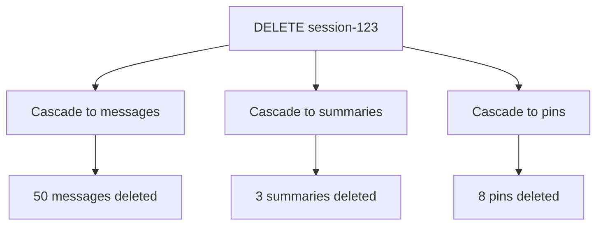

# Database Operations & Common Patterns

## Overview

This document provides practical examples of common database operations, query patterns, and best practices for working with the Kalito database. It serves as a reference guide for developers working with the codebase.

## Table of Contents

1. [Session Operations](#session-operations)
2. [Message Operations](#message-operations)
3. [Persona Operations](#persona-operations)
4. [Memory System Operations](#memory-system-operations)
5. [Complex Queries](#complex-queries)
6. [Transactions](#transactions)
7. [Performance Optimization](#performance-optimization)
8. [Common Pitfalls](#common-pitfalls)

---

## Session Operations

### Creating a New Session

```typescript
import { db } from './db/db'
import { v4 as uuidv4 } from 'uuid'

function createSession(name: string, model?: string, persona_id?: string) {
  const id = uuidv4()
  const now = new Date().toISOString()
  
  const stmt = db.prepare(`
    INSERT INTO sessions (id, name, model, persona_id, created_at, updated_at, saved)
    VALUES (?, ?, ?, ?, ?, ?, 0)
  `)
  
  stmt.run(id, name, model || null, persona_id || null, now, now)
  
  return { id, name, model, persona_id, created_at: now, updated_at: now, saved: 0 }
}
```

**Usage**:
```typescript
const session = createSession('My Chat', 'gpt-4', 'default-cloud')
console.log(session.id) // "f47ac10b-58cc-4372-a567-0e02b2c3d479"
```

---

### Listing All Sessions

```typescript
function getAllSessions() {
  return db.prepare(`
    SELECT * FROM sessions
    ORDER BY updated_at DESC
  `).all()
}
```

---

### Getting a Single Session

```typescript
function getSession(sessionId: string) {
  return db.prepare(`
    SELECT * FROM sessions WHERE id = ?
  `).get(sessionId)
}
```

---

### Updating Session

```typescript
function updateSession(sessionId: string, updates: {
  name?: string
  model?: string
  persona_id?: string
  recap?: string
  saved?: number
}) {
  const now = new Date().toISOString()
  
  const fields = []
  const values = []
  
  if (updates.name !== undefined) {
    fields.push('name = ?')
    values.push(updates.name)
  }
  if (updates.model !== undefined) {
    fields.push('model = ?')
    values.push(updates.model)
  }
  if (updates.persona_id !== undefined) {
    fields.push('persona_id = ?')
    values.push(updates.persona_id)
  }
  if (updates.recap !== undefined) {
    fields.push('recap = ?')
    values.push(updates.recap)
  }
  if (updates.saved !== undefined) {
    fields.push('saved = ?')
    values.push(updates.saved)
  }
  
  fields.push('updated_at = ?')
  values.push(now)
  values.push(sessionId)
  
  db.prepare(`
    UPDATE sessions SET ${fields.join(', ')}
    WHERE id = ?
  `).run(...values)
}
```

**Usage**:
```typescript
updateSession('session-123', {
  name: 'Updated Chat Name',
  saved: 1
})
```

---

### Deleting a Session

```typescript
function deleteSession(sessionId: string) {
  // This automatically cascades to:
  // - All messages
  // - All conversation_summaries
  // - All semantic_pins
  
  db.prepare('DELETE FROM sessions WHERE id = ?').run(sessionId)
}
```

**Cascade Visualization**:


---

### Getting Session with Message Count

```typescript
function getSessionWithStats(sessionId: string) {
  return db.prepare(`
    SELECT 
      s.*,
      COUNT(m.id) as message_count,
      MAX(m.created_at) as last_message_at
    FROM sessions s
    LEFT JOIN messages m ON s.id = m.session_id
    WHERE s.id = ?
    GROUP BY s.id
  `).get(sessionId)
}
```

**Result**:
```typescript
{
  id: 'session-123',
  name: 'My Chat',
  model: 'gpt-4',
  // ... other session fields
  message_count: 47,
  last_message_at: '2025-10-06T10:30:00.000Z'
}
```

---

## Message Operations

### Adding a Message

```typescript
function addMessage(
  sessionId: string,
  role: 'system' | 'user' | 'assistant',
  text: string,
  modelId?: string,
  tokenUsage?: number,
  importanceScore: number = 0.5
) {
  const now = new Date().toISOString()
  
  const stmt = db.prepare(`
    INSERT INTO messages (
      session_id, role, text, model_id, 
      token_usage, importance_score, created_at
    )
    VALUES (?, ?, ?, ?, ?, ?, ?)
  `)
  
  const result = stmt.run(
    sessionId,
    role,
    text,
    modelId || null,
    tokenUsage || null,
    importanceScore,
    now
  )
  
  return { id: result.lastInsertRowid, ...arguments }
}
```

**Usage**:
```typescript
// User message
addMessage('session-123', 'user', 'How do I use async/await?', null, null, 0.7)

// Assistant response
addMessage('session-123', 'assistant', 'Async/await is...', 'gpt-4', 150, 0.6)
```

---

### Getting Messages for a Session

```typescript
// Get recent messages
function getRecentMessages(sessionId: string, limit: number = 50) {
  return db.prepare(`
    SELECT * FROM messages
    WHERE session_id = ?
    ORDER BY created_at DESC
    LIMIT ?
  `).all(sessionId, limit)
}

// Get important messages
function getImportantMessages(sessionId: string, minScore: number = 0.7) {
  return db.prepare(`
    SELECT * FROM messages
    WHERE session_id = ? AND importance_score >= ?
    ORDER BY importance_score DESC, created_at DESC
  `).all(sessionId, minScore)
}
```

---

### Updating Message Importance

```typescript
function updateMessageImportance(messageId: number, score: number) {
  db.prepare(`
    UPDATE messages 
    SET importance_score = ?
    WHERE id = ?
  `).run(score, messageId)
}
```

---

### Getting Message Range

```typescript
function getMessageRange(
  sessionId: string,
  startMessageId: number,
  endMessageId: number
) {
  return db.prepare(`
    SELECT * FROM messages
    WHERE session_id = ?
      AND id BETWEEN ? AND ?
    ORDER BY created_at ASC
  `).all(sessionId, startMessageId, endMessageId)
}
```

---

### Calculating Token Usage for Session

```typescript
function getSessionTokenUsage(sessionId: string) {
  const result = db.prepare(`
    SELECT 
      SUM(token_usage) as total_tokens,
      COUNT(*) as message_count,
      AVG(token_usage) as avg_tokens_per_message
    FROM messages
    WHERE session_id = ? AND token_usage IS NOT NULL
  `).get(sessionId)
  
  return result
}
```

**Result**:
```typescript
{
  total_tokens: 15420,
  message_count: 47,
  avg_tokens_per_message: 328.09
}
```

---

## Persona Operations

### Creating a Persona

```typescript
function createPersona(data: {
  id: string
  name: string
  prompt: string
  description?: string
  icon?: string
  category: 'cloud' | 'local'
  temperature?: number
  maxTokens?: number
  topP?: number
  repeatPenalty?: number
  is_default?: number
}) {
  const now = new Date().toISOString()
  
  const stmt = db.prepare(`
    INSERT INTO personas (
      id, name, prompt, description, icon, category,
      temperature, maxTokens, topP, repeatPenalty,
      is_default, created_at, updated_at
    )
    VALUES (?, ?, ?, ?, ?, ?, ?, ?, ?, ?, ?, ?, ?)
  `)
  
  stmt.run(
    data.id,
    data.name,
    data.prompt,
    data.description || null,
    data.icon || null,
    data.category,
    data.temperature || null,
    data.maxTokens || null,
    data.topP || null,
    data.repeatPenalty || null,
    data.is_default || 0,
    now,
    now
  )
  
  return data
}
```

---

### Getting Personas by Category

```typescript
function getPersonasByCategory(category: 'cloud' | 'local') {
  return db.prepare(`
    SELECT * FROM personas
    WHERE category = ?
    ORDER BY is_default DESC, name ASC
  `).all(category)
}
```

---

### Getting Default Persona

```typescript
function getDefaultPersona(category: 'cloud' | 'local') {
  return db.prepare(`
    SELECT * FROM personas
    WHERE category = ? AND is_default = 1
    LIMIT 1
  `).get(category)
}
```

---

### Updating Persona

```typescript
function updatePersona(personaId: string, updates: Partial<Persona>) {
  const now = new Date().toISOString()
  
  const fields = []
  const values = []
  
  Object.keys(updates).forEach(key => {
    if (key !== 'id') {
      fields.push(`${key} = ?`)
      values.push(updates[key])
    }
  })
  
  fields.push('updated_at = ?')
  values.push(now)
  values.push(personaId)
  
  db.prepare(`
    UPDATE personas SET ${fields.join(', ')}
    WHERE id = ?
  `).run(...values)
}
```

---

### Deleting a Persona

```typescript
function deletePersona(personaId: string) {
  // Check if any sessions use this persona
  const sessions = db.prepare(`
    SELECT COUNT(*) as count FROM sessions WHERE persona_id = ?
  `).get(personaId)
  
  if (sessions.count > 0) {
    throw new Error(`Cannot delete persona: ${sessions.count} sessions use it`)
  }
  
  db.prepare('DELETE FROM personas WHERE id = ?').run(personaId)
}
```

---

## Memory System Operations

### Creating a Summary

```typescript
function createSummary(
  sessionId: string,
  summaryText: string,
  startMessageId: number,
  endMessageId: number,
  messageCount: number,
  importanceScore: number = 0.7
) {
  const id = uuidv4()
  const now = new Date().toISOString()
  
  const stmt = db.prepare(`
    INSERT INTO conversation_summaries (
      id, session_id, summary, message_count,
      start_message_id, end_message_id,
      importance_score, created_at
    )
    VALUES (?, ?, ?, ?, ?, ?, ?, ?)
  `)
  
  stmt.run(
    id,
    sessionId,
    summaryText,
    messageCount,
    startMessageId.toString(),
    endMessageId.toString(),
    importanceScore,
    now
  )
  
  return { id, sessionId, summaryText, messageCount }
}
```

---

### Getting Summaries for Session

```typescript
function getSummaries(sessionId: string, limit?: number) {
  const query = limit
    ? `SELECT * FROM conversation_summaries
       WHERE session_id = ?
       ORDER BY importance_score DESC, created_at ASC
       LIMIT ?`
    : `SELECT * FROM conversation_summaries
       WHERE session_id = ?
       ORDER BY importance_score DESC, created_at ASC`
  
  return limit
    ? db.prepare(query).all(sessionId, limit)
    : db.prepare(query).all(sessionId)
}
```

---

### Creating a Pin

```typescript
function createPin(
  sessionId: string,
  content: string,
  options: {
    sourceMessageId?: number
    importanceScore?: number
    pinType?: 'user' | 'auto' | 'code' | 'concept' | 'system'
  } = {}
) {
  const id = uuidv4()
  const now = new Date().toISOString()
  
  const stmt = db.prepare(`
    INSERT INTO semantic_pins (
      id, session_id, content, source_message_id,
      importance_score, pin_type, created_at
    )
    VALUES (?, ?, ?, ?, ?, ?, ?)
  `)
  
  stmt.run(
    id,
    sessionId,
    content,
    options.sourceMessageId?.toString() || null,
    options.importanceScore || 0.8,
    options.pinType || 'user',
    now
  )
  
  return { id, sessionId, content }
}
```

---

### Getting Pins for Session

```typescript
function getPins(sessionId: string, pinType?: string) {
  if (pinType) {
    return db.prepare(`
      SELECT * FROM semantic_pins
      WHERE session_id = ? AND pin_type = ?
      ORDER BY importance_score DESC
    `).all(sessionId, pinType)
  }
  
  return db.prepare(`
    SELECT * FROM semantic_pins
    WHERE session_id = ?
    ORDER BY importance_score DESC
  `).all(sessionId)
}
```

---

### Building Memory Context

```typescript
interface MemoryContext {
  pins: any[]
  summaries: any[]
  recentMessages: any[]
  totalTokens: number
}

function buildMemoryContext(
  sessionId: string,
  tokenLimit: number = 4000
): MemoryContext {
  // 1. Get all pins (highest priority)
  const pins = db.prepare(`
    SELECT * FROM semantic_pins
    WHERE session_id = ?
    ORDER BY importance_score DESC
  `).all(sessionId)
  
  // 2. Get top summaries
  const summaries = db.prepare(`
    SELECT * FROM conversation_summaries
    WHERE session_id = ?
    ORDER BY importance_score DESC, created_at ASC
    LIMIT 5
  `).all(sessionId)
  
  // 3. Calculate tokens used so far (rough estimate)
  let tokensUsed = 0
  tokensUsed += pins.reduce((sum, p) => sum + estimateTokens(p.content), 0)
  tokensUsed += summaries.reduce((sum, s) => sum + estimateTokens(s.summary), 0)
  
  // 4. Get recent messages that fit remaining budget
  const remainingTokens = tokenLimit - tokensUsed
  const recentMessages = db.prepare(`
    SELECT * FROM messages
    WHERE session_id = ?
    ORDER BY created_at DESC
    LIMIT 50
  `).all(sessionId)
  
  // Filter messages to fit token budget
  const filteredMessages = []
  let messageTokens = 0
  
  for (const msg of recentMessages) {
    const msgTokens = estimateTokens(msg.text)
    if (messageTokens + msgTokens <= remainingTokens) {
      filteredMessages.push(msg)
      messageTokens += msgTokens
    } else {
      break
    }
  }
  
  return {
    pins,
    summaries,
    recentMessages: filteredMessages.reverse(), // Chronological order
    totalTokens: tokensUsed + messageTokens
  }
}

function estimateTokens(text: string): number {
  // Rough estimate: ~4 characters per token
  return Math.ceil(text.length / 4)
}
```

---

### Getting Memory Statistics

```typescript
function getMemoryStats(sessionId: string) {
  const stats = db.prepare(`
    SELECT 
      COUNT(*) as totalMessages,
      MIN(created_at) as oldestMessage,
      MAX(created_at) as newestMessage,
      AVG(importance_score) as avgImportance
    FROM messages
    WHERE session_id = ?
  `).get(sessionId)
  
  const summaryCount = db.prepare(`
    SELECT COUNT(*) as count FROM conversation_summaries
    WHERE session_id = ?
  `).get(sessionId)
  
  const pinCount = db.prepare(`
    SELECT COUNT(*) as count FROM semantic_pins
    WHERE session_id = ?
  `).get(sessionId)
  
  return {
    totalMessages: stats.totalMessages,
    totalSummaries: summaryCount.count,
    totalPins: pinCount.count,
    oldestMessage: stats.oldestMessage,
    newestMessage: stats.newestMessage,
    averageImportanceScore: stats.avgImportance
  }
}
```

---

## Complex Queries

### Get Sessions with Persona Info

```typescript
function getSessionsWithPersonas() {
  return db.prepare(`
    SELECT 
      s.*,
      p.name as persona_name,
      p.icon as persona_icon,
      p.category as persona_category
    FROM sessions s
    LEFT JOIN personas p ON s.persona_id = p.id
    ORDER BY s.updated_at DESC
  `).all()
}
```

---

### Get Most Active Sessions

```typescript
function getMostActiveSessions(limit: number = 10) {
  return db.prepare(`
    SELECT 
      s.*,
      COUNT(m.id) as message_count,
      SUM(m.token_usage) as total_tokens,
      MAX(m.created_at) as last_activity
    FROM sessions s
    LEFT JOIN messages m ON s.id = m.session_id
    GROUP BY s.id
    ORDER BY message_count DESC
    LIMIT ?
  `).all(limit)
}
```

---

### Search Messages

```typescript
function searchMessages(query: string, sessionId?: string) {
  const sql = sessionId
    ? `SELECT m.*, s.name as session_name
       FROM messages m
       JOIN sessions s ON m.session_id = s.id
       WHERE m.text LIKE ? AND m.session_id = ?
       ORDER BY m.created_at DESC`
    : `SELECT m.*, s.name as session_name
       FROM messages m
       JOIN sessions s ON m.session_id = s.id
       WHERE m.text LIKE ?
       ORDER BY m.created_at DESC`
  
  const searchPattern = `%${query}%`
  
  return sessionId
    ? db.prepare(sql).all(searchPattern, sessionId)
    : db.prepare(sql).all(searchPattern)
}
```

---

### Get Conversation Timeline

```typescript
function getConversationTimeline(sessionId: string) {
  return db.prepare(`
    SELECT 
      'message' as type,
      id,
      role as subtype,
      text as content,
      importance_score,
      created_at
    FROM messages
    WHERE session_id = ?
    
    UNION ALL
    
    SELECT 
      'summary' as type,
      id,
      'summary' as subtype,
      summary as content,
      importance_score,
      created_at
    FROM conversation_summaries
    WHERE session_id = ?
    
    UNION ALL
    
    SELECT 
      'pin' as type,
      id,
      pin_type as subtype,
      content,
      importance_score,
      created_at
    FROM semantic_pins
    WHERE session_id = ?
    
    ORDER BY created_at ASC
  `).all(sessionId, sessionId, sessionId)
}
```

---

## Transactions

### Basic Transaction

```typescript
function createSessionWithMessage(
  sessionName: string,
  firstMessage: string
) {
  return db.transaction(() => {
    const sessionId = uuidv4()
    const now = new Date().toISOString()
    
    // Create session
    db.prepare(`
      INSERT INTO sessions (id, name, created_at, updated_at)
      VALUES (?, ?, ?, ?)
    `).run(sessionId, sessionName, now, now)
    
    // Add first message
    db.prepare(`
      INSERT INTO messages (session_id, role, text, created_at)
      VALUES (?, 'user', ?, ?)
    `).run(sessionId, firstMessage, now)
    
    return sessionId
  })()
}
```

---

### Complex Transaction with Rollback

```typescript
function transferPinToNewSession(
  pinId: string,
  newSessionId: string
) {
  return db.transaction(() => {
    // Get pin
    const pin = db.prepare(`
      SELECT * FROM semantic_pins WHERE id = ?
    `).get(pinId)
    
    if (!pin) {
      throw new Error('Pin not found')
    }
    
    // Verify new session exists
    const session = db.prepare(`
      SELECT id FROM sessions WHERE id = ?
    `).get(newSessionId)
    
    if (!session) {
      throw new Error('Target session not found')
    }
    
    // Update pin
    db.prepare(`
      UPDATE semantic_pins
      SET session_id = ?
      WHERE id = ?
    `).run(newSessionId, pinId)
    
    return { success: true, pinId, newSessionId }
  })()
}
```

---

## Performance Optimization

### Using Prepared Statements

```typescript
// ❌ Bad: Re-parsing SQL every time
function addMessageBad(sessionId: string, text: string) {
  db.prepare(`
    INSERT INTO messages (session_id, role, text, created_at)
    VALUES (?, 'user', ?, ?)
  `).run(sessionId, text, new Date().toISOString())
}

// ✅ Good: Prepare once, execute many times
const addMessageStmt = db.prepare(`
  INSERT INTO messages (session_id, role, text, created_at)
  VALUES (?, 'user', ?, ?)
`)

function addMessageGood(sessionId: string, text: string) {
  addMessageStmt.run(sessionId, text, new Date().toISOString())
}
```

---

### Batch Inserts

```typescript
function addMultipleMessages(sessionId: string, messages: Array<{
  role: string
  text: string
  importance_score?: number
}>) {
  const stmt = db.prepare(`
    INSERT INTO messages (session_id, role, text, importance_score, created_at)
    VALUES (?, ?, ?, ?, ?)
  `)
  
  const now = new Date().toISOString()
  
  // Use transaction for batch insert
  const insertMany = db.transaction((msgs) => {
    for (const msg of msgs) {
      stmt.run(
        sessionId,
        msg.role,
        msg.text,
        msg.importance_score || 0.5,
        now
      )
    }
  })
  
  insertMany(messages)
}
```

---

### Pagination

```typescript
function getMessagesPaginated(
  sessionId: string,
  page: number = 1,
  pageSize: number = 20
) {
  const offset = (page - 1) * pageSize
  
  const messages = db.prepare(`
    SELECT * FROM messages
    WHERE session_id = ?
    ORDER BY created_at DESC
    LIMIT ? OFFSET ?
  `).all(sessionId, pageSize, offset)
  
  const total = db.prepare(`
    SELECT COUNT(*) as count FROM messages
    WHERE session_id = ?
  `).get(sessionId)
  
  return {
    messages,
    pagination: {
      page,
      pageSize,
      total: total.count,
      totalPages: Math.ceil(total.count / pageSize)
    }
  }
}
```

---

## Common Pitfalls

### ❌ Pitfall 1: Foreign Keys Not Enabled

```typescript
// Without foreign_keys = ON
db.prepare('DELETE FROM sessions WHERE id = ?').run('session-123')
// Messages remain orphaned!

// With foreign_keys = ON (in db.ts)
database.pragma('foreign_keys = ON')
db.prepare('DELETE FROM sessions WHERE id = ?').run('session-123')
// Messages automatically deleted via CASCADE
```

---

### ❌ Pitfall 2: Not Using Transactions

```typescript
// Bad: Multiple separate operations
function badMultipleInserts(items: any[]) {
  for (const item of items) {
    db.prepare('INSERT INTO ...').run(item)  // Each is a separate transaction
  }
  // Slow! Each insert hits disk
}

// Good: Single transaction
function goodMultipleInserts(items: any[]) {
  const insert = db.transaction((items) => {
    for (const item of items) {
      db.prepare('INSERT INTO ...').run(item)
    }
  })
  insert(items)  // All or nothing, much faster
}
```

---

### ❌ Pitfall 3: Not Handling NULL Values

```typescript
// Bad: Assumes values exist
const session = getSession('session-123')
console.log(session.persona_id.toUpperCase())  // Error if NULL!

// Good: Check for NULL
const session = getSession('session-123')
console.log(session.persona_id?.toUpperCase() || 'No persona')
```

---

### ❌ Pitfall 4: SQL Injection

```typescript
// Bad: String concatenation
function badSearch(query: string) {
  return db.prepare(`
    SELECT * FROM messages WHERE text LIKE '%${query}%'
  `).all()  // Vulnerable to SQL injection!
}

// Good: Parameterized queries
function goodSearch(query: string) {
  return db.prepare(`
    SELECT * FROM messages WHERE text LIKE ?
  `).all(`%${query}%`)  // Safe from SQL injection
}
```

---

### ❌ Pitfall 5: Not Using Indexes

```typescript
// Slow without index
db.prepare(`
  SELECT * FROM messages
  WHERE session_id = ? AND importance_score > 0.7
  ORDER BY created_at DESC
`).all(sessionId)

// Already optimized with:
// CREATE INDEX idx_messages_session_importance_created
//   ON messages(session_id, importance_score DESC, created_at DESC)
```

---

## Summary

This document covered:
- ✅ CRUD operations for all tables
- ✅ Complex queries and joins
- ✅ Transaction handling
- ✅ Performance optimization techniques
- ✅ Common pitfalls and how to avoid them

For more information, see:
- [01-Database-Overview.md](./01-Database-Overview.md)
- [02-Table-Schemas.md](./02-Table-Schemas.md)
- [03-Initialization-Process.md](./03-Initialization-Process.md)
- [04-Connection-Management.md](./04-Connection-Management.md)
- [05-Memory-System.md](./05-Memory-System.md)
