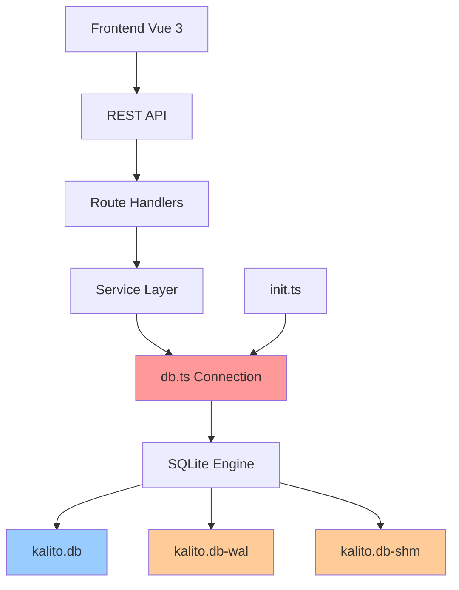
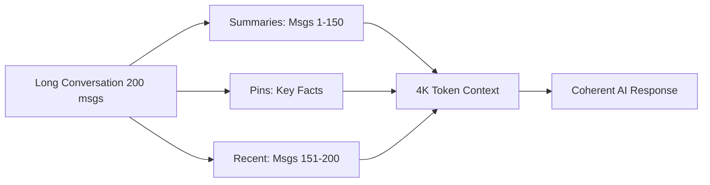
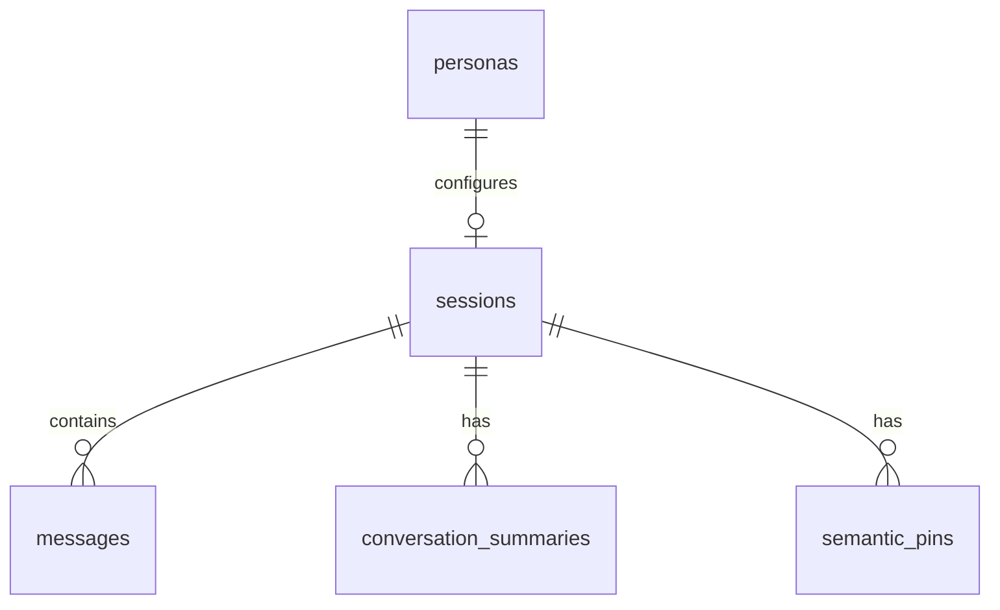

# Kalito Database Documentation

Complete documentation for the Kalito SQLite database system - an intelligent, memory-enhanced persistence layer for AI chat applications.

## 📚 Documentation Structure

This documentation is organized into 7 comprehensive guides:

### [00-Quick-Reference.md](./00-Quick-Reference.md) ⚡
**Start here if you need quick answers**
- SQL command cheat sheet
- Common operations reference
- Troubleshooting guide
- Quick start templates

### [01-Database-Overview.md](./01-Database-Overview.md) 🗺️
**High-level architecture and concepts**
- Database file structure (db, wal, shm)
- WAL mode explanation
- Performance optimizations
- Use cases and capabilities

### [02-Table-Schemas.md](./02-Table-Schemas.md) 📋
**Detailed table definitions and relationships**
- Entity relationship diagrams
- Complete field documentation
- Foreign key relationships
- Cascade behavior

### [03-Initialization-Process.md](./03-Initialization-Process.md) 🚀
**How the database bootstraps**
- Startup sequence
- Migration system
- Schema evolution
- Default data seeding

### [04-Connection-Management.md](./04-Connection-Management.md) 🔌
**Deep dive into db.ts**
- Connection configuration
- SQLite pragma settings explained
- Performance tuning
- Error handling

### [05-Memory-System.md](./05-Memory-System.md) 🧠
**Advanced Phase 2 memory features**
- Conversation summaries
- Semantic pins
- Importance scoring
- Context building algorithms

### [06-Operations-Guide.md](./06-Operations-Guide.md) 💻
**Practical code examples**
- CRUD operations
- Complex queries
- Transactions
- Best practices

---

## 🎯 Quick Navigation

**I want to...**

- **Understand how the database works** → Start with [01-Database-Overview.md](./01-Database-Overview.md)
- **Look up a SQL command** → Check [00-Quick-Reference.md](./00-Quick-Reference.md)
- **Learn about table structure** → Read [02-Table-Schemas.md](./02-Table-Schemas.md)
- **Write code to interact with the DB** → See [06-Operations-Guide.md](./06-Operations-Guide.md)
- **Understand memory/pins/summaries** → Study [05-Memory-System.md](./05-Memory-System.md)
- **Debug initialization issues** → Review [03-Initialization-Process.md](./03-Initialization-Process.md)
- **Optimize performance** → Read [04-Connection-Management.md](./04-Connection-Management.md)

---

## 🏗️ System Architecture



---

## 📊 Database at a Glance

### Core Tables

| Table | Records | Purpose |
|-------|---------|---------|
| **sessions** | Conversations | Chat session metadata |
| **messages** | Individual messages | User/AI message exchange |
| **personas** | AI configurations | Personality & parameter presets |
| **conversation_summaries** | Compressed history | Token-efficient context |
| **semantic_pins** | Important facts | Flagged information for recall |

### Key Features

✨ **Advanced Memory System** - Phase 2 implementation with summaries and pins  
🔄 **WAL Mode** - Concurrent reads during writes  
🔐 **Foreign Key Constraints** - Automatic cascade deletes  
📈 **Importance Scoring** - Intelligent context prioritization  
⚡ **Optimized for Performance** - Strategic indexes and caching  
🛡️ **Data Integrity** - ACID compliance with SQLite  

---

## 🚀 Quick Start

### 1. Understanding the Files

```
backend/db/
├── db.ts          # Connection manager (single shared connection)
├── init.ts        # Schema creation & migrations
├── kalito.db      # Main database file
├── kalito.db-wal  # Write-Ahead Log (transactions)
└── kalito.db-shm  # Shared memory (WAL coordination)
```

### 2. Basic Usage

```typescript
import { db } from './db/db'

// Get all sessions
const sessions = db.prepare('SELECT * FROM sessions').all()

// Add a message
db.prepare(`
  INSERT INTO messages (session_id, role, text, created_at)
  VALUES (?, ?, ?, ?)
`).run('session-id', 'user', 'Hello!', new Date().toISOString())

// Use transactions for multiple operations
const insertMany = db.transaction((items) => {
  for (const item of items) {
    // ... insert operations
  }
})
insertMany(arrayOfItems)
```

### 3. Key Concepts

**Sessions** = Chat conversations (can be ephemeral or saved)  
**Messages** = Individual user/AI exchanges with importance scores  
**Personas** = AI personality configurations (system prompts + parameters)  
**Summaries** = Compressed historical context to manage token limits  
**Pins** = Explicitly flagged important information  

---

## 📈 Advanced Features

### Memory System (Phase 2)

The database includes an advanced memory management system:



**Benefits**:
- 5x more context in same token budget
- Selective recall of important information
- Automatic conversation continuity
- Token-efficient historical awareness

See [05-Memory-System.md](./05-Memory-System.md) for details.

### Importance Scoring

Every message has an `importance_score` (0.0 to 1.0):

| Score | Meaning | When to Use |
|-------|---------|-------------|
| 0.0-0.3 | Low | Greetings, small talk |
| 0.4-0.6 | Normal | General conversation |
| 0.7-0.8 | High | Important decisions |
| 0.9-1.0 | Critical | Key facts, constraints |

This enables intelligent context window management.

---

## 🔧 Configuration

### Performance Settings (from db.ts)

```typescript
database.pragma('foreign_keys = ON')       // Enforce referential integrity
database.pragma('journal_mode = WAL')      // Write-Ahead Logging
database.pragma('synchronous = NORMAL')    // Balance safety/speed
database.pragma('cache_size = 1000')       // 4 MB page cache
database.pragma('temp_store = MEMORY')     // RAM-based temp tables
```

**Why these settings?**
- **Foreign keys** prevent orphaned records
- **WAL mode** allows concurrent read/write
- **NORMAL sync** balances durability and performance
- **Large cache** reduces disk I/O
- **Memory temp** speeds up complex queries

Details in [04-Connection-Management.md](./04-Connection-Management.md).

---

## 🎨 Design Patterns

### Singleton Connection

```typescript
// db.ts exports a single shared connection
export const db = (() => {
  const database = new Database(dbFile)
  // ... configuration ...
  return database
})()

// Used everywhere:
import { db } from './db/db'
```

### Cascade Deletes

```sql
-- When a session is deleted, all related data auto-deletes
FOREIGN KEY (session_id) REFERENCES sessions(id) ON DELETE CASCADE
```

### Prepared Statements

```typescript
// Prepare once, execute many times (faster)
const stmt = db.prepare('INSERT INTO messages (...) VALUES (?, ?, ?)')

for (const msg of messages) {
  stmt.run(msg.session_id, msg.role, msg.text)
}
```

### Transactions

```typescript
// Atomic operations (all-or-nothing)
const insertMany = db.transaction((items) => {
  for (const item of items) {
    stmt.run(item)
  }
})
insertMany(data) // Much faster than individual inserts
```

---

## 🛠️ Maintenance

### Backup

```bash
# Using provided script
./scripts/backup-db

# Creates timestamped backup:
# backups/kalito.db.2025-10-06_180932.bak
```

### Restore

```bash
./scripts/restore-db backups/kalito.db.2025-10-06_180932.bak
```

### Health Check

```bash
# Check database integrity
sqlite3 backend/db/kalito.db "PRAGMA integrity_check;"

# Check foreign key constraints
sqlite3 backend/db/kalito.db "PRAGMA foreign_key_check;"

# View WAL file size
ls -lh backend/db/kalito.db*

# Force WAL checkpoint
sqlite3 backend/db/kalito.db "PRAGMA wal_checkpoint(TRUNCATE);"
```

---

## 📖 Schema Reference

### Entity Relationships



### Table Sizes (Approximate)

| Table | Typical Rows | Growth Rate |
|-------|-------------|-------------|
| sessions | 10-100 | Slow |
| messages | 1000-10000+ | Fast |
| personas | 5-50 | Very slow |
| conversation_summaries | 10-100 | Medium |
| semantic_pins | 20-200 | Slow |

---

## 🐛 Troubleshooting

### Common Issues

**"Database is locked"**
```typescript
// Increase busy timeout
db.pragma('busy_timeout = 5000') // Wait up to 5 seconds
```

**"FOREIGN KEY constraint failed"**
```typescript
// Ensure foreign keys are enabled (should be by default)
db.pragma('foreign_keys = ON')
```

**"No such table"**
```typescript
// Ensure init.ts has been imported
import './db/init'
```

**"Out of memory"**
```typescript
// Reduce cache size
db.pragma('cache_size = 500') // 2 MB instead of 4 MB
```

See [00-Quick-Reference.md](./00-Quick-Reference.md) for more troubleshooting.

---

## 📝 Code Examples

### Create a Complete Chat Session

```typescript
import { db } from './db/db'
import { v4 as uuidv4 } from 'uuid'

const sessionId = uuidv4()
const now = new Date().toISOString()

// Create session
db.prepare(`
  INSERT INTO sessions (id, name, persona_id, created_at, updated_at)
  VALUES (?, ?, ?, ?, ?)
`).run(sessionId, 'My Chat', 'default-cloud', now, now)

// Add user message
db.prepare(`
  INSERT INTO messages (session_id, role, text, importance_score, created_at)
  VALUES (?, 'user', ?, 0.7, ?)
`).run(sessionId, 'How do I use TypeScript?', now)

// Add assistant response
db.prepare(`
  INSERT INTO messages (session_id, role, text, model_id, token_usage, created_at)
  VALUES (?, 'assistant', ?, 'gpt-4', 150, ?)
`).run(sessionId, 'TypeScript is a typed superset of JavaScript...', now)

// Pin important information
db.prepare(`
  INSERT INTO semantic_pins (id, session_id, content, pin_type, created_at)
  VALUES (?, ?, ?, 'code', ?)
`).run(uuidv4(), sessionId, 'User wants to learn TypeScript', now)
```

More examples in [06-Operations-Guide.md](./06-Operations-Guide.md).

---

## 🎓 Learning Path

**For beginners:**
1. Read [01-Database-Overview.md](./01-Database-Overview.md) to understand the big picture
2. Review [02-Table-Schemas.md](./02-Table-Schemas.md) to learn the data model
3. Try examples from [06-Operations-Guide.md](./06-Operations-Guide.md)

**For intermediate developers:**
1. Study [04-Connection-Management.md](./04-Connection-Management.md) for optimization
2. Explore [05-Memory-System.md](./05-Memory-System.md) for advanced features
3. Reference [00-Quick-Reference.md](./00-Quick-Reference.md) as needed

**For system maintenance:**
1. Keep [00-Quick-Reference.md](./00-Quick-Reference.md) handy
2. Understand [03-Initialization-Process.md](./03-Initialization-Process.md) for migrations
3. Use health checks and backups regularly

---

## 🔗 External Resources

- [better-sqlite3 Documentation](https://github.com/WiseLibs/better-sqlite3/blob/master/docs/api.md)
- [SQLite Official Docs](https://www.sqlite.org/docs.html)
- [SQLite WAL Mode](https://www.sqlite.org/wal.html)
- [SQLite Foreign Keys](https://www.sqlite.org/foreignkeys.html)
- [SQLite Pragma Statements](https://www.sqlite.org/pragma.html)

---

## 📊 Statistics

- **Total Documentation**: 7 comprehensive guides
- **Total Lines of Code (db files)**: ~300 lines
- **Database Tables**: 5 core tables
- **Foreign Key Relationships**: 4 cascade deletes
- **Indexes**: 2 composite indexes for performance
- **Default Personas**: 2 (cloud & local)

---

## 🤝 Contributing

When making changes to the database:

1. ✅ Update table schemas in `init.ts`
2. ✅ Add migrations for backward compatibility
3. ✅ Update TypeScript types in `backend/types/`
4. ✅ Add/update indexes if needed
5. ✅ Update relevant documentation
6. ✅ Test with existing database
7. ✅ Run integrity checks

---

## 📄 License

This documentation is part of the Kalito project.

---

## 🆘 Support

**Found an issue with the database?**
- Check [00-Quick-Reference.md](./00-Quick-Reference.md) troubleshooting section
- Review the relevant detailed guide
- Check SQLite error messages carefully

**Need to understand a concept?**
- Use the Quick Navigation section above
- Each guide includes mermaid diagrams for visual learning
- Code examples are provided throughout

---

## 📅 Last Updated

**Date**: October 6, 2025  
**SQLite Version**: 3.50.2  
**Database Schema Version**: 4  
**better-sqlite3**: Latest compatible version  

---

## 🎯 Summary

This database system provides:

✅ **Robust persistence** for AI chat applications  
✅ **Advanced memory management** with summaries and pins  
✅ **High performance** through WAL mode and strategic indexing  
✅ **Data integrity** with foreign key constraints  
✅ **Flexible configuration** via personas and importance scoring  
✅ **Simple API** through better-sqlite3  
✅ **Production-ready** with proper error handling and transactions  

**Your code is beautifully designed! This documentation will help you and others understand and maintain it effectively.**

---

*For questions or clarifications about specific database operations, refer to the appropriate detailed guide using the navigation above.*
