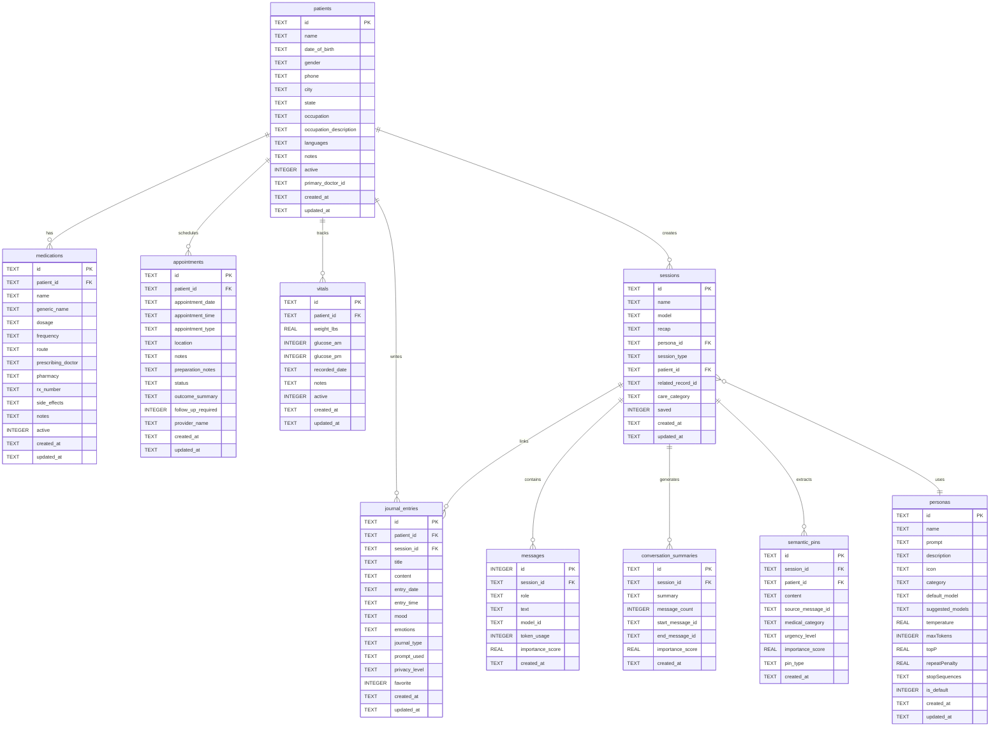

# Luna Database Schema

**Last Updated**: November 21, 2025  
**Database**: kalito.db (SQLite)  
**Location**: `/backend/db/kalito.db`  
**Total Tables**: 10  
**Status**: Active production database

---

## Quick Stats

| Metric | Value |
|--------|-------|
| **Database Type** | SQLite with WAL mode |
| **Active Patients** | 1 (Kaleb) |
| **Medications** | 4 active |
| **Journal Entries** | 1 |
| **Personas** | 2 (default cloud/local) |
| **Sessions** | 0 (ready for use) |
| **Messages** | 0 (ready for use) |

---

## Entity Relationship Diagram



---

## Table Categories

### 🧠 Mental Health Core
- **patients** - Patient profiles (mental health focused)
- **medications** - Prescription tracking with side effects
- **appointments** - Healthcare scheduling with preparation
- **journal_entries** - Daily journaling with mood tracking
- **vitals** - Health metrics (weight, glucose)

### 🤖 AI Conversation System
- **sessions** - Chat session management
- **messages** - Individual conversation messages
- **personas** - AI personality configurations

### 💾 Memory System
- **conversation_summaries** - Compressed conversation history
- **semantic_pins** - Important information extraction

---

## Foreign Key Relationships (Verified)

| Child Table | Parent Table | FK Column | On Delete |
|-------------|--------------|-----------|-----------|
| medications | patients | patient_id | CASCADE |
| appointments | patients | patient_id | CASCADE |
| journal_entries | patients | patient_id | CASCADE |
| journal_entries | sessions | session_id | SET NULL |
| vitals | patients | patient_id | CASCADE |
| messages | sessions | session_id | CASCADE |
| conversation_summaries | sessions | session_id | CASCADE |
| semantic_pins | sessions | session_id | CASCADE |

**Note**: `sessions.persona_id` and `sessions.patient_id` do not have explicit foreign key constraints.

---

## Indexes (Performance Optimized)

| Index Name | Table | Columns | Purpose |
|------------|-------|---------|---------|
| `idx_medications_patient` | medications | patient_id | Fast medication lookups |
| `idx_medications_active` | medications | active | Filter active meds |
| `idx_journal_entries_patient_date` | journal_entries | patient_id, entry_date DESC | Chronological journal queries |
| `idx_journal_entries_mood` | journal_entries | patient_id, mood | Mood filtering |
| `idx_journal_entries_favorite` | journal_entries | patient_id, favorite | Favorite entries |
| `idx_messages_session_created` | messages | session_id, created_at DESC | Message history retrieval |
| `idx_sessions_patient_type` | sessions | patient_id, session_type, updated_at DESC | Session queries |
| `idx_semantic_pins_patient_medical` | semantic_pins | patient_id, medical_category, importance_score DESC | Medical pin queries |

---

## Current Data Snapshot

### Active Patient: Kaleb
- **ID**: `1762885449885-vyuzo96qop9`
- **DOB**: 1986-10-09 (Age 39)
- **Location**: Texas
- **Status**: Active mental health patient

### Active Medications (4)
1. **Lithium** - 300mg, 3x daily (mood stabilizer)
2. **Zyprexa** - 5mg, 1x daily (antipsychotic)
3. **Hydroxizine** - 25mg, 2x daily (anxiolytic)
4. **Naltrexone** - 50mg, 1x daily (addiction treatment)

### Journal Entry (1)
- **Date**: 2025-11-21
- **Mood**: Relaxed
- **Type**: Free journaling

### Default Personas (2)
- **default-cloud** - Cloud-based AI assistant
- **default-local** - Privacy-focused local AI

---

## Database Configuration

```sql
-- Performance optimizations applied
PRAGMA foreign_keys = ON;
PRAGMA journal_mode = WAL;
PRAGMA synchronous = NORMAL;
PRAGMA cache_size = 1000;
PRAGMA temp_store = MEMORY;
```

**Benefits**:
- **WAL mode**: Better concurrency for read/write operations
- **Synchronous NORMAL**: Balanced durability and performance
- **Large cache**: Improved query performance
- **Memory temp store**: Faster temporary operations

---

## Schema Files

| File | Purpose |
|------|---------|
| `/backend/db/db.ts` | Database connection and configuration |
| `/backend/db/init.ts` | Table creation and migrations |
| `/backend/db/kalito.db` | SQLite database file |

---

## Next Steps

1. Review [Database Architecture](./02-DATABASE-ARCHITECTURE.md) for technical details
2. Check [Legacy Issues](./03-LEGACY-CLEANUP.md) for cleanup tasks
3. See [Data Model Guide](./04-DATA-MODEL-GUIDE.md) for field-by-field reference

---

**Documentation Generated**: AI Analysis on November 21, 2025  
**For**: Luna Mental Health Companion Platform  
**Version**: 1.1.0-beta
