# Luna Database Legacy Cleanup

**Last Updated**: November 21, 2025  
**Status**: ⚠️ Eldercare legacy columns detected  
**Priority**: High - Documentation claims cleanup is complete

---

## Executive Summary

The Luna database contains **legacy eldercare columns** that contradict the README claim: *"All eldercare legacy removed, optimized for mental health use case"*. Additionally, several extended columns exist in the live database but are not defined in the `init.ts` schema file, creating maintenance risks.

---

## 🚨 Critical Issue: Eldercare Legacy Columns

### Affected Table: `personas`

```mermaid
graph TB
    subgraph "Documented Schema init.ts"
        InitSchema["personas table<br/>✅ Mental health focus<br/>❌ No eldercare columns"]
    end
    
    subgraph "Actual Database"
        ActualDB["personas table<br/>✅ All base columns<br/>⚠️ eldercare_specialty<br/>⚠️ patient_context"]
    end
    
    InitSchema -.->|"Schema mismatch"| ActualDB
    
    style ActualDB fill:#f96,stroke:#c33,stroke-width:3px
```



### Current State

```sql
-- FOUND IN LIVE DATABASE:
CREATE TABLE personas (
  id TEXT PRIMARY KEY,
  name TEXT NOT NULL,
  prompt TEXT NOT NULL,
  description TEXT,
  icon TEXT,
  category TEXT,
  default_model TEXT,
  suggested_models TEXT,
  temperature REAL,
  maxTokens INTEGER,
  topP REAL,
  repeatPenalty REAL,
  stopSequences TEXT,
  is_default INTEGER DEFAULT 0,
  created_at TEXT DEFAULT CURRENT_TIMESTAMP,
  updated_at TEXT DEFAULT CURRENT_TIMESTAMP,
  eldercare_specialty TEXT,        -- ❌ LEGACY COLUMN
  patient_context INTEGER DEFAULT 0 -- ❌ LEGACY COLUMN
);
```

### Data Analysis

```bash
# Query: SELECT eldercare_specialty, patient_context FROM personas
# Results:
# - default-cloud: eldercare_specialty=NULL, patient_context=0
# - default-local: eldercare_specialty=NULL, patient_context=0
```

**Impact**:
- ✅ Columns are not actively used (NULL/0 values)
- ❌ Still exist in schema (not truly "cleaned")
- ❌ Contradict documentation claims
- ⚠️ May confuse future developers/AI models

---

## Schema Discrepancies (init.ts vs Database)

### Sessions Table Extensions


**Missing from init.ts**:
```sql
-- These columns exist in DB but NOT in init.ts:
session_type TEXT DEFAULT 'chat'
patient_id TEXT
related_record_id TEXT
care_category TEXT
```

**Impact**:
- ⚠️ New installations won't have these columns
- ⚠️ Migration logic added them, but not in base schema
- ⚠️ Documentation doesn't explain these fields

---

### Semantic Pins Table Extensions

**Missing from init.ts**:
```sql
-- These columns exist in DB but NOT in init.ts:
medical_category TEXT
patient_id TEXT
urgency_level TEXT DEFAULT 'normal'
```

**Current Index**:
```sql
CREATE INDEX idx_semantic_pins_patient_medical 
  ON semantic_pins(patient_id, medical_category, importance_score DESC);
```

**Impact**:
- ⚠️ Extended for medical use case (good)
- ❌ Not documented in schema definition
- ⚠️ Index references columns not in CREATE TABLE

---

## Remediation Plan

### Priority 1: Remove Eldercare Columns (HIGH)

```sql
-- Step 1: Backup database
-- Run: ./scripts/backup-db

-- Step 2: Drop eldercare columns from personas
BEGIN TRANSACTION;

-- SQLite doesn't support DROP COLUMN in older versions
-- Recreate table without legacy columns

CREATE TABLE personas_new (
  id TEXT PRIMARY KEY,
  name TEXT NOT NULL,
  prompt TEXT NOT NULL,
  description TEXT,
  icon TEXT,
  category TEXT,
  default_model TEXT,
  suggested_models TEXT,
  temperature REAL,
  maxTokens INTEGER,
  topP REAL,
  repeatPenalty REAL,
  stopSequences TEXT,
  is_default INTEGER DEFAULT 0,
  created_at TEXT DEFAULT CURRENT_TIMESTAMP,
  updated_at TEXT DEFAULT CURRENT_TIMESTAMP
  -- ✅ No eldercare columns
);

-- Copy data (excluding legacy columns)
INSERT INTO personas_new (
  id, name, prompt, description, icon, category,
  default_model, suggested_models, temperature, maxTokens,
  topP, repeatPenalty, stopSequences, is_default,
  created_at, updated_at
)
SELECT 
  id, name, prompt, description, icon, category,
  default_model, suggested_models, temperature, maxTokens,
  topP, repeatPenalty, stopSequences, is_default,
  created_at, updated_at
FROM personas;

-- Drop old table
DROP TABLE personas;

-- Rename new table
ALTER TABLE personas_new RENAME TO personas;

COMMIT;
```

**Expected Result**: ✅ Personas table clean, no eldercare columns

---

### Priority 2: Document Extended Columns (MEDIUM)

**Update init.ts** to include extended session fields:

```typescript
// Add to init.ts after base sessions table creation:

// Sessions table with extended fields for patient tracking
db.exec(`
CREATE TABLE IF NOT EXISTS sessions (
  id TEXT PRIMARY KEY,
  name TEXT,
  model TEXT,
  recap TEXT,
  persona_id TEXT,
  session_type TEXT DEFAULT 'chat',
  patient_id TEXT,
  related_record_id TEXT,
  care_category TEXT,
  saved INTEGER DEFAULT 0,
  created_at TEXT,
  updated_at TEXT
);
`)

// Add index for patient session queries
db.exec(`
CREATE INDEX IF NOT EXISTS idx_sessions_patient_type 
  ON sessions(patient_id, session_type, updated_at DESC);
`)
```

**Update semantic_pins** definition:

```typescript
// Semantic pins with medical extensions
db.exec(`
CREATE TABLE IF NOT EXISTS semantic_pins (
  id TEXT PRIMARY KEY,
  session_id TEXT NOT NULL,
  patient_id TEXT,
  content TEXT NOT NULL,
  source_message_id TEXT,
  medical_category TEXT,
  urgency_level TEXT DEFAULT 'normal',
  importance_score REAL DEFAULT 0.8,
  pin_type TEXT DEFAULT 'user',
  created_at TEXT DEFAULT CURRENT_TIMESTAMP,
  FOREIGN KEY (session_id) REFERENCES sessions(id) ON DELETE CASCADE
);
`)

// Add medical category index
db.exec(`
CREATE INDEX IF NOT EXISTS idx_semantic_pins_patient_medical 
  ON semantic_pins(patient_id, medical_category, importance_score DESC);
`)
```

---

### Priority 3: Add Missing Foreign Keys (LOW)

**Recommendation**: Add explicit foreign key constraints for data integrity

```sql
-- Currently missing:
sessions.persona_id → personas.id (no FK)
sessions.patient_id → patients.id (no FK)
semantic_pins.patient_id → patients.id (no FK)
```

**Implementation** (requires table recreation):

```sql
-- Example for sessions table
FOREIGN KEY (persona_id) REFERENCES personas(id) ON DELETE SET NULL
FOREIGN KEY (patient_id) REFERENCES patients(id) ON DELETE CASCADE
```

**Impact**:
- ✅ Prevent orphaned sessions if persona deleted
- ✅ Automatic cleanup if patient deleted
- ⚠️ Requires migration (table recreation)

---

## Verification Checklist

After cleanup, verify the following:

```sql
-- ✅ Personas table has no eldercare columns
PRAGMA table_info(personas);
-- Should NOT contain: eldercare_specialty, patient_context

-- ✅ Sessions table includes extended fields
PRAGMA table_info(sessions);
-- Should contain: session_type, patient_id, related_record_id, care_category

-- ✅ Semantic pins includes medical fields
PRAGMA table_info(semantic_pins);
-- Should contain: medical_category, patient_id, urgency_level

-- ✅ All indexes exist
SELECT name FROM sqlite_master WHERE type='index' ORDER BY name;
-- Should contain: idx_sessions_patient_type, idx_semantic_pins_patient_medical

-- ✅ Foreign keys intact
PRAGMA foreign_key_check;
-- Should return empty (no violations)
```

---

## Migration Script Template

```typescript
// File: backend/db/migrations/cleanup-eldercare-legacy.ts

import { db } from '../db'

export function cleanupEldercareLegacy() {
  console.log('🧹 Starting eldercare legacy cleanup...')
  
  db.transaction(() => {
    // Step 1: Backup check
    console.log('⚠️  Ensure database backup exists before proceeding')
    
    // Step 2: Clean personas table
    db.pragma('foreign_keys = OFF')
    
    db.exec(`
      CREATE TABLE personas_new (
        id TEXT PRIMARY KEY,
        name TEXT NOT NULL,
        prompt TEXT NOT NULL,
        description TEXT,
        icon TEXT,
        category TEXT,
        default_model TEXT,
        suggested_models TEXT,
        temperature REAL,
        maxTokens INTEGER,
        topP REAL,
        repeatPenalty REAL,
        stopSequences TEXT,
        is_default INTEGER DEFAULT 0,
        created_at TEXT DEFAULT CURRENT_TIMESTAMP,
        updated_at TEXT DEFAULT CURRENT_TIMESTAMP
      );
    `)
    
    db.exec(`
      INSERT INTO personas_new 
      SELECT 
        id, name, prompt, description, icon, category,
        default_model, suggested_models, temperature, maxTokens,
        topP, repeatPenalty, stopSequences, is_default,
        created_at, updated_at
      FROM personas;
    `)
    
    db.exec(`DROP TABLE personas;`)
    db.exec(`ALTER TABLE personas_new RENAME TO personas;`)
    
    db.pragma('foreign_keys = ON')
    
    console.log('✅ Eldercare columns removed from personas table')
  })()
  
  console.log('✅ Legacy cleanup completed')
}

// Run migration
if (require.main === module) {
  cleanupEldercareLegacy()
}
```

---

## Testing After Cleanup

```bash
# 1. Verify schema matches documentation
sqlite3 backend/db/kalito.db ".schema personas"

# 2. Check that personas still exist
sqlite3 backend/db/kalito.db "SELECT id, name, category FROM personas"

# 3. Test persona selection in UI
# - Should load default personas
# - Should not throw errors
# - AI chat should work normally

# 4. Verify no data loss
sqlite3 backend/db/kalito.db "SELECT COUNT(*) FROM personas"
# Expected: 2 (default-cloud, default-local)

# 5. Check README alignment
grep -i "eldercare" README.md
grep -i "legacy" README.md
# Update if necessary to reflect TRUE cleanup status
```

---

## Documentation Updates Required

After cleanup, update:

1. **README.md**
   - ✅ Confirm: "All eldercare legacy removed" 
   - Add: "Database cleaned on [DATE]"

2. **docs/db/DB-SCHEMA.md** (if it exists)
   - Update personas schema
   - Remove any eldercare references

3. **This Document**
   - Mark as ✅ RESOLVED
   - Add cleanup completion date

---

## Summary

| Issue | Status | Priority | Impact |
|-------|--------|----------|--------|
| Eldercare columns in personas | ⚠️ Active | HIGH | Documentation inconsistency |
| Sessions extended fields undocumented | ⚠️ Active | MEDIUM | Maintenance risk |
| Semantic pins medical fields undocumented | ⚠️ Active | MEDIUM | Maintenance risk |
| Missing foreign keys | ⚠️ Active | LOW | Data integrity risk |

**Recommendation**: Execute Priority 1 cleanup immediately to align database with documentation claims.

---

**Next**: See [Data Model Guide](./04-DATA-MODEL-GUIDE.md) for complete field-by-field reference.
