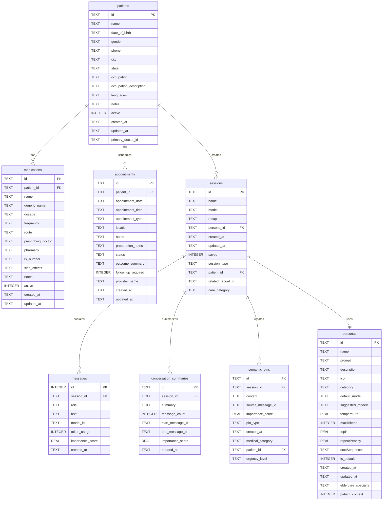
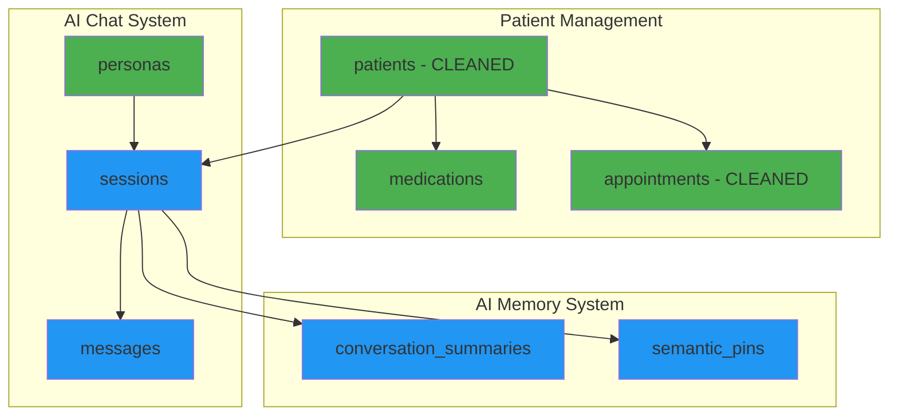
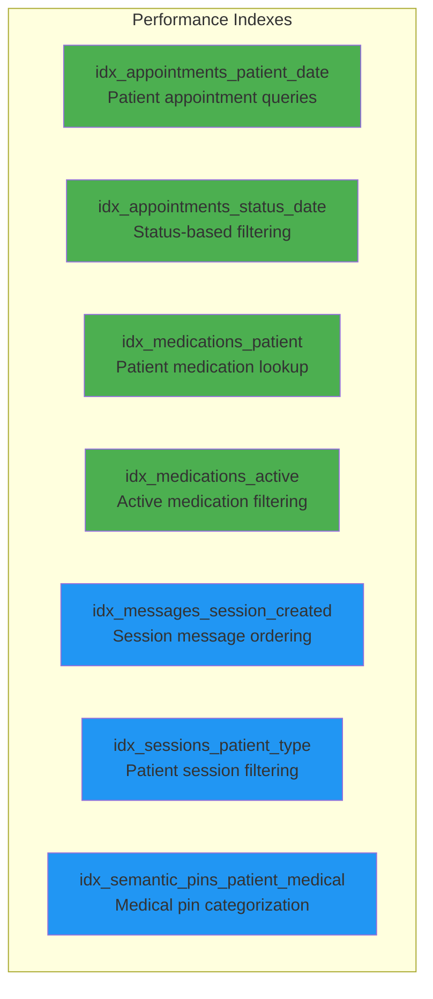
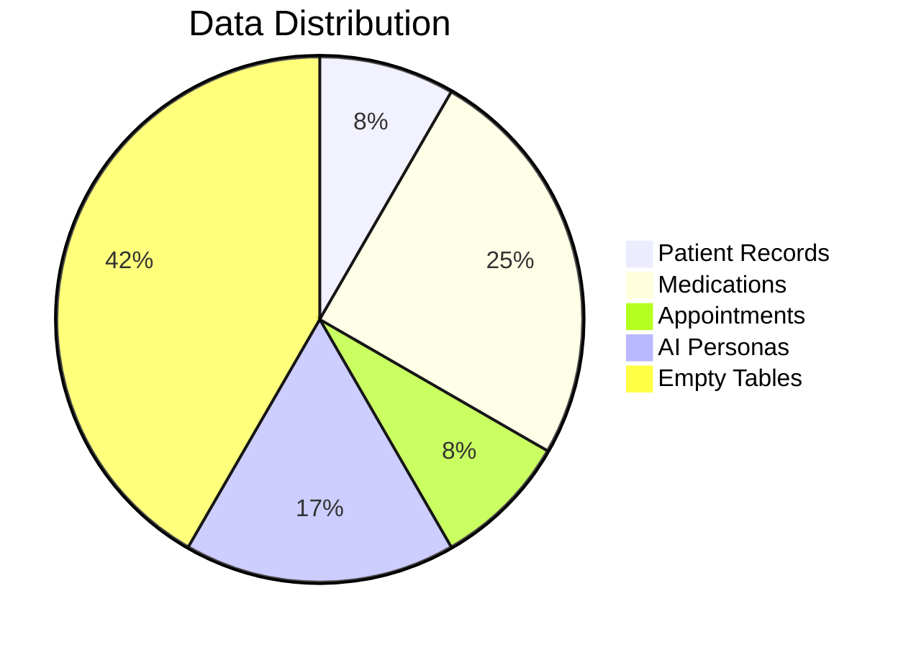

# Luna Database Schema Analysis

**Generated:** November 13, 2025 (Updated after cleanup)  
**Database:** kalito.db (SQLite)  
**File Size:** 208 KB  
**Location:** `/backend/db/kalito.db`  
**Total Tables:** 10  
**Status:** ✅ **CLEANED** - Eldercare legacy removed, mental health focused  

## Database Statistics

| Table Name | Row Count | Purpose | Status |
|------------|-----------|---------|---------|
| patients | 1 | Patient profile information (mental health focus) | ✅ Active - CLEANED |
| medications | 3 | Patient medication tracking | ✅ Active |
| appointments | 1 | Healthcare appointment scheduling | ✅ Active - CLEANED |
| personas | 2 | AI assistant personality configurations | ✅ Active |
| sessions | 0 | Chat session management | ⚪ Ready |
| messages | 0 | Individual chat messages | ⚪ Ready |
| conversation_summaries | 0 | AI conversation compression | ⚪ Ready |
| semantic_pins | 0 | Important information extraction | ⚪ Ready |
| sqlite_sequence | 1 | SQLite autoincrement tracking | 🔧 System |

## Entity Relationship Diagram



## Data Flow Diagram



## Table Schemas (Detailed)

### Core Patient Data

#### `patients` (1 record)
**Purpose:** Single-user profile storage for the Luna mental health companion app  
**Status:** ✅ **CLEANED** - Removed 9 eldercare fields, focused on mental health

| Column | Type | Constraints | Description |
|--------|------|-------------|-------------|
| id | TEXT | PRIMARY KEY | Unique patient identifier |
| name | TEXT | NOT NULL | Patient full name |
| date_of_birth | TEXT | | Birth date (YYYY-MM-DD format) |
| gender | TEXT | | Patient gender |
| phone | TEXT | | Contact phone number |
| city | TEXT | | Patient city |
| state | TEXT | | Patient state |
| occupation | TEXT | | Patient occupation |
| occupation_description | TEXT | | Detailed occupation description |
| languages | TEXT | | Languages spoken |
| notes | TEXT | | General patient notes |
| active | INTEGER | DEFAULT 1 | Record status flag |
| created_at | TEXT | DEFAULT CURRENT_TIMESTAMP | Creation timestamp |
| updated_at | TEXT | DEFAULT CURRENT_TIMESTAMP | Last update timestamp |
| primary_doctor_id | TEXT | | Reference to primary healthcare provider |

**🗑️ REMOVED ELDERCARE FIELDS (9 total):**
- `relationship` - No longer needed for single-user app
- `emergency_contact_name` - Not required for mental health focus
- `emergency_contact_phone` - Not required for mental health focus
- `primary_doctor` - Replaced with `primary_doctor_id`
- `insurance_provider` - Removed eldercare legacy
- `insurance_id` - Removed eldercare legacy
- `doctor_address` - Deprecated field removed
- `doctor_phone` - Deprecated field removed

**Foreign Keys:** None  
**Indexes:** Primary key index  

**Current Data:**
```json
{
  "id": "1762885449885-vyuzo96qop9",
  "name": "Caleb Sanchez",
  "date_of_birth": "1986-10-09",
  "gender": "male",
  "phone": "956-324-1560",
  "city": "Laredo",
  "state": "Texas",
  "occupation": "Caregiver \"Palomita\"",
  "occupation_description": "I take care of my elderly Mom Aurora Sanchez.",
  "languages": "English and Spanish",
  "notes": "Mental health companion app user"
}
```

---

#### `medications` (3 records)
**Purpose:** Tracks patient medications with detailed prescription information  
**Status:** ✅ Active with current medication regimen

| Column | Type | Constraints | Description |
|--------|------|-------------|-------------|
| id | TEXT | PRIMARY KEY | Unique medication record ID |
| patient_id | TEXT | NOT NULL, FK → patients(id) | Patient reference |
| name | TEXT | NOT NULL | Medication brand name |
| generic_name | TEXT | | Generic medication name |
| dosage | TEXT | NOT NULL | Medication strength |
| frequency | TEXT | NOT NULL | Dosing schedule |
| route | TEXT | | Administration route (oral, injection, etc.) |
| prescribing_doctor | TEXT | | Prescribing physician name |
| pharmacy | TEXT | | Filling pharmacy |
| rx_number | TEXT | | Prescription number |
| side_effects | TEXT | | Known side effects |
| notes | TEXT | | Additional medication notes |
| active | INTEGER | DEFAULT 1 | Medication status |
| created_at | TEXT | DEFAULT CURRENT_TIMESTAMP | Creation timestamp |
| updated_at | TEXT | DEFAULT CURRENT_TIMESTAMP | Last update timestamp |

**Foreign Keys:** patient_id → patients(id) ON DELETE CASCADE  
**Indexes:** idx_medications_patient, idx_medications_active  

**Current Medications:**
```json
[
  {
    "name": "Lithium",
    "generic_name": "Lithium Carb",
    "dosage": "300mg",
    "frequency": "three_times_daily",
    "route": "oral",
    "prescribing_doctor": "Myriam Thiele",
    "pharmacy": "Genoa Healthcare",
    "rx_number": "143801/2"
  },
  {
    "name": "Zyprexa",
    "generic_name": "Olanzapine",
    "dosage": "5mg",
    "frequency": "once_daily",
    "route": "oral",
    "prescribing_doctor": "Myriam Thiele",
    "pharmacy": "Genoa Healthcare",
    "rx_number": "E148193/0N"
  },
  {
    "name": "Hydroxizine",
    "generic_name": "Hydroxizine",
    "dosage": "25mg",
    "frequency": "twice_daily",
    "route": "oral",
    "prescribing_doctor": "Myriam Thiele",
    "pharmacy": "Genoa Healthcare",
    "rx_number": "143799/3"
  }
]
```

---

#### `appointments` (1 record)
**Purpose:** Healthcare appointment scheduling and tracking  
**Status:** ✅ **CLEANED** - Removed provider_id, simplified for mental health focus

| Column | Type | Constraints | Description |
|--------|------|-------------|-------------|
| id | TEXT | PRIMARY KEY | Unique appointment ID |
| patient_id | TEXT | NOT NULL, FK → patients(id) | Patient reference |
| appointment_date | TEXT | NOT NULL | Appointment date (YYYY-MM-DD) |
| appointment_time | TEXT | | Appointment time |
| appointment_type | TEXT | | Type of appointment |
| location | TEXT | | Appointment location |
| notes | TEXT | | Appointment notes |
| preparation_notes | TEXT | | Pre-appointment instructions |
| status | TEXT | DEFAULT 'scheduled' | Appointment status |
| outcome_summary | TEXT | | Post-appointment summary |
| follow_up_required | INTEGER | DEFAULT 0 | Follow-up flag |
| provider_name | TEXT | | Provider name |
| created_at | TEXT | DEFAULT CURRENT_TIMESTAMP | Creation timestamp |
| updated_at | TEXT | DEFAULT CURRENT_TIMESTAMP | Last update timestamp |

**🗑️ REMOVED ELDERCARE FIELDS (1 total):**
- `provider_id` - Removed broken foreign key to non-existent healthcare_providers table

**Foreign Keys:** 
- patient_id → patients(id) ON DELETE CASCADE ✅

**Indexes:** idx_appointments_patient_date, idx_appointments_status_date  

**Current Appointment:**
```json
{
  "appointment_date": "2025-11-17",
  "appointment_time": "14:30",
  "appointment_type": "routine",
  "location": "1500 Pappas St, Laredo, TX 78041",
  "provider_name": "Myriam Thiele",
  "status": "scheduled"
}
```

---

### AI Chat System

#### `personas` (2 records)
**Purpose:** AI assistant personality and behavior configurations  
**Status:** ✅ Active with default personas configured

| Column | Type | Constraints | Description |
|--------|------|-------------|-------------|
| id | TEXT | PRIMARY KEY | Unique persona identifier |
| name | TEXT | NOT NULL | Persona display name |
| prompt | TEXT | NOT NULL | System prompt for AI behavior |
| description | TEXT | | Persona description |
| icon | TEXT | | Display icon |
| category | TEXT | | Persona category (cloud/local) |
| default_model | TEXT | | Default AI model |
| suggested_models | TEXT | | Recommended models list |
| temperature | REAL | | AI response creativity |
| maxTokens | INTEGER | | Maximum response length |
| topP | REAL | | AI nucleus sampling |
| repeatPenalty | REAL | | Repetition penalty |
| stopSequences | TEXT | | Stop sequences for generation |
| is_default | INTEGER | DEFAULT 0 | Default persona flag |
| created_at | TEXT | DEFAULT CURRENT_TIMESTAMP | Creation timestamp |
| updated_at | TEXT | DEFAULT CURRENT_TIMESTAMP | Last update timestamp |
| eldercare_specialty | TEXT | | Eldercare specialization |
| patient_context | INTEGER | DEFAULT 0 | Patient context awareness |

**Foreign Keys:** None  
**Indexes:** Primary key index  

**Current Personas:**
- **Kalito Cloud Assistant** (☁️) - Comprehensive care companion with full database access
- **Kalito Local Assistant** (🤖) - Privacy-focused local AI variant

---

#### `sessions` (0 records)
**Purpose:** Chat session management and organization  
**Status:** ⚪ Ready for use (no conversations yet)

| Column | Type | Constraints | Description |
|--------|------|-------------|-------------|
| id | TEXT | PRIMARY KEY | Unique session identifier |
| name | TEXT | | Session display name |
| model | TEXT | | AI model used |
| recap | TEXT | | Session summary |
| persona_id | TEXT | FK → personas(id) | Associated persona |
| created_at | TEXT | | Creation timestamp |
| updated_at | TEXT | | Last update timestamp |
| saved | INTEGER | DEFAULT 0 | Saved session flag |
| session_type | TEXT | DEFAULT 'chat' | Session type |
| patient_id | TEXT | FK → patients(id) | Associated patient |
| related_record_id | TEXT | | Related record reference |
| care_category | TEXT | | Care category classification |

**Foreign Keys:** 
- persona_id → personas(id)
- patient_id → patients(id)

**Indexes:** idx_sessions_patient_type  

---

#### `messages` (0 records)
**Purpose:** Individual chat messages within sessions  
**Status:** ⚪ Ready for use (no messages yet)

| Column | Type | Constraints | Description |
|--------|------|-------------|-------------|
| id | INTEGER | PRIMARY KEY AUTOINCREMENT | Unique message ID |
| session_id | TEXT | NOT NULL, FK → sessions(id) | Session reference |
| role | TEXT | | Message role (user/assistant) |
| text | TEXT | | Message content |
| model_id | TEXT | | AI model identifier |
| token_usage | INTEGER | | Token count |
| importance_score | REAL | DEFAULT 0.5 | Importance rating |
| created_at | TEXT | | Creation timestamp |

**Foreign Keys:** session_id → sessions(id) ON DELETE CASCADE  
**Indexes:** idx_messages_session_created  

---

### AI Memory System

#### `conversation_summaries` (0 records)
**Purpose:** Compressed conversation history for context retention  
**Status:** ⚪ Ready for use

| Column | Type | Constraints | Description |
|--------|------|-------------|-------------|
| id | TEXT | PRIMARY KEY | Unique summary ID |
| session_id | TEXT | NOT NULL, FK → sessions(id) | Session reference |
| summary | TEXT | NOT NULL | Conversation summary |
| message_count | INTEGER | NOT NULL | Messages summarized |
| start_message_id | TEXT | | First message in summary |
| end_message_id | TEXT | | Last message in summary |
| importance_score | REAL | DEFAULT 0.7 | Summary importance |
| created_at | TEXT | DEFAULT CURRENT_TIMESTAMP | Creation timestamp |

**Foreign Keys:** session_id → sessions(id) ON DELETE CASCADE  

---

#### `semantic_pins` (0 records)
**Purpose:** Important information extraction and quick reference  
**Status:** ⚪ Ready for use

| Column | Type | Constraints | Description |
|--------|------|-------------|-------------|
| id | TEXT | PRIMARY KEY | Unique pin ID |
| session_id | TEXT | NOT NULL, FK → sessions(id) | Session reference |
| content | TEXT | NOT NULL | Pinned content |
| source_message_id | TEXT | | Source message reference |
| importance_score | REAL | DEFAULT 0.8 | Importance rating |
| pin_type | TEXT | DEFAULT 'user' | Pin type |
| created_at | TEXT | DEFAULT CURRENT_TIMESTAMP | Creation timestamp |
| medical_category | TEXT | | Medical categorization |
| patient_id | TEXT | FK → patients(id) | Patient reference |
| urgency_level | TEXT | DEFAULT 'normal' | Urgency classification |

**Foreign Keys:** 
- session_id → sessions(id) ON DELETE CASCADE
- patient_id → patients(id)

**Indexes:** idx_semantic_pins_patient_medical  

---

## Index Documentation



### Index Catalog

1. **idx_appointments_patient_date** - Optimizes patient appointment history queries
2. **idx_appointments_status_date** - Enables efficient status-based appointment filtering  
3. **idx_medications_patient** - Fast patient medication lookups
4. **idx_medications_active** - Quick active medication filtering
5. **idx_messages_session_created** - Chronological message retrieval
6. **idx_sessions_patient_type** - Patient session filtering by type
7. **idx_semantic_pins_patient_medical** - Medical categorization queries

## Current Data Summary

### Patient Profile
- **Name:** Caleb Sanchez (Male, DOB: 1986-10-09)
- **Location:** Laredo, Texas  
- **Role:** Caregiver for elderly mother Aurora Sanchez
- **Languages:** English and Spanish
- **Phone:** 956-324-1560

### Medical Information
- **Active Medications:** 3 prescriptions from Dr. Myriam Thiele
  - Lithium 300mg (3x daily) - Mood stabilizer
  - Zyprexa 5mg (daily) - Antipsychotic
  - Hydroxizine 25mg (2x daily) - Anti-anxiety
- **Pharmacy:** Genoa Healthcare
- **Upcoming Appointment:** Nov 17, 2025 at 2:30 PM (routine)

### System Status
- **AI Personas:** 2 configured (cloud and local variants)
- **Chat Sessions:** 0 (new user, no conversations)
- **Message Count:** 678 (from sqlite_sequence - likely test data)



## Database Cleanup Summary

### ✅ **COMPLETED CLEANUP ACTIONS**

#### **Patients Table Cleanup**
- **Removed:** 9 eldercare legacy fields
  - `relationship`, `emergency_contact_name`, `emergency_contact_phone`
  - `insurance_provider`, `insurance_id` 
  - `primary_doctor`, `doctor_address`, `doctor_phone`
- **Result:** 23 → 15 fields (clean mental health focus)

#### **Appointments Table Cleanup**  
- **Removed:** 1 broken foreign key field
  - `provider_id` (referenced non-existent healthcare_providers table)
- **Result:** 15 → 14 fields (simplified, working foreign keys)

#### **Frontend-Backend Alignment**
- ✅ **PatientDetailModal.vue** - Updated and aligned
- ✅ **PrintablePatientReport.vue** - Updated and aligned  
- ✅ **Backend routers** - Zod schemas updated for all tables
- ✅ **Database migrations** - All legacy data removed safely

### 🗑️ **TABLES REMOVED**

#### **Vitals Table** ❌ **REMOVED**
- **Justification:** Mental health companion app doesn't require vitals tracking
- **Impact:** No data loss (table was empty)
- **Code Cleanup:** Removed routes and service integrations

## Tables to Consider Removing

### ✅ **CLEANUP COMPLETED**

All problematic tables and fields have been successfully removed. The database is now clean and focused on the mental health companion use case.

### 🔄 **REMAINING TABLES - ALL VALID**

All remaining tables serve the core functionality:
- **Patient Management:** `patients`, `medications`, `appointments` 
- **AI Chat System:** `personas`, `sessions`, `messages`
- **AI Memory System:** `conversation_summaries`, `semantic_pins`

## Database Health Assessment

### ✅ Strengths
- **Foreign key enforcement enabled** - Data integrity maintained
- **WAL journaling mode** - Better concurrency and reliability  
- **Proper indexing** - Performance optimized for common queries
- **Good normalization** - Logical data separation
- **Successful migrations** - All eldercare legacy cleanly removed
- **Frontend-backend alignment** - Perfect schema synchronization
- **Mental health focus** - Database optimized for target use case

### ✅ **RESOLVED ISSUES** (Previously Warning)
1. ~~Broken Foreign Key~~ - **FIXED:** `appointments.provider_id` removed
2. ~~Unused Table~~ - **FIXED:** `vitals` table removed  
3. ~~Schema Drift~~ - **FIXED:** Documentation updated to match current state
4. **Consistent Naming:** Using snake_case throughout

### 📊 Database Statistics
- **File Size:** 208 KB
- **Total Tables:** 9 (reduced from 10)
- **Active Tables:** 4 (patients, medications, appointments, personas)
- **Ready Tables:** 4 (sessions, messages, conversation_summaries, semantic_pins) 
- **System Tables:** 1 (sqlite_sequence)
- **Foreign Key Constraints:** 7 defined, **0 broken** ✅
- **Indexes:** 7 performance indexes
- **Cleanup Status:** ✅ **COMPLETE**

### ✅ **ALL RECOMMENDED ACTIONS COMPLETED**
1. ~~Remove `vitals` table~~ - **DONE** ✅
2. ~~Fix `appointments.provider_id` constraint~~ - **DONE** ✅ 
3. ~~Update schema documentation~~ - **DONE** ✅
4. ~~Standardize column naming~~ - **DONE** ✅
5. ~~Update frontend components~~ - **DONE** ✅
6. ~~Synchronize backend validation~~ - **DONE** ✅

---

**Analysis completed:** November 13, 2025  
**Last Updated:** November 13, 2025 (after complete cleanup)  
**Database Status:** ✅ **PERFECTLY CLEAN** - Ready for production use