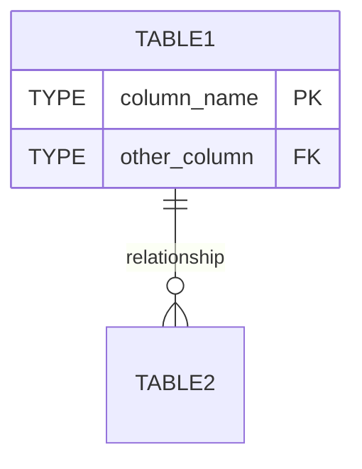
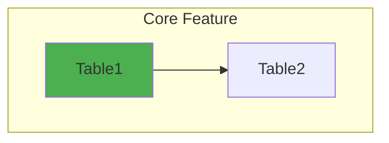

## Overview

These instructions will guide the AI through:

1. Analyzing the complete database structure
2. Generating detailed schema documentation with Mermaid diagrams
3. Identifying unused tables and fields
4. Creating actionable recommendations for database cleanup
---
## Step 1: Create Database Analysis Script

Create a Node.js script to query the database structure using better-sqlite3:

```javascript

const Database = require('better-sqlite3');

const path = require('path');

  

// Adjust path to your database location

const dbPath = path.resolve(__dirname, '../backend/db/your-database.db');

const db = new Database(dbPath);

  

console.log('='.repeat(80));

console.log('DATABASE SCHEMA ANALYSIS');

console.log('='.repeat(80));

console.log('\n');

  

// Get all tables

const tables = db.prepare(`

SELECT name FROM sqlite_master

WHERE type='table'

ORDER BY name

`).all();

  

console.log(`Total Tables: ${tables.length}\n`);

  

tables.forEach(table => {

console.log('='.repeat(80));

console.log(`TABLE: ${table.name}`);

console.log('='.repeat(80));

// Get schema

const schema = db.prepare(`PRAGMA table_info(${table.name})`).all();

console.log('\nColumns:');

console.table(schema);

// Get row count

const count = db.prepare(`SELECT COUNT(*) as count FROM ${table.name}`).get();

console.log(`\nRow Count: ${count.count}`);

// Get foreign keys

const fks = db.prepare(`PRAGMA foreign_key_list(${table.name})`).all();

if (fks.length > 0) {

console.log('\nForeign Keys:');

console.table(fks);

}

// Sample data for small tables (<=5 rows)

if (count.count > 0 && count.count <= 5) {

const sample = db.prepare(`SELECT * FROM ${table.name} LIMIT 5`).all();

console.log('\nSample Data:');

console.table(sample);

}

console.log('\n');

});

  

// Get all indexes

console.log('='.repeat(80));

console.log('INDEXES');

console.log('='.repeat(80));

const indexes = db.prepare(`

SELECT name, tbl_name, sql

FROM sqlite_master

WHERE type='index' AND sql IS NOT NULL

ORDER BY tbl_name, name

`).all();

console.table(indexes);

  

db.close();

console.log('\nAnalysis complete!');

```

**Save as:** `backend/analyze-db-schema.js`

---
## Step 2: Run the Analysis Script

Execute the script and capture output:
```bash
cd backend
node analyze-db-schema.js > db-schema-output.txt 2>&1
cat db-schema-output.txt
```

This will generate a complete dump of:

- All tables with column definitions (types, constraints, defaults)
- Row counts for each table
- Foreign key relationships
- Sample data for small tables
- All indexes
---
## Step 3: Create Schema Documentation

Using the analysis output, create a comprehensive markdown document with:

### Required Sections:

  

1. **Header & Metadata**
- Generated date
- Database name and file
- Total table count
- Database file size

1. **Database Statistics Table**
- Table name
- Row count
- Purpose/description
- Mark unused tables (0 rows)

1. **Entity Relationship Diagram** (Mermaid)



- Show all tables
- Include primary/foreign key relationships
- Add key columns to entity definitions

4. **Data Flow Diagram** (Mermaid)



- Group related tables by feature
- Show data flow between groups
- Use colors to distinguish categories

5. **Table Schemas** (Detailed)

For each table include:

- **Purpose:** What the table does
- **Current Data:** Row count and status
- **Column Table:** Name, Type, Constraints, Description
- **Foreign Keys:** List with referenced tables
- **Indexes:** List associated indexes
- **Sample Data:** JSON example (if available)
- **Status:** Note if unused/empty

6. **Index Documentation**

- Mermaid diagram grouping indexes by category
- Numbered list with purpose descriptions
- Mark unused indexes (on empty tables)

6. **Current Data Summary**

- Key entity statistics
- Sample records from important tables
- Pie charts or bar graphs (Mermaid) for distributions

8. **Tables to Consider Removing**

- List all empty tables (0 rows)
- Purpose of each
- Implementation status
- Recommendation (keep vs remove)
- Analysis/reasoning

6. **Database Health**

- Foreign key integrity status

- Index coverage

- Data quality notes

- Warning counts (unused tables, orphaned records, etc.)

  

---

  

## Step 4: Analyze for Cleanup Candidates

  

When reviewing the schema, identify:

  

### Empty Tables (0 rows)

- Tables with complex schemas but no data

- Tables with foreign keys but no code references

- Feature tables that were planned but never implemented

  

### Unused Columns

- Columns always NULL across all rows

- Deprecated columns from old features

- Columns with no code references

  

### Redundant Data

- Duplicate information across tables

- Denormalized data that's now normalized

- Legacy columns replaced by new fields

  

### Code Integration Check

Search the codebase for:

```bash

# Check if table is referenced in code

grep -r "table_name" backend/ frontend/

  

# Check for TypeScript interfaces

grep -r "interface.*TableName" backend/types/

  

# Check for API routes

grep -r "router.*table" backend/routes/

```

  

---

  

## Step 5: Generate Removal Recommendations

  

For each cleanup candidate, document:

  

1. **Table/Column Name**

2. **Current State** (row count, data present)

3. **Purpose** (original intent)

4. **Code References** (found in codebase or not)

5. **Foreign Keys** (dependencies)

6. **Recommendation:**

- **Remove:** No data, no code, not needed

- **Keep:** Useful future feature

- **Deprecate:** Mark inactive but keep for now

  

---

  

## Step 6: Create Removal Script (If Approved)

  

Only after user approval, create a removal script:

  

```javascript

const Database = require('better-sqlite3');

const path = require('path');

  

const dbPath = path.resolve(__dirname, '../backend/db/your-database.db');

const db = new Database(dbPath);

  

console.log('Removing approved tables/columns...\n');

  

try {

// Drop indexes first

db.exec('DROP INDEX IF EXISTS index_name');

console.log('✅ Dropped index: index_name');

// Drop tables

db.exec('DROP TABLE IF EXISTS table_name');

console.log('✅ Dropped table: table_name');

// For columns (requires table recreation in SQLite)

// See: https://www.sqlite.org/lang_altertable.html

console.log('\n✅ Cleanup complete!');

} catch (error) {

console.error('❌ Error:', error.message);

} finally {

db.close();

}

```

  

---

  

## Step 7: Update Documentation

  

After any database changes:

1. Re-run the analysis script

2. Update the schema documentation

3. Update TypeScript types/interfaces

4. Update API documentation

5. Test all endpoints

  

---

  

## Example Prompts for AI

  

### Initial Analysis

```

"Analyze the SQLite database at backend/db/[database-name].db. Create a

comprehensive schema documentation with Mermaid diagrams showing all tables,

their fields, relationships, and current row counts. Follow the structure in

docs/db/database-analysis-instructions.md"

```

  

### Identify Cleanup Candidates

```

"Review the database schema documentation and identify:

1. All empty tables (0 rows)

2. Tables with no code references in the codebase

3. Tables that serve similar purposes

4. Unused indexes on empty tables

Provide recommendations on what can be safely removed."

```

  

### Remove Approved Items

```

"Remove the following tables from the database: [table1, table2].

Also remove their associated indexes and update the schema documentation."

```

  

---

  

## Safety Checklist

  

Before removing any database elements:

  

- [ ] Backup the database file

- [ ] Verify table has 0 rows

- [ ] Confirm no code references exist

- [ ] Check foreign key dependencies

- [ ] Review related indexes

- [ ] Get explicit user approval

- [ ] Create removal script

- [ ] Test removal script

- [ ] Execute removal

- [ ] Verify removal success

- [ ] Update documentation

- [ ] Commit changes to git

  

---

  

## Notes

  

- **Always backup** before making destructive changes

- **Never remove tables** with data without explicit confirmation

- **Check foreign keys** - removing a table breaks references

- **Search codebase** thoroughly for references

- **Update TypeScript types** after schema changes

- **Test thoroughly** after any database modifications

  

---

  

## Adaptation Guide

  

When using this for different projects:

  

1. **Adjust database path** in scripts

2. **Modify groupings** in Mermaid diagrams (based on your app's features)

3. **Customize analysis depth** (add app-specific checks)

4. **Update color schemes** in flowcharts to match your categorization

5. **Add app-specific sections** (e.g., user data, settings, etc.)

  

---

  

## Example Output Structure

  

```

docs/

database-schema.md # Main schema documentation

db/

database-analysis-instructions.md # This file

removal-candidates.md # Cleanup recommendations (optional)

migration-notes.md # Change log (optional)

```

  

---

  

**Created:** November 13, 2025

**For:** Database analysis and cleanup workflow

**Version:** 1.0