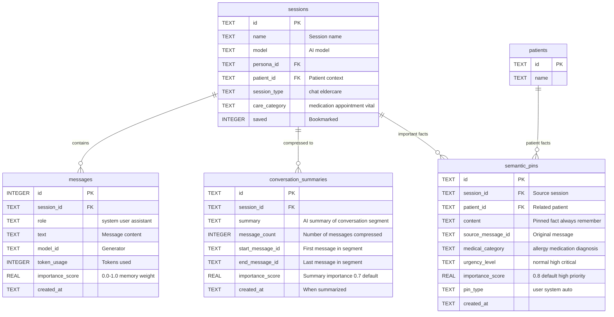
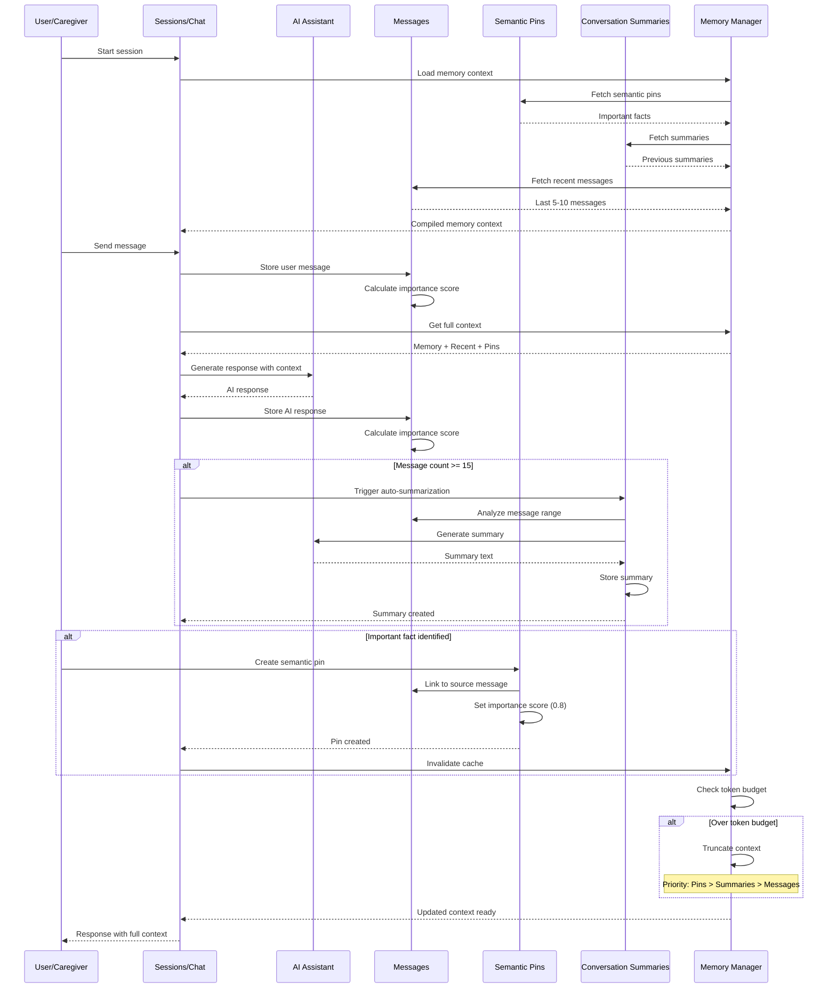
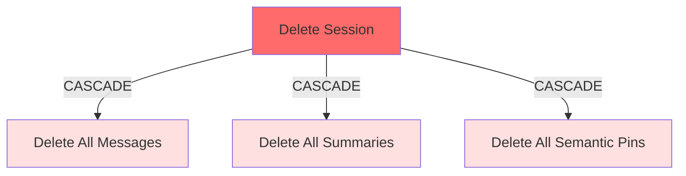
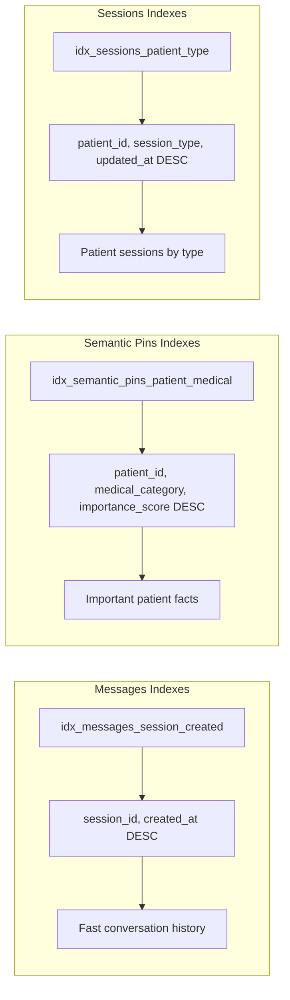

# 💾 Kalito Memory System

## Overview

Memory that balances recency, importance, and relevance.

**How it works:**

```

Memory Context = Recent Messages + Semantic Pins + Conversation Summaries

```

---
## Memory System Architecture


This diagram shows how the AI memory management system is structured:



---
## Core Components

### 1. Sessions - Conversation Persistence

Every conversation is automatically saved and organized in persistent sessions.

**Sessions** (`sessions` table):

- **Session ID**: Unique identifier (UUID or timestamp-based)
- **Session Name**: Auto-generated from first exchange or custom
- **Model**: AI model used for conversation
- **AI Recap**: Auto-generated conversation summary
- **Persona ID**: Links to active persona configuration
- **Session Type**: Categorization (chat, eldercare) - defaults to 'chat'
- **Patient Relationship**: Optional patient_id for patient-specific sessions
- **Related Records**: Links to medical records, appointments via related_record_id
- **Care Category**: Tags eldercare sessions (medication, appointment, vital, etc.)
- **Timestamps**: Creation and update tracking
- **Saved Flag**: All sessions are automatically persistent

**Session Features:**

- **Auto-Save Model**: All sessions immediately persistent
- **Intelligent Recaps**: AI generates conversation summaries
- **Session History**: View all past conversations
- **Quick Resume**: Click any session to continue
- **Model Persistence**: Remembers which model was used
- **Persona Memory**: Tracks persona used in conversation
- **Delete with Cleanup**: Cascade delete removes messages, pins, summaries
- **Patient Context**: Eldercare sessions link directly to patient records
- **Category Filtering**: Organize sessions by care category

**Session UI Components:**

- `SessionSidebar.vue`: Desktop session list with search
- `SessionSidebarMobile.vue`: Mobile-optimized session management
- One-click session resumption
- Visual indicators for active sessions
- Confirm dialog for deletions
- Search and filter capabilities
---
### 2. Recent Messages (Rolling Buffer)

- Last 5-10 messages with importance scoring
- Cached for performance (5-second TTL)
- Excludes current user input to avoid echo
- Sorted chronologically for natural conversation flow
- Token usage tracking per message
- Model identification for multi-model conversations
---
### 3. Semantic Pins

**Semantic Pins** (`semantic_pins` table):

- Key information extracted from conversations
- User-created or AI-generated pins
- Importance scoring (0.0-1.0, default 0.8)
- Pin types: user, system, auto, medical
- Medical category tagging (allergy, medication, diagnosis, symptom, warning, etc.)
- Patient relationship linking (connects pins to specific patients)
- Urgency level tracking (normal, high, critical)
- Source message tracking for context
- Session-scoped with cascade delete on session removal

**Pin Use Cases:**

- Medical allergies and contraindications
- Important medication instructions
- Critical patient preferences
- Care plan highlights
- Recurring symptoms or concerns
- Family member contact information
---
### 4. Conversation Summaries

**Conversation Summaries** (`conversation_summaries` table):

- Auto-generated when sessions reach 15+ messages
- Intelligent summarization using session model
- Message count and range tracking
- Importance scoring (default 0.7)
- Session relationship with cascade delete
- Start/end message boundary tracking
- Efficient context compression

**Smart Features:**

- **Automatic Summarization**: Triggers after 15 messages, uses best available model
- **Token Budget Management**: Dynamically truncates context to fit model limits
- **Cache Invalidation**: Clears caches when new messages arrive
- **Importance Scoring**: Messages scored based on content, length, keywords
- **Context Truncation**: Prioritizes pins > summaries > recent messages when over budget
---
## Memory Data Flow

  
This diagram shows how data flows through the memory system during a conversation:



---

## Memory Cascade Deletion

This diagram shows how memory-related data is cleaned up when sessions are deleted:



**Legend**:

- 🔴 Red = Delete trigger
- 🟠 Light Red = Cascaded deletions


When a session is deleted, all associated memory data (messages, summaries, and pins) are automatically removed to maintain data integrity.

---
## Memory Indexing Strategy

The memory system uses strategic indexes for optimal query performance:



---
## API Endpoints

- `GET /api/memory/:sessionId/context` - Full memory context
- `POST /api/memory/pins` - Create semantic pin
- `GET /api/memory/pins/:sessionId` - Get session pins
- `POST /api/memory/summarize/:sessionId` - Manual summarization
---
## Memory System Statistics

### Data Retention

- **Recent Messages**: Rolling buffer of 5-10 messages
- **Message Cache TTL**: 5 seconds for performance
- **Semantic Pins**: Persistent until session deleted
- **Summaries**: Auto-generated at 15+ messages
- **Default Importance Scores**:
- Messages: Calculated dynamically (0.0-1.0)
- Semantic Pins: 0.8 (high priority)
- Summaries: 0.7 (medium-high priority)
### Context Priority

When token budget is exceeded, context is truncated in this order:

1. **Keep**: Semantic Pins (always included)
2. **Keep**: Conversation Summaries (compressed history)
3. **Truncate**: Recent Messages (oldest first)
### Foreign Key Relationships

- **Sessions** → Messages (1:N with CASCADE delete)
- **Sessions** → Semantic Pins (1:N with CASCADE delete)
- **Sessions** → Conversation Summaries (1:N with CASCADE delete)
- **Patients** → Semantic Pins (1:N for patient-specific facts)
---
## Memory System Features

### ✅ Core Capabilities

- Foreign key constraints enabled
- Cascade deletes for data integrity
- Automatic cache invalidation
- Dynamic importance scoring
- Token budget management
- Context-aware truncation
- Patient relationship linking
- Medical category tagging
- Urgency level tracking
- Source message tracking
- Multi-model summarization support
### 🎯 Performance Optimizations

- Message caching (5-second TTL)
- Strategic composite indexes
- Efficient query patterns
- Lazy loading of context
- Smart truncation algorithms