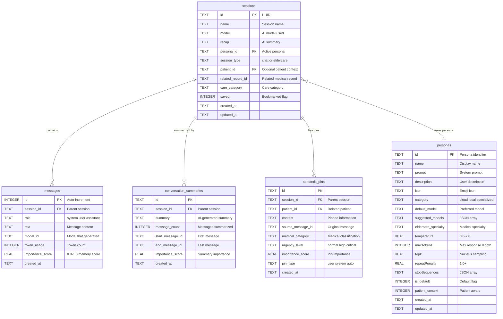
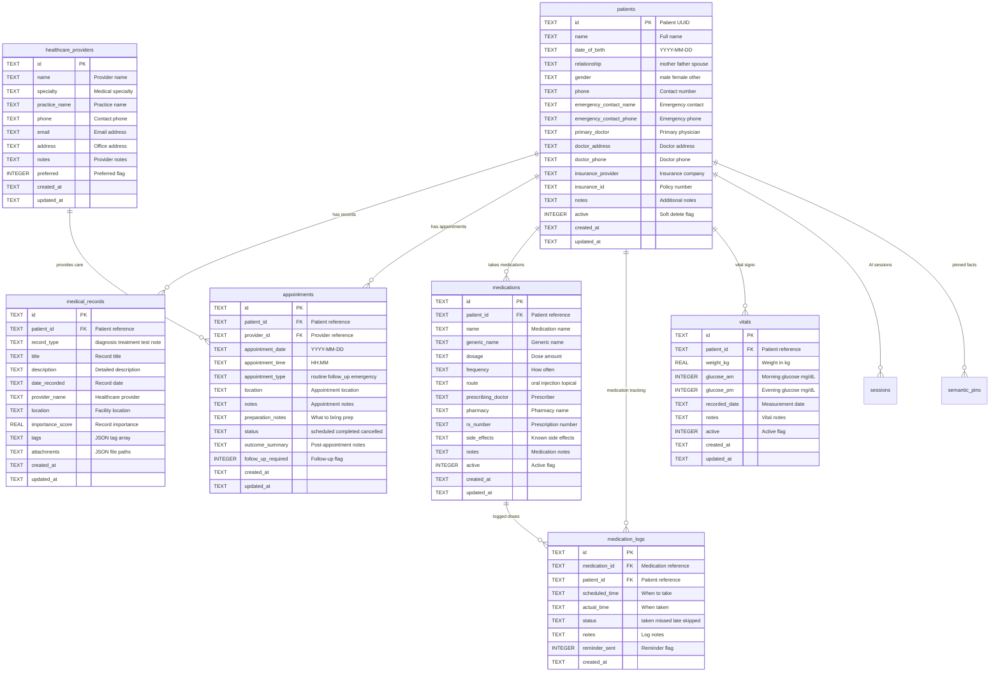

# Kalito Database Schema Diagrams

This document provides comprehensive visual representations of the Kalito database schema using Mermaid diagrams.

---

## Complete Entity Relationship Diagram

This diagram shows all tables and their relationships in the Kalito database:

---

## Chat & AI System (Isolated View)

This diagram focuses on the chat, session, and AI persona system:

---

## Eldercare System (Patient-Centric View)

This diagram shows the patient-centric eldercare management system:

---

## Healthcare Provider Network

This diagram shows the healthcare provider and appointment scheduling system:

---

## Medication Management System

This diagram focuses on medication tracking and adherence:

---

## Memory & Context System

This diagram shows the AI memory management system:

---

## Database Indexes Overview

This diagram shows the indexing strategy for query optimization:

---

## Foreign Key Relationships (Cascade Delete)

This diagram shows which deletions cascade to related records:

**Legend**:
- 🔴 Red = Delete trigger
- 🟡 Yellow = Soft delete (sets to NULL)
- 🟠 Light Red = Cascaded deletions

---

## Data Flow: Patient Care Cycle

This diagram shows how data flows through a typical eldercare workflow:

---

## Table Size & Complexity Matrix

---

## Summary Statistics

### Table Count
- **Total Tables**: 13
- **Chat/AI Tables**: 5 (sessions, messages, personas, conversation_summaries, semantic_pins)
- **Eldercare Tables**: 7 (patients, medical_records, appointments, medications, medication_logs, vitals, healthcare_providers)
- **Support Tables**: 1 (caregivers)

### Foreign Keys
- **Total Foreign Keys**: 13
- **Cascade Delete**: 11
- **Set NULL**: 1 (healthcare_providers → appointments)

### Indexes
- **Total Indexes**: 10 (plus auto-created PK indexes)
- **Composite Indexes**: 7
- **Single Column Indexes**: 3

### Key Relationships
1. **Sessions** → Messages (1:N with cascade)
2. **Patients** → Medical Records (1:N with cascade)
3. **Patients** → Appointments (1:N with cascade)
4. **Patients** → Medications (1:N with cascade)
5. **Medications** → Medication Logs (1:N with cascade)
6. **Healthcare Providers** → Appointments (1:N)
7. **Sessions** → Semantic Pins (1:N with cascade)
8. **Patients** → Semantic Pins (1:N)

### Data Integrity Features
- ✅ Foreign key constraints enabled
- ✅ Cascade deletes for related data
- ✅ Soft deletes (active flags)
- ✅ Default values for optional fields
- ✅ Timestamp tracking (created_at, updated_at)
- ✅ Importance scoring for AI memory
