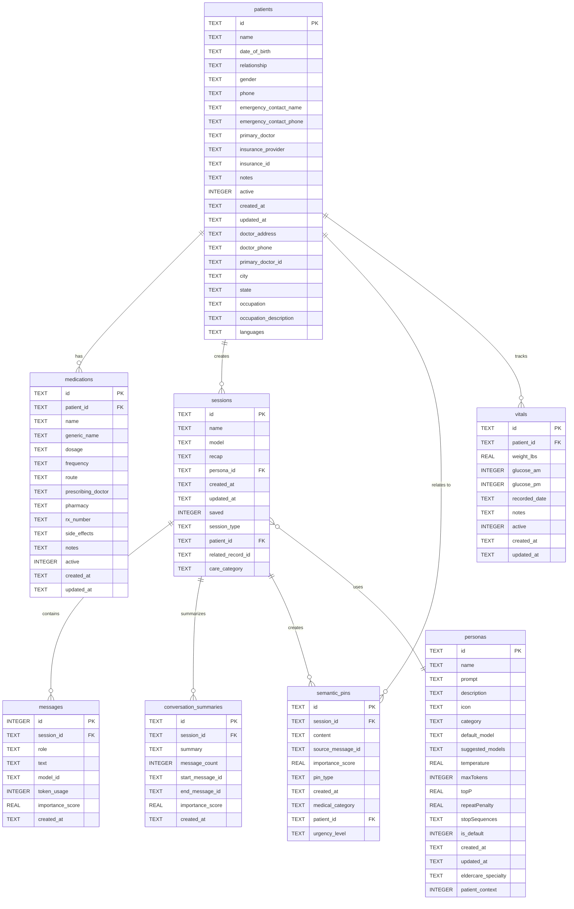

# Project Luna Database Schema

This document visualizes the current database structure for Project Luna - a single-user mental health companion app.

## Database Overview

## Table Descriptions

### Core User Data
- **patients**: Single user profile (Caleb Sanchez) with personal and health information
- **medications**: Tracks medications with dosage, frequency, and prescription details
- **vitals**: Records health vitals like weight and glucose readings

### AI Chat System
- **sessions**: Chat sessions with AI companions, can be linked to patient records
- **messages**: Individual messages within chat sessions
- **personas**: AI personality configurations with different specialties and behaviors

### AI Memory System
- **conversation_summaries**: Compressed summaries of long conversations for context retention
- **semantic_pins**: Important information extracted from conversations for quick reference

## Recent Changes

**Updated (November 12, 2025):**
- Added `doctor_address`, `doctor_phone`, and `primary_doctor_id` fields to `patients` table
- Confirmed `vitals` table is still present in the database
- **REMOVED `appointments` table** - Feature no longer needed

**Removed Tables (November 11, 2025):**
- `caregivers` - Multi-user eldercare concept (not needed for single-user app)
- `healthcare_providers` - Eldercare-specific provider management
- `medication_logs` - Medication adherence tracking (user decided not to track)

## Current Record Counts
- patients: 1
- medications: 3
- sessions: 0
- messages: 0
- personas: 2
- conversation_summaries: 0
- semantic_pins: 0
- vitals: 0
